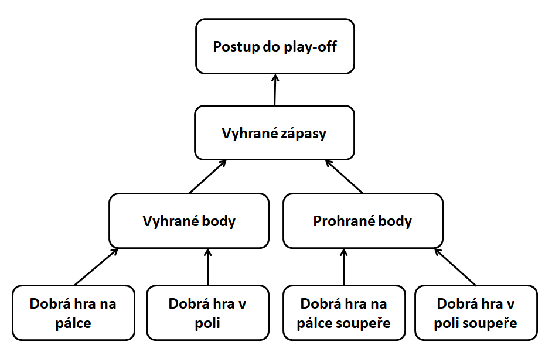

HR analytika už dnes není ve světě HR žádnou horkou novinkou. Téměř všichni z oboru už o HR analytice něco slyšeli, něco o ní vědí a případně se jí už také pokouší ve svých organizacích v nějaké podobě zavádět. Zároveň většinou uznávají její důležitost při transformaci HR z podpůrné a administrativní funkce na funkci, která dokáže organizacím bezprostředně pomáhat dosahovat jejich strategických cílů. Navzdory tomuto všeobecnému povědomí o HR analytice a navzdory řadě úspěšně realizovaných HR analytických projektů (viz např. série článků od [Davida Greena](https://www.linkedin.com/in/davidrgreen/) - [článek 1](https://www.linkedin.com/pulse/20-people-analytics-case-studies-part-1-david-green/?trk=mp-author-card), [článek 2](https://www.linkedin.com/pulse/20-people-analytics-case-studies-part-2-david-green/?published=t), [článek 3](https://www.linkedin.com/pulse/20-more-people-analytics-case-studies-part-i-david-green/), [článek 4](https://www.linkedin.com/pulse/20-people-analytics-case-studies-part-ii-david-green/?published=t&lipi=urn%3Ali%3Apage%3Ad_flagship3_pulse_read%3BFsCNnpkoSuyb52Adn9lUhw%3D%3D)) překvapivě málo organizací HR analytiku reálně a systematicky využívá. Tento stav reflektují i výsledky výzkumu [2018 Human Capital Trends](https://www2.deloitte.com/cz/en/pages/human-capital/articles/globalni-trendy-v-oblasti-lidskeho-kapitalu-pro-rok-2018.html) od společnosti Deloitte, ze kterých vyplývá, že organizace si většinou uvědomují strategickou důležitost výzvy, kterou představuje datifikace HR, zároveň se ale necítí být na čelení této výzvě příliš dobře připraveny. Už nějakou dobu platí, že když už se v organizaci s HR daty nějak pracuje, tak je to většinou pouze na úrovni nějakého základního reportingu vybraných HR metrik a KPIs typu náklady na nábor, délka období neobsazenosti volné pracovní pozice, míra ne/dobrovolné odchodovosti zaměstnanců, počet zaměstnanců na jednoho HR business partnera apod. Slabinou tohoto přístupu je, že takto sledované metriky jsou často relevantní pouze pro monitorování a řízení efektivnosti HR coby nákladového střediska, ale již méně pro dosahování strategických cílů organizace. Spíše výjimečně se potom v tomto kontextu využívají nějaké pokročilejší analytiky, které obecně mají větší potenciál přicházet s doporučeními s přímým dopadem na schopnost organizací dosahovat svých strategických cílů. 

Výsledky [výzkumu provedeného společnostmi MIT Sloan Management Review a SAS](https://sloanreview.mit.edu/projects/the-hard-work-behind-data-analytics-strategy/) naznačují, že tento nevyužitý potenciál HR analytiky má dvě hlavní příčiny. První z nich je to, že tradiční HR mnohdy postrádá analytický mindset a některé z kompetencí, které jsou klíčové pro úspěšnou realizaci HR analytických projektů (přehled těchto kompetencí a důsledků jejich absence či nedostatečné úrovně viz např. [tento článek](https://mortenkamp.com/2016/06/06/six-must-have-competencies-in-a-world-class-analytics-team/) od [Mortena Kamp Andersena](https://www.linkedin.com/in/mortenkampandersen/)). Ve stejném duchu [Josh Bersin](https://www.linkedin.com/in/bersin/) ve své zprávě [HR Technology Disruptions for 2018](http://marketing.bersin.com/rs/976-LMP-699/images/HRTechDisruptions2018-Report-100517.pdf) konstatuje, že zvládnutí základních analytických dovedností patří mezi nejdůležitější prediktory efektivní implementace HR analytiky v organizacích: "*Equip all HR staff with basic data literacy skills. All HR practitioners should know basic statistical concepts, where to find data, how to slice and dice it, how to read a dashboard, and how to bring data and analytics to bear on business issues. Our research reveals that such basic skills are among the most important predictors of high-performing people analytics.*" 

Druhou hlavní příčinou je potom to, že HR analytické projekty nebývají ukotveny v rámci nějaké širší strategie, jak data systematicky využívat při řízení lidských zdrojů, navíc  způsobem, který by byl sladěný se strategickými cíli společnosti. Zde platí praxí osvědčená pravda projektového managementu, že při implementaci projektů je potřeba vždy začínat od konce. V kontextu HR analytických projektů to tedy znamená začínat nikoli od dat, ale od toho, k čemu mají být HR analytické výstupy použity. A očekávání managementu je, že HR analytika bude v posledku hlavně pomáhat zlepšovat obchodní výsledky společnosti. Názorně to ilustruje níže uvedené schéma (převzaté z [článku](https://www.hrzone.com/lead/strategy/why-hr-needs-to-up-its-game-in-strategic-people-analytics) [Maxe Blumberga](https://www.linkedin.com/in/maxblumberg/)), které zachycuje předpokládaný kauzální řetězec spojující HR procesy s obchodními výsledky. Úkolem HR analytiky je potom s pomocí dat a analytických nástrojů tyto dvě oblasti propojit a zjistit, jak optimalizací prvního zajistit zlepšení toho druhého.   


Řadě organizací by v tomto ohledu mohl být inspirací známý příběh [oaklandského baseballového týmu „Áček“](https://en.wikipedia.org/wiki/Oakland_Athletics), který se stal předlohou pro [knihu Moneyball](https://en.wikipedia.org/wiki/Moneyball) a z ní vycházející stejnojmenný [film](https://www.csfd.cz/film/255150-moneyball/prehled/). Právě tento příběh jako jeden z prvních ukázal a mezi širokou veřejností zpopularizoval možnosti využití statistické analýzy ve světě sportu a potažmo také v rámci řízení lidských zdrojů. Díky radikální změně dosavadního přístupu k výběru nových hráčů, který se začal více opírat o výstupy statistické analýzy [sabermetrických](https://en.wikipedia.org/wiki/Sabermetrics) dat o herním chování hráčů, dokázal management oaklandského baseballového týmu „Áček“ přijímat rozhodnutí, která z jednoho z nejchudších týmů americké baseballové ligy učinila jeden z nejúspěšnějších týmů soutěže (měřeno počtem vítězství v základní části soutěže a počtem postupů do play-off). Abychom mohli tento příběh plně vytěžit coby inspiraci, jak analyzovat svá vlastní zaměstnanecká data, bude užitečné, když se na jednotlivé analytické kroky, které stály v pozadí úspěchu oklandských "Áček", podíváme trochu podrobněji. A učiníme tak za využití volně dostupného [statistického softwaru R](https://www.r-project.org/) a veřejně dostupné [databáze historických údajů o výsledcích v americké baseballové lize](https://drive.google.com/file/d/0B5YUO0Asd9KfMG1UaXpEVjJqQWc/view).

## 1. krok: Začít od konce aneb strategický rámec HR analytiky

Jak bylo uvedeno výše, často podceňovaným krokem při zavádění HR analytiky do firem a organizací je zasazení HR analytiky do nějakého širšího strategického rámce, ze kterého by jasně vyplývalo, čemu má vlastně HR analytika sloužit. HR analytika je pouze nástroj, konkrétně nástroj na zodpovídání otázek, resp. na testování různých hypotéz. To, zda bude tento nástroj užitečný, závisí na tom, zda si dokážeme klást ty správné otázky. To je přitom z velké části dáno tím, zda si jsme vědomi, jaké jsou strategické cíle naší organizace. Jen ve světle těchto cílů dává smysl klást si nějaké otázky, sbírat a analyzovat nějaká data za účelem nalezení odpovědí na položené otázky a posléze činit nějaká konkrétní rozhodnutí na základě nalezených odpovědí. V případě oaklandských „Áček“ byl cíl jasný – kvalifikovat se do play-off. 

## 2. krok: Definice problému a kvantifikace cíle
[Paul DePodesta](https://en.wikipedia.org/wiki/Paul_DePodesta), kterého generální manažer oaklandských „Áček“ [Billy Beane](https://en.wikipedia.org/wiki/Billy_Beane) přijal do týmu jako statistického analytika, redukoval tento cíl na celkem jednoduchý matematický problém: Kolik zápasů musí tým vyhrát, aby se kvalifikoval do play-off? K zodpovězení této otázky DePodesta potřeboval historická data o počtu vítězství jednotlivých týmů v minulých sezónách a o tom, zda se jim podařilo postoupit do play-off, či nikoli. 

```{r echo=TRUE, message=FALSE, warning=FALSE}
# Načtěme si knihovnu, která nám umožní si načíst a předpřipravit data k analýze a také je i vizualizovat. 
library(tidyverse)

# Načteme si naše data.
baseball <- read_csv("baseball.csv")

# Pro získání lepší představy o nich se podívejme na jejich prvních deset řádků.
head(baseball, 10)

# Pro následující analýzy si potom vytvořme podmnožinu dat, která měli k dispozici v Oaklandu v roce 2002, kdy se děj Moneyballu převážně odehrává.
moneyball <- baseball %>%
  filter(Year < 2002)
```

Podíváme-li se na data mezi lety 1996–2001, tj. na data z relativně nedávné minulosti (vztaženo k roku 2002, kdy se děj Moneyballu převážně odehrává), z grafického vyjádření vztahu mezi počtem vítězství v základní částí soutěže a postupem do play-off je dobře patrné, že čím více zápasů tým vyhraje v základní soutěži, tím větší je šance, že se také dostane do play-off. 

```{r echo=TRUE, message=FALSE, warning=FALSE}
# Vytvořme si graf zachycující vztah mezi počtem vítězství v základní části soutěže a postupem do play-off
moneyball %>%
  filter(Year < 2002 & Year > 1995) %>%
  select (W, Playoffs) %>%
  mutate(rnd = runif(176,0,1)) %>%
  ggplot(aes(x = W, y = rnd, color = as.factor(Playoffs)))+
  geom_point(size = 2)+
  scale_x_continuous(limits=c(50,120), breaks = seq(50,120,5))+
  scale_color_manual(values = c("#9e9e9e", "#ff1919"), labels = c("Tým nepostoupil do play-off","Tým postoupil do play-off"))+
  ggtitle("Postupy týmů do play-off mezi lety 1996-2001")+
  ylab("")+
  xlab("Počet vítězství v základní části soutěže")+
  theme(legend.position = "bottom",
        axis.ticks.y = element_blank(),
        axis.text.y = element_blank(),
        axis.text.x = element_text(size=11),
        axis.title.x = element_text(size=11),
        legend.text = element_text(size=11),
        legend.title = element_blank())
```

S daty, která máme k dispozici, máme tu výhodu, že můžeme vztah mezi počtem vítězství v základní části soutěže a šancí na postup do play-off přesně kvantifikovat. Provedeme-li podrobnější analýzu našich dat, ukáže se, že velkou (přibližně 95%) šanci na postup do play-off má tým tehdy, když v základní části vyhraje minimálně 95 zápasů. Těchto 95 vítězství představuje dobře definovaný a kvantifikovaný cíl, kterého by se oaklandská „Áčka“ měla snažit dosáhnout.

```{r echo=TRUE, message=FALSE, warning=FALSE}
# Vyfiltrujme si opět data mezi lety 1996-2001. 
moneyball2 <- moneyball %>%
  filter(Year < 2002 & Year > 1995)

# Vytvořme si seznam několika různých hodnot počtu vítězství v základní části soutěže.
pocet_vitezstvi <- seq(60,115,5)
ucast_v_playoff <- vector(mode="numeric", length=length(pocet_vitezstvi))
playoff_data <- data.frame(pocet_vitezstvi = pocet_vitezstvi, ucast_v_playoff = ucast_v_playoff)

# Vypočtěme si, jaká je pravděpodobnost postupu do play-off při různém počtu vítězství v základní části soutěže.
for(i in 1:nrow(playoff_data)){
 playoff_data$ucast_v_playoff[i] <- length(moneyball2$W[moneyball2$W >= playoff_data$pocet_vitezstvi[i] & moneyball2$Playoffs == 1])/length(moneyball2$W[moneyball2$W >= playoff_data$pocet_vitezstvi[i]]) 
}

# A nyní si vztah mezi počtem vyhraných zápasů v základní části soutěže a pravděpodobností účasti v play-off vizualizujme.
ggplot(playoff_data, aes(x = pocet_vitezstvi, y = ucast_v_playoff))+
  geom_point(size = 2)+
  geom_line()+
  ggtitle("Souvislost mezi počtem výher v základní části soutěže a\npravděpodobností postupu týmu do play-off (1996-2001)")+
  ylab("Pravděpodobnost postupu týmu do play-off")+
  xlab("Počet vítězství v základní části soutěže")+
  scale_x_continuous(limits=c(60,115), breaks = seq(60,115,5))+
  scale_y_continuous(limits=c(0,1), breaks = seq(0,1,0.1))+
  theme(axis.text = element_text(size=11),
        axis.title = element_text(size=11))
```

## 3. krok: Kladení otázek a měření
S takto definovaným a kvantifikovaným cílem si potom můžeme klást dalších otázky, na které když si dokážeme odpovědět, zvýšíme tím naše šance na to, že tohoto cíle dosáhneme. V případě oaklandských „Áček“ se můžeme ptát, díky čemu tým dosahuje v zápasech vítězství? Celkem zjevná odpověď zní, že díky tomu, že dokáže získat více bodů než jeho soupeři. Otázkou ale je, přesně o kolik bodů navíc musí tým získat, aby v základní části soutěže dosáhl na minimálně 95 vítězství. K zodpovězení této otázky opět potřebujeme historická data (údaje o vyhraných a prohraných bodech) a relativně jednoduchý statistický model zvaný [lineární regrese](https://cs.wikipedia.org/wiki/Lineární_regrese), pomocí kterého můžeme popsat vztah mezi počtem vyhraných zápasů v základní části soutěže a rozdílem mezi vyhranými a prohranými body. Z níže uvedeného grafu je zřejmé, že mezi těmito dvěma proměnnými je velice těsný vztah a že spolu velice silně [korelují](https://cs.wikipedia.org/wiki/Korelace).

```{r echo=TRUE, message=FALSE, warning=FALSE}
# Vypočtěme si rozdíl mezi vyhranými a prohranými body
moneyball <- moneyball %>%
  mutate(RD = RS - RA)

# Graficky si znázorněme vztah mezi počtem vyhraných zápasů v základní části soutěže a rozdílem mezi vyhranými a prohranými body
library(ggpubr)
ggplot(moneyball, aes(x = RD , y = W))+
  geom_point(alpha = 0.5, size = 2)+
  geom_smooth(method = "lm", se = FALSE)+
  ggtitle("Vztah mezi počtem vítězství v základní části soutěže a\nrozdílem mezi vyhranými a prohranými body")+
  xlab("Rozdíl mezi počtem vyhraných a prohraných bodů")+
  ylab("Počet vítězství")+
  theme(axis.title = element_text(size = 11),
        axis.text = element_text(size = 11))+
  scale_x_continuous(limits = c(-350,350), breaks = seq(-350,350,50))+
  scale_y_continuous(limits = c(40, 120), breaks = seq(40,120,10))+
  stat_cor(method = "pearson", label.x = 275, label.y = 45)
```

Při použití modelu lineární regrese můžeme vztah mezi těmito dvěma proměnnými popsat trochu podrobněji. 

```{r echo=TRUE, message=FALSE, warning=FALSE}
# Regresní analýza vztahu mezi mezi počtem vyhraných zápasů v základní části soutěže a rozdílem mezi vyhranými a prohranými body 
reg_model1 <- glm(W ~ RD, data = moneyball, family = "gaussian")
summary(reg_model1)
```

Výsledná regresní rovnice nám říká, že *očekávaný počet vítězství = 80.88 + 0.106 x Rozdílový skór*. Tzn., že při vyrovnaném poměru vyhraných a prohraných bodů můžeme očekávat, že tým vyhraje přibližně 80 zápasů za sezónu, a že když se rozdílové skóre navýší o deset bodů, můžeme očekávat, že tým vyhraje v průměru o jeden zápas za sezónu navíc. Klíčové je ale pro nás to, že s pomocí této rovnice a s trochou algebry si můžeme jednoduše vypočítat, že k dosažení minimálně 95 vítězství za sezónu potřebuje tým vyhrát přibližně o 133 bodů více, než kolik jich se soupeři prohraje (*(95 - 80.88) / 0.106*).  

## 4. krok: Kladení dalších otázek a další měření
Tímto zjištěním se náš cíl opět trochu více specifikuje a vyvolává další otázky. Otázka, která se téměř sama nabízí, se týká charakteristik hráčů, které nejlépe předpovídají počet vyhraných a prohraných bodů, a tím tedy také pravděpodobnost postupu týmu do play-off. DePodesta na základě svých analýz zjistil, že počet vyhraných bodů nejtěsněji souvisí s procentem případů, kdy se hráč dostane na metu (tzv. *On-Base Percentage* - OBP), a to, jak daleko se hráč dostane při svém odpalu (tzv. *Slugging Percentage* - SLG). Analogické statistiky pro týmy soupeřů (OOBP a OSLG) potom stejně dobře předpovídají počet prohraných bodů. Když vztah mezi těmito proměnnými popíšeme opět pomocí modelu lineární regrese, můžeme se s jeho pomocí pokusit předpovědět, jak si tým povede příští sezónu. Taková předpověď by přitom mohla být potenciálně velice užitečná, protože na jejím základě bychom případně mohli upravit některá svá rozhodnutí o koupi nebo prodeji vybraných hráčů. Pojďme tuto předpověď vytvořit pro tým oaklandských „Áček“ pro sezónu 2002 na základě dat z let 1962-2001. Z předchozí analýzy již víme, že…  

*Počet vítězství = 80.88 + 0.106 x (Počet vyhraných bodů - Počet prohraných bodů)*.  

Nyní potřebujeme určit, jaký bude pravděpodobný počet vyhraných a prohraných bodů. Pomůžeme si opět regresní analýzou.

```{r echo=TRUE, message=FALSE, warning=FALSE}
# Regresní analýza vztahu mezi mezi počtem vyhraných bodů v základní části soutěže a dvěma vybranými hráčskými/týmovými statistikami 
regModel2 = lm(RS ~ OBP + SLG, data=moneyball)
summary(regModel2)

# Regresní analýza vztahu mezi mezi počtem prohraných bodů v základní části soutěže a dvěma vybranými hráčskými/týmovými statistikami 
regModel3 = lm(RA ~ OOBP + OSLG, data=moneyball)
summary(regModel3)
```

S pomocí regresní analýzy jsme zjistili, že…  

*Počet vyhraných bodů = -804.63 + 2737.77 x OBP + 1584.91 x SLG*  
*Počet prohraných bodů = -837.38 + 2913.60 x OOBP + 1514.29 x OSLG*.  

Se znalostí hráčských/týmových statistik oaklandských „Áček“ za rok 2001 se nyní můžeme pokusit předpovědět nejdříve počet vyhraných a prohraných bodů a potom také předpokládaný počet vítězství v základní části soutěže. Při formulování této předpovědi vycházíme z předpokladu, že se složení týmu v průběhu sezóny 2002 nebude (např. z důvodu zranění hráčů) příliš lišit od jeho složení v roce 2001. 

```{r echo=TRUE, message=FALSE, warning=FALSE}
# Hráčské/týmové statistiky oaklandských „Áček“ za rok 2001
OBP_OAK <- moneyball$OBP[which(moneyball$Team=="OAK" & moneyball$Year == 2001)]
SLG_OAK <- moneyball$SLG[which(moneyball$Team=="OAK" & moneyball$Year == 2001)]
OOBP_OAK <- moneyball$OOBP[which(moneyball$Team=="OAK" & moneyball$Year == 2001)]
OSLG_OAK <- moneyball$OSLG[which(moneyball$Team=="OAK" & moneyball$Year == 2001)]

# Pravděpodobné hodnoty vybraných statistik oaklandských "Áček" pro rok 2002 vypočítané s pomocí odhadnutých regresních modelů
pocet_vyhranych_bodu_pred <- round(-804.63 + 2737.77*OBP_OAK + 1584.91*SLG_OAK)
pocet_prohranych_bodu_pred <- round(-837.38 + 2913.60*OOBP_OAK + 1514.29*OSLG_OAK)
pocet_vitezstvi_pred <- round(80.88 + 0.106 * (pocet_vyhranych_bodu_pred - pocet_prohranych_bodu_pred), 0)

# Skutečné hodnoty vybraných statistik oaklandských "Áček" pro rok 2002
pocet_vyhranych_bodu_real <- baseball$RS[which(baseball$Team=="OAK" & baseball$Year == 2002)] 
pocet_prohranych_bodu_real <- baseball$RA[which(baseball$Team=="OAK" & baseball$Year == 2002)] 
pocet_vitezstvi_real <- baseball$W[which(baseball$Team=="OAK" & baseball$Year == 2002)]

# Tabulka porovnávající statistické předpovědi se skutečností 
pred <- c(pocet_vyhranych_bodu_pred, pocet_prohranych_bodu_pred, pocet_vitezstvi_pred)
real <- c(pocet_vyhranych_bodu_real, pocet_prohranych_bodu_real, pocet_vitezstvi_real)
table <- data.frame("Předpověd" = pred, "Skutečnost" = real)
row.names(table) <- c("Vyhrané body", "Prohrané body", "Počet vítězství")
table
```

Porovnání našich předpovědí s reálnými výsledky za sezónu 2002 ukazuje, že se nám podařilo velice přesně předpovědět výsledky v nadcházející ligové sezóně, a významně tak snížit míru naší nejistoty při jejím plánování.

## 5. krok: Propojení dílčích vhledů aneb organizace jako stroj
[Matt Dancho](https://www.linkedin.com/in/mattdancho/) ve své metodice k datově-analytickým projektům doporučuje, abychom se při snaze o pochopení obchodního problému organizace na danou organizaci dívali jako na druh stroje, který má určité vstupy, procesy a výstupy. Tuto metaforu stroje můžeme nyní využít k tomu, abychom všechny výše uvedené dílčí vhledy spojili do jednotného rámce. V něm budou mít oaklandská "Áčka" podobu jednoduchého stroje na výrobu postupů do play-off - viz obrázek níže. 



Ze schématu je dobře patrné, jak tento stroj funguje: Jeho výstupy jsou postupy do play-off, kterých dosahuje tak, že se snaží vyhrát více zápasů, resp. získat více bodů než soupeřící týmy; k tomu využívá vstupy v podobě schopnosti hráčů hrát dobře na pálce a v poli; vstupem ovlivňujícím chod stroje jsou rovněž obdobné schopnosti hráčů soupeřících týmů. Jedná se samozřejmě o velmi zjednodušený kauzální model fungování týmu oakladnských "Áček", ale jak konstatuje slavný statistický aforismus, [modely jsou vždy nepřesné, ale některé z nich jsou užitečné](https://en.wikipedia.org/wiki/All_models_are_wrong).

Jakkoli naše modely fungování organizace budou vždy neúplné, je důležité ověřit, zda tyto modely i přes svou omezenost v dostatečné míře odrážejí realitu tak, jak nám ji zprostředkovávají dostupná data. Za tímto účelem můžeme použít statistickou metodu [strukturálního modelování](https://en.wikipedia.org/wiki/Structural_equation_modeling), která umožňuje formalizovat naše představy o vzájemných vztazích mezi několika různými proměnnými a zhodnotit míru souladu těchto našich představ s dostupnými daty. Teprve po takovém zhodnocení věrohodnosti modelu je rozumné na něm zakládat svá další rozhodnutí. Pojďme tedy tuto metodu použít rovněž na náš nově vytvořený model fungování týmu oaklandských "Áček" a ověřit míru jeho věrohodnosti. 

```{r echo=TRUE, message=FALSE, warning=FALSE}
# Data, která budeme potřebovat pro ověření věrohodnosti našeho modelu fungování oaklandských "Áček" 
sem_data <- moneyball %>%
  filter(Year < 2002 & Year > 1995) %>%
  select(RS, RA, RD, W, Playoffs, OBP, SLG, OOBP, OSLG)

# Definice modelu, která je v souladu s výše uvedeným schématem
library(lavaan)
oak_model <- '
     Playoffs ~ W
     W ~ RS + RA
     RA ~ OOBP + OSLG
     RS ~ OBP + SLG 
'
# Odhad parametrů modelu
fit_oak_model <- sem(oak_model, data = sem_data, missing = "pairwise", estimator = "WLSMV", ordered = "Playoffs")
summary(fit_oak_model, standardized = T, fit.measures = T, rsq = T)
```

```{r echo=TRUE, message=FALSE, warning=FALSE}
# Grafické znázornění modelu fungování oaklandských "Áček" 
library(semPlot)
semPaths(fit_oak_model, 
         whatLabels="std", 
         intercepts=FALSE, 
         style="lisrel",
         nCharNodes=0,
         nCharEdges=0,
         curveAdjacent = TRUE,
         title=TRUE,
         layout="tree2",
         curvePivot=TRUE,
         rotation =3)
```

Výstupy provedené tzv. [pěšinkové analýzy](https://en.wikipedia.org/wiki/Path_analysis_(statistics)), která je speciálním typem strukturálního modelování, naznačují, že námi navržený model je v souladu s daty, která máme k dispozici (viz "příznivé" hodnoty indexů shody, resp. neshody jako je TLI a CFI, resp. RMSEA, a také vysoké hodnoty standardizovaných regresních koeficientů). Dávají nám tak dobrý důvod věřit, že naše další kroky a rozhodnutí, která založíme na tomto modelu, budou mít žádoucí efekt na požadované výstupy, tj. na postup oaklandských "Áček" do play-off.  

## 6. krok: Intervence 
Na základě výše uvedených zjištění začal management oaklandských „Áček“ do svého týmu vybírat hráče, kteří sice nevyhovovali tradičním kritériím, podle kterých hráčští skauti posuzovali kvalitu baseballových hráčů, ale za to vykazovali přesně ty charakteristiky, které podle DePodestových analýz předpovídaly počet vyhraných a prohraných bodů, a potažmo tedy také pravděpodobnost účasti v play-off, která byla hlavním cílem managementu. Díky tomu, že konkurenční týmy důležitost těchto hráčských statistik podceňovaly a naopak přeceňovaly jiné, méně důležité proměnné (např. míru úspěšnosti odpalů, tzv. *Batting Average*), mohl management oaklandských „Áček“ relativně levně skupovat hráče, kteří jim umožňovali dosahovat stanoveného cíle. Výsledkem bylo to, že oaklandská „Áčka“ vyhrávala zhruba o 20 zápasů za sezónu více než stejně „chudé“ týmy a přibližně stejně tolik zápasů jako 2krát až 3krát bohatší konkurence - viz graf níže. 

```{r echo=TRUE, message=FALSE, warning=FALSE, preview=TRUE}
# Načtěme si potřebná data Lahmanovy baseballové databáze, která je veřejně přístupná na adrese http://seanlahman.com/baseball-archive/statistics/
mzdyHracu <- read_csv("salaries.csv")
vyhryTymu <- read_csv("teams.csv")

# Vypočtěme si průměrnou sumu mezd vyplácených jednotlivými týmy svým hráčům v letech 1998-2001 
prumerna_suma_MezdHracu <- mzdyHracu %>%
  filter(yearID > 1997 & yearID < 2002) %>%
  group_by(teamID) %>%
  summarise(prumerna_suma_MezdHracu = sum(salary)/length(unique(yearID)))

# Vypočtěme si pro jednotlivé týmy průměrný počet výher za sezónu v letech 1998-2001
prumerny_pocet_vyher <- vyhryTymu %>%
  filter(yearID > 1997 & yearID < 2002) %>%
  group_by(teamID) %>%
  summarise(prumerny_pocet_vyher = sum(W)/length(unique(yearID)))

# Vyjádřeme si graficky vztah mezi počtem výher a množstvím peněz, které týmy vynakládají na mzdy svých hráčů 
library(ggrepel)
prumerna_suma_MezdHracu %>%
  left_join(prumerny_pocet_vyher, "teamID") %>%
  mutate(OAK = ifelse(teamID == "OAK", "ano", "ne")) %>%
  ggplot(aes(x= prumerna_suma_MezdHracu, y = prumerny_pocet_vyher, fill = OAK)) +
  geom_point()+
  ggtitle("Mzdy hráčů a počet vítězství v letech 1998-2001")+
  xlab("Průměrná suma mezd hráčů (USD)")+
  ylab("Průměrný počet výher za sezónu")+
  geom_label_repel(
    aes(label = teamID),
    box.padding = 0.25, point.padding = 0.25,
    segment.color = 'grey50')+
  theme(legend.position="none")+
  scale_fill_manual(values = c("#ffd400", "#ffffff"), 
                        labels = c("ano","ne"))+
  scale_y_continuous(limits=c(65,100), breaks = seq(65,100,5)) +
  scale_x_continuous(limits=c(2e+07,9e+07), breaks = seq(2e+07,9e+07,1e+07))
```

## Omezení HR analytiky
Přes veškerou přidanou hodnotu, kterou HR analytika pro organizaci může mít, je vhodné si vůči ní zachovat zdravou míru skepse a být si vědom jejích omezení. Níže uvádím přehled několika z nich.

* Kvalita a užitečnost výstupů HR analytiky je závislá na kvalitě dat, která do ní vstupují. Jako kdekoli jinde i zde platí okřídlené rčení „*rubbish in, rubbish out*“. Schopnost získat potřebná data včas, v dostatečné kvalitě a v dostatečném množství přitom představuje jedno z nejužších hrdel celého procesu zavádění HR analytiky v organizacích.

* HR analytika pracuje s historickými daty a vychází z předpokladu, že minulost je dobrým prediktorem budoucnosti. Ale jak nás na to opakovaně upozorňují odborníci jako [Nassim Taleb](https://en.wikipedia.org/wiki/Nassim_Nicholas_Taleb) nebo [Philip Tetlock](https://en.wikipedia.org/wiki/Philip_E._Tetlock), tento vztah mezi minulostí a budoucností platí pouze do určité míry a pouze v relativně krátkém časovém horizontu. Na každém rohu na nás číhá nějaká potenciální [černá labuť](https://en.wikipedia.org/wiki/The_Black_Swan:_The_Impact_of_the_Highly_Improbable), která může postavit na hlavu všechno, co jsme se na základě našich minulých zkušeností naučili brát jako samozřejmou jistotu. 

* Ne každé prostředí je stejně předvídatelné jako svět sportu. Poměr [signálu a šumu](https://www.kosmas.cz/knihy/191522/signal-a-sum/) se může napříč různými oblastmi významně lišit a čím více převládá náhodný šum nad signálem, tím méně jsou výstupy z HR analytiky užitečné. Příkladem zde může být relativně neúspěšná snaha předpovídat to, jak si baseballové týmu povedou v play-off. Na rozdíl od základní části soutěže, kde se hraje dostatek zápasů na to, aby se vyrušil vliv náhodného štěstí a smůly, v pětizápasových kolech play-off hraje náhoda tak významnou roli, že souvislost mezi celkovým počtem vítězství v základní části a pořadím týmu v play-off je téměř nulová.  

```{r echo=TRUE, message=FALSE, warning=FALSE}
# Vyfiltrujme si data mezi lety 1994-2011, kdy v play-off hraje 8 týmů.
moneyball3 <- moneyball %>%
  filter(Year < 2012 & Year > 1993)
  
# Výpočtěme si Kendallovu pořadovou korelaci mezi mezi celkovýmm počtem vítězství v základní části soutěže a pořadím týmu v play-off mezi lety 1994-2011. 
suppressWarnings(cor.test(~ W + RankPlayoffs, data = moneyball3, method = "kendall"))
```

*	Čísla mají tu zvláštní moc, že dokážou v člověku velice snadno vzbudit dojem, že toho víme mnohem více než je tomu ve skutečnosti. Je však dobré si být vědom toho, že každá statistická předpověď je vždy zatížena nějakou mírou chyby, tu větší, tu menší. Velkou výhodou statistických modelů je to, že tato chyba je u nich explicitně vyčíslena, takže s ní lze dopředu počítat a zohlednit ji při následném rozhodování. Tato „upřímnost“ ohledně své vlastní omylnosti paradoxně mnohdy staví statistické modely do horšího světla než jinak méně přesné intuitivní úsudky expertů, pro které podobné údaje o míře jejich omylnosti většinou nejsou vůbec k dispozici. 

* Velikost výhody, kterou nám zavedení HR analytiky dává, může být závislá na tom, zda podobné postupy využívá také naše konkurence. Opět to lze celkem dobře doložit na oaklandských „Áčkách“. Jejich výsledky se mezi lety 2002 až 2012, tj. v době po zveřejnění Moneyballu, kdy již všechny týmy měly příležitost seznámit se s principy prediktivní analytiky a zavést ji do své praxe, začaly více přibližovat výsledkům podobně „chudých“ soupeřů a naopak jejich bohatší soupeři jim svým výkonem zase trochu odskočili - viz graf níže. Z toho mimo jiné vyplývá, že s tím, jak se stále více společností bude při řízení lidských zdrojů spoléhat na výstupy z HR analytiky, přestane být HR analytika nějakou zásadní konkurenční výhodou a stane se z ní něco, co organizaci "pouze" umožní držet krok s konkurencí. 

```{r echo=TRUE, message=FALSE, warning=FALSE}
# Vypočtěme si průměrnou sumu mezd vyplácených jednotlivými týmy svým hráčům v letech 2002-2012 
prumerna_suma_MezdHracu2 <- mzdyHracu %>%
  filter(yearID > 2001 & yearID <= 2012) %>%
  group_by(teamID) %>%
  summarise(prumerna_suma_MezdHracu = sum(salary)/length(unique(yearID)))

# Vypočtěme si pro jednotlivé týmy průměrný počet výher za sezónu v letech 2002-2012
prumerny_pocet_vyher2 <- vyhryTymu %>%
  filter(yearID > 2001 & yearID <=2012) %>%
  group_by(teamID) %>%
  summarise(prumerny_pocet_vyher = sum(W)/length(unique(yearID)))

# Vyjádřeme si graficky vztah mezi počtem výher a množstvím peněz, které týmy vynakládají na mzdy svých hráčů 
prumerna_suma_MezdHracu2 %>%
  left_join(prumerny_pocet_vyher2, "teamID") %>%
  mutate(OAK = ifelse(teamID == "OAK", "ano", "ne")) %>%
  ggplot(aes(x= prumerna_suma_MezdHracu, y = prumerny_pocet_vyher, fill = OAK)) +
  geom_point()+
  ggtitle("Mzdy hráčů a počet vítězství v letech 2002-2012")+
  xlab("Průměrná suma mezd hráčů (USD)")+
  ylab("Průměrný počet výher za sezónu")+
  geom_label_repel(
    aes(label = teamID),
    box.padding = 0.25, point.padding = 0.25,
    segment.color = 'grey50')+
  theme(legend.position="none")+
  scale_fill_manual(values = c("#ffd400", "#ffffff"), 
                        labels = c("ano","ne")) +
  scale_y_continuous(limits=c(65,100), breaks = seq(65,100,5)) +
  scale_x_continuous(limits=c(3e+07,2e+08), breaks = seq(3e+07,2e+08,2e+07))
```

## Závěr
Na příkladu oaklandského baseballového mužstva jsme takto mohli sledovat obvyklý postup aplikace HR analytiky na určitý druh problému, který se snaží v dané organizaci vyřešit. Vzhledem ke specifickému předmětu podnikání oaklandských „Áček“ bylo tímto cílem dosáhnout postupu do play-off a to v situaci, kdy management neměl dostatek finančních prostředků na zaplacení hráčů považovaných dle tradičních měřítek za kvalitní a perspektivní. Od tohoto cíle se potom odvíjela řada kroků, které blíže specifikovaly jeho povahu a identifikovaly faktory (mimo jiné i ty personální), které s jeho dosažením souvisí. Na základě této znalosti potom bylo možné formulovat určité předpovědi a učinit jistá rozhodnutí, která zvýšila pravděpodobnost toho, že se podaří  vytčeného cíle dosáhnout. Přestože tento příběh o využití HR analytiky se odehrál ve světě sportu, jeho logika je platná i v kontextu tradičnějšího typu organizací. Ostatně **ve všech typech organizací jde nakonec především o to mít na správném místě a ve správný čas ty správné lidi** - jedině tak tyto organizace mohou systematicky dosahovat svých strategických cílů. 

V několika příštích článcích se podobným způsobem podíváme na to, jak organizace mohu zvýšit šance na dosažení svých strategických cílů prostřednictvím aplikace HR analytiky na takové HR procesy jako je řízení výkonnosti, rozvoj a vzdělávání zaměstnanců, kariérní rozvoj, plánování nástupnictví, monitorování spokojenosti zaměstnanců, change management, nábor a výběr zaměstnanců a jejich onboarding nebo competency management.

