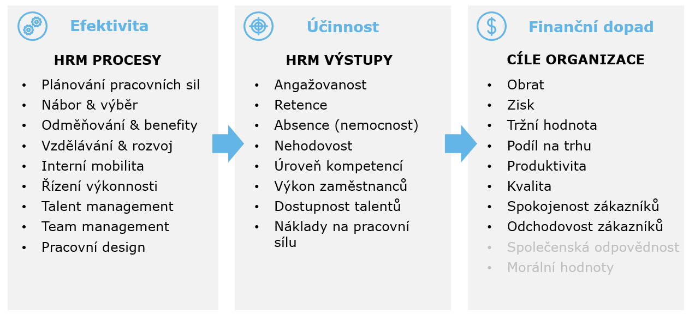

HR analytika ve své podstatě vychází ze známé zásady managementu, že **co nelze měřit, nelze ani (efektivně) řídit a zlepšovat**, a aplikuje tuto zásadu na lidské zdroje. V několika posledních letech potom k tomu navíc přidává nadstavbu v podobě pokročilejších analytických postupů, které mají větší potenciál přijít s hlubšími vhledy a s doporučeními s větším efektem. Ale ať už využíváte pouze základní reporting nebo nějakou pokročilejší analytiku, cíl je vždy stejný – snažit se s pomocí dat a jejich analýzy žádoucím způsobem ovlivnit jednotlivé HR procesy, které organizacím pomáhají dosahovat jejich strategických cílů. Názorně to ilustruje níže uvedené schéma zachycující mechanismus propojující HR procesy s (nejen) finančními výsledky organizace. 



HR analytika pomáhá optimalizovat nastavení tohoto mechanismu tím, že umožňuje nalézat odpovědi na některé klíčové otázky, jako např.:

* Kterými kanály se k nám dostávají ti nejlepší kandidáti?
* Jaké charakteristiky od sebe odlišují úspěšné a neúspěšné kandidáty? 
* Které faktory přispívají k úspěšnému onboardingu? 
* Která „kápéíčka“ mají nejsilnější vazbu na finanční výsledky firmy? 
* Jaké tréninky vedou s nejvyšší pravděpodobností ke zlepšení pracovního výkonu?
* Které intervence mají největší dopad na zaměstnanci pociťovaný well-being nebo work-life balance? 
* Co u zaměstnanců zvyšuje, nebo naopak snižuje míru jejich angažovanosti?
* Kde se v organizaci nachází izolovaná sila a úzká hrdla znemožňující efektivní komunikaci a spolupráci mezi jednotlivými zaměstnanci, týmy nebo i celými odděleními? 
* Kdo představuje skrytý talent, který je potřeba podchytit a dále rozvíjet?  
* Kde lze očekávat odpor v souvislosti s plánovanými změnami ve firmě a kdo naopak může být jejich ambasadorem a katalyzátorem?
* Které faktory přispívají k odchodovosti zaměstnanců a u kterých konkrétních zaměstnanců je zvýšené riziko, že firmu během několika příštích měsíců opustí?

Právě posledně jmenovaný způsob využití HR analytiky často představuje jeden z prvních druhů HR analytických projektů, kterými se ve firmách s HR analytikou začíná, a to z dobře pochopitelného důvodu. S **nežádoucími odchody zaměstnanců** jsou totiž spojené [vysoké přímé i nepřímé náklady](http://login.bersin.com/uploadedFiles/021517-calculating-true-cost-voluntary-turnover.pdf), takže i poměrně mírné snížení odchodovosti zaměstnanců může představovat značnou úsporu, kterou ocení management každé firmy. Naléhavost tohoto problému navíc ještě zvyšuje současná fáze ekonomického cyklu s rekordně nízkou mírou nezaměstnanosti, která v kombinaci s různými on-line platformami na zprostředkování práce motivuje mnoho lidí k hledání nového místa, kde, jak doufají, bude práce zajímavější, smysluplnější a lépe placená a kolegové tam budou sympatičtější a šéfové inspirativnější. Viz graf níže, který na datech z USA názorně dokládá těsnost vztahu mezi mírou nezaměstnanosti a mírou dobrovolné odchodovosti zaměstnanců (*r* = -0,95, *p* < 0,001 ).

```{r echo=FALSE, message=FALSE, warning=FALSE, fig.width=8, fig.height=6}
# Nacteni dat ----------------------------------------------------

# Nacteni potrebnych knihoven
library(readxl)
library(tidyverse)

# Nacteni dat po jejich stazeni z https://www.bls.gov/news.release/jolts.t18.htm , resp. 
# https://data.bls.gov/pdq/SurveyOutputServlet
unmpl_data <- read_xlsx("C:/Users/lstehlik/Documents/_WORKFORCE_ANALYTICS/People_Analytics_Blog/_posts/2018-10-14-hr-analytika-a-odchodovost-zamstnanc/BLS_Unemployment_Rates.xlsx", sheet = "Unemployment Rate", col_names = TRUE)

quits_data <- read_xlsx("C:/Users/lstehlik/Documents/_WORKFORCE_ANALYTICS/People_Analytics_Blog/_posts/2018-10-14-hr-analytika-a-odchodovost-zamstnanc/BLS_Quits_Rates.xlsx")

# Priprava dat pro vizualizaci ------------------------------------

# Data k mire nezamestnanosti
# Prejmenovani sloupcu
colnames(unmpl_data) <- c("Date", "Unmpl_Rate")

# Odstraneni prvniho radku
unmpl_data <- unmpl_data[-1,]

# Zmena typu dat
library(lubridate)
unmpl_data <- unmpl_data %>%
  mutate(Unmpl_Rate = as.numeric(Unmpl_Rate),
         Date = myd(Date, truncated = 1))

# Data k dobrovolne odchodovosti zamestnancu
# Prejmenovani sloupcu
colnames(quits_data) <- quits_data[11,]

# Odstraneni prvnich 11 radku
quits_data <- quits_data[-1:-11,]

# Zmena typu data a formatu dat z sirokeho na dlouhy
quits_data <- quits_data %>%
  gather(Month, Quits_Rate, Jan:Dec, factor_key= FALSE) %>%
  na.omit() %>%
  mutate(Year = as.integer(Year),
         Quits_Rate = as.numeric(Quits_Rate)) %>%
  mutate(Date = paste(Month, " ", Year)) %>%
  mutate(Date = myd(Date, truncated = 1)) %>%
  select(Date, Quits_Rate) %>%
  arrange(Date)
  
# Spojeni obou souboru dat do jednoho
mydata <- quits_data %>%
  inner_join(unmpl_data, on = "Date")

# Vizualizace dat -----------------------------------------------
library(scales)

# Vytvoreni grafu
mydata %>%
  ggplot(aes(x = Date)) +
  geom_line(aes(y = Quits_Rate, color = "Míra dobrovolné odchodovosti (po statistickém odstranění sezónní komponenty)"), size = 1.5) +
  geom_line(aes(y = Unmpl_Rate/5, color = "Míra nezaměstnanosti (po statistickém odstranění sezónní komponenty)"), size = 1.5) +
  scale_y_continuous(sec.axis = sec_axis(~.*5, name = "Měsíční míra nezaměstnanosti [%]")) +
  scale_x_date(date_breaks = "12 months",
               labels=date_format("%m/%y")) +
  scale_colour_manual(values = c("#0A9BD0", "orange")) +
  theme(axis.text.x = element_text(angle = 45, hjust = 1),
        legend.position="bottom", 
        legend.direction = "vertical") +
  labs(title = "Vztah mezi mírou nezaměstnanosti a mírou dobrovolné odchodovosti",
       subtitle = "Údaje pro USA mezi lety 2001 a 2018",
       caption = "Zdroj dat: Bureau of Labor Statistics",
       y = "Měsíční míra dobrovolné odchodovosti [%]",
       x = "Měsíc a rok",
       colour = "")

# Korelace mezi mirou nezamestnanosti a dobrovolne odchodovosti zamestnancu
# cor.test(mydata$Quits_Rate, mydata$Unmpl_Rate)$estimate
# cor.test(mydata$Quits_Rate, mydata$Unmpl_Rate)$p.value
```

Vzhledem k palčivosti tohoto problému, který trápí nejednu firmu, není žádným velkým překvapením, že se tématu odchodovosti zaměstnanců věnovalo a stále věnuje velké množství různých studií. Takto např. na konci roku 2017 vyšla rozsáhlá meta-analýza od autorů [Rubensteina, Eberlyové a Leeho](https://onlinelibrary.wiley.com/doi/abs/10.1111/peps.12226), kteří syntetizovali výsledky více než 300 dílčích výzkumů týkajících se prediktorů odchodovosti. Můžeme se tak oprávněně ptát, co nového nám může přinést HR analytika zaměřená na odchodovost zaměstnanců realizovaná pouze v jediné organizaci. Nebylo vše podstatné k tomuto tématu již objeveno? (K této otázce viz např. [tento inspirativní a trochu provokativní článek](https://www.linkedin.com/pulse/predicting-turnover-stating-bleedin-obvious-hedegaard-rasmussen/) od [Thomase Rasmussena](https://www.linkedin.com/in/thomas-hedegaard-rasmussen-9b26043/).) Je pravda, že není příliš pravděpodobné, že při analýze vašich vlastních dat narazíte na nějaký naprosto nový faktor související s odchodovostí. Na druhou stranu je rovněž pravda, že každá organizace je v něčem jedinečná, takže některé z retenčních faktorů pro danou organizaci budou pravděpodobně více a jiné méně důležité. Tato informace o relativní důležitosti jednotlivých retenčních faktorů je potom klíčová při nastavování retenčního plánu a HR analytika může být při tomto velice nápomocná.

S pomocí [tohoto dashboardu](https://aanalytics.shinyapps.io/turnover_analytics_dashboard/) - vytvořeného prostřednictvím analytického nástroje [R](https://www.r-project.org/) a vizualizačního nástroje [Shiny](https://shiny.rstudio.com/) za využití [ukázkových dat od společnosti IBM](https://www.ibm.com/communities/analytics/watson-analytics-blog/hr-employee-attrition/) - si můžete sami vyzkoušet, jak užitečné by pro Vás mohly být výstupy z takového HR analytického projektu zaměřeného na odchodovost zaměstnanců. Dashboard obsahuje informace, které pomáhají (nejen) managementu zodpovědět řadu klíčových otázek, které stojí na počátku každého účinného plánu na retenci zaměstnanců, jako např.:

* Kolik zaměstnanců nás ročně opouští?
* Které skupiny zaměstnanců odcházejí nejčastěji?
* Jaký je externí benchmark? Jsme na tom podobě jako konkurence v oboru?
* Představuje pro nás stávající úroveň odchodovosti závažný problém, a vyplatí se nám ho tedy řešit?
* Z jakých důvodů lidé obecně nejčastěji odcházejí ze zaměstnání?
* Jaké faktory přispívají k odchodu specificky našich zaměstnanců?
* Jaká pro-retenční opatření jsou obecně k dispozici?
* Jaká pro-retenční opatření bychom měli zvolit vzhledem k pravděpodobným důvodům odchodů našich zaměstnanců?  
* Na jaké skupiny zaměstnanců se především zaměřit z hlediska prevence jejich odchodovosti? 
* U kterých konkrétních zaměstnanců existuje zvýšené riziko, že odejdou, a na jaké konkrétní retenční faktory se u nich zaměřit v rámci pravidelného stay interview? 

Jak je z výše uvedeného výčtu otázek patrné, dashboard obsahuje informace, které při svém rozhodování mohou využít **nejen HR manažeři, ale také HR business partneři nebo přímo team-leadeři a linioví manažeři** jednotlivých týmů či oddělení. Kromě toho dashboard obsahuje také řadu technických detailů o použitém predikčním modelu a samotná data, které stojí v pozadí všech prezentovaných vizualizací a analýz. S jejich pomocí tak **HR/Business analytik** může např. hledat optimální způsob, jak nastavit skórovací algoritmus, aby se maximalizoval pozitivní efekt pro-retenčních opatření, nebo může v dostupných datech sám hledat nějaké další užitečné informace. Více viz již [samotný dashboard](https://aanalytics.shinyapps.io/turnover_analytics_dashboard/), z něhož můžete níže vidět několik screenshotů. 

*Screenshot části dashboardu, která obsahuje různé řezy odchodovostí zaměstnanců, a dává tak dobrý přehled o tom, které skupiny zaměstnanců jsou odchodovostí nejvíce ohrožené.*  


*Screenshot části dashboardu, která obsahuje informace o pravděpodobnosti odchodu jednotlivých zaměstnanců společně s dalšími informacemi, které mohou posloužit jako podklad pro individuální intervence s cílem předejít nežádoucím odchodům zaměstnanců.* 


*Screenshot části dashboardu, která obsahuje informace o výkonu/kvalitě statistického modelu použitého k identifikaci významných prediktorů odchodovosti zaměstnanců a k odhadu pravděpodobnosti odchodu jednotlivých zaměstnanců.* 


