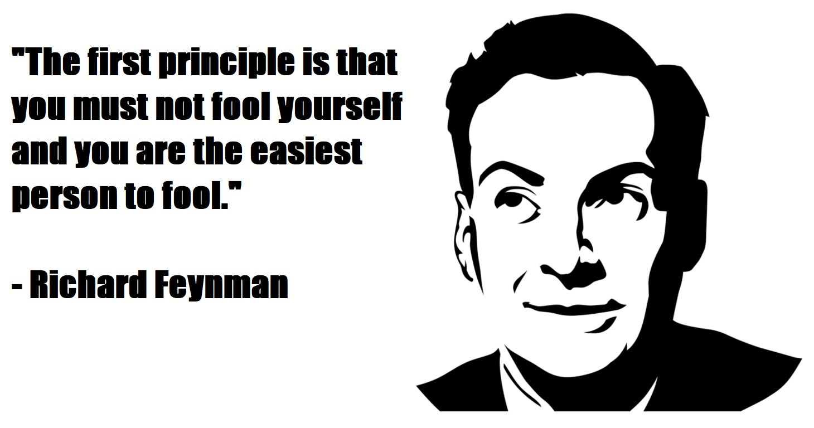

The turn of the year, which is full of all sorts of resolutions to change for the better in our private lives and in our organizations, is a good time to remind ourselves that analytic tools can be very helpful in our efforts to make these resolutions come true. One way they can help us is by verifying that we have really achieved our stated goals and that we are not just fooling ourselves into believing so. We need to keep in mind [Richard Feynman](https://en.wikipedia.org/wiki/Richard_Feynman)'s famous principle of critical thinking...

  


<br>  

One of the tools that can help us with that is [segmented regression analysis of interrupted time series data](https://www.alnap.org/system/files/content/resource/files/main/segmented-regression-wagner-2002.pdf) (thanks to [Masatake Hirono](https://www.linkedin.com/posts/masatakehirono1351_day044-100daysofcode-r-activity-6749580595254456320-qHK_) for pointing me to its existence). It allows us to model changes in various processes and outcomes that follow interventions, while controlling for other types of changes (e.g. trends and seasonality) that may have occurred regardless of the interventions. It is thus very useful for data analysis conducted within studies with a [quasi experimental study design](https://en.wikipedia.org/wiki/Quasi-experiment) that are often in the organizational context the best alternative to the “gold standard” of [randomized controlled trials](https://en.wikipedia.org/wiki/Randomized_controlled_trial) (RCTs) that are not always realizable or politically acceptable.

For illustration, let's use this tool for testing hypothesis about people’s increased interest in topics related to work-life balance and well-being due to the COVID-19 pandemic and subsequent changes in the way people work. As a proxy measure of this interest we will use worldwide search interest data over the last 10 years from [Google Trends](https://trends.google.com/trends/?geo=US) using search terms *work-life balance* and *well-being* (see Fig. 1 and 2 below).


*Fig. 1: Interest in “work-life balance” topic over the last 10 years measured as a search interest by Google Trends. The numbers represent search interest relative to the highest point on the chart for the given region and time. A value of 100 is the peak popularity for the term. A value of 50 means that the term is half as popular. A score of 0 means that there was not enough data for this term.*  


<br>  


*Fig. 2: Interest in “well-being” topic over the last 10 years measured as a search interest by Google Trends. The numbers represent search interest relative to the highest point on the chart for the given region and time. A value of 100 is the peak popularity for the term. A value of 50 means that the term is half as popular. A score of 0 means that there was not enough data for this term.*  


<br>  

Based solely on the visual inspection of the graphs, it is pretty difficult to tell whether there was some effect of the COVID-19 pandemic or not, especially in the case of work-life balance (for the purpose of this analysis, the beginning of the pandemic is assumed to have started in March 2020). For sure it’s not a job for “inter-ocular trauma test” when the existence of the effect hits you directly between the eyes. We need to rely here on inferential statistics and its ability to help us with distinguishing signal from noise.

Before conducting the analysis itself, we need to wrangle the data from Google Trends a little bit using the recipe presented in [the Wagner, Zhang, and Ross-Degnan’s paper](https://www.alnap.org/system/files/content/resource/files/main/segmented-regression-wagner-2002.pdf). Specifically, we need the following five variables (or six, given that we have two dependent variables):  

* **search interest** – numerical variable representing search interest relative to the highest point on the chart for the given region and time; this variable is truncated within the interval between values of 0 and 100; a value of 100 is the peak popularity for the term; a value of 50 means that the term is half as popular; a score of 0 means that there was not enough data for this term; this variable serves as a dependent (criterion) variable;  
* **elapsed time** – numerical variable representing the number of months that elapsed from the beginning of the time series; this variable enables estimation of the size and direction of the overall trend in the data;  
* **pandemic** – dichotomic variable indicating the presence/absence of pandemic; as already mentioned above, for the purpose of this analysis, the beginning of the pandemic is assumed to have started in March 2020; this variable enables testing hypothesis about the effect of pandemic on people’s interest in work-life balance and well-being;  
* **elapsed time after pandemic onset** – numerical variable representing the number of months that elapsed from the beginning of pandemic; this variable enables estimation of the size and direction of the trend in the data after the onset of pandemic;    
* **month** – categorical variable representing specific month within a year; this variable enables controlling for the effect of seasonality.

```{r echo=TRUE, message=FALSE, warning=FALSE}

# uploading library for data manipulation
library(tidyverse)

# uploading data
dfWorkLifeBalance <- readr::read_csv("./workLifeBalanceGoogleTrendData.csv")
dfWellBeing <- readr::read_csv("./wellBeingGoogleTrendData.csv")

dfAll <- dfWorkLifeBalance %>%
  # joining both datasets
  dplyr::left_join(
    dfWellBeing, by = "Month"
    ) %>%
  # changing the format and name of Month variable
  dplyr::mutate(
    Month = stringr::str_glue("{Month}-01"),
    Month = lubridate::ymd(Month)
    ) %>%
  dplyr::rename(
    date = Month
    ) %>%
  # creating new variable month
  dplyr::mutate(
    month = lubridate::month(date,label = TRUE, abbr = TRUE),
    month = factor(month, 
                   levels = c("Jan","Feb","Mar","Apr","May","Jun","Jul","Aug","Sep","Oct","Nov","Dec"), 
                   labels = c("Jan","Feb","Mar","Apr","May", "Jun","Jul","Aug","Sep","Oct","Nov","Dec"), 
                   ordered = FALSE)
    ) %>%
  # arranging data in ascending order by date
  dplyr::arrange(
    date
    ) %>%
  # creating new variables
  dplyr::mutate(
    elapsedTime = row_number(),
    pandemic = case_when(
      date >= '2020-03-01' ~ 1,
      TRUE ~ 0
      ),
    elapsedTimeAfterPandemic = cumsum(pandemic)
    ) %>%
  # changing order of variables in df
  dplyr::select(
    date, workLifeBalance, wellBeing, elapsedTime, month, pandemic, elapsedTimeAfterPandemic
    )

```  
  
  
<br>

Here is a table with the resulting data we will use for testing our hypothesis.  

```{r}

# uploading library for making user-friendly data table
library(DT)

DT::datatable(
  dfAll,
  class = 'cell-border stripe', 
  filter = 'top',
  extensions = 'Buttons',
  fillContainer = FALSE,
  options = list(
    pageLength = 5, 
    autoWidth = TRUE,
    dom = 'Bfrtip',
    buttons = c('copy'), 
    scrollX = TRUE, 
    selection="multiple"
    )
  )

```
  
*Table 1: Final dataset used for testing hypothesis about impact of the COVID-19 pandemic on people's interest in work-life balance and well-being.*  


<br>  

We will model our data using common segmented regression models that have following general structure:  

$$Y_{t} = β_{0} + β_{1}*time_{t} + β_{2}*intervention_{t} + β_{3}*time after intervention_{t} + e_{t}$$

Given that we are dealing with correlated and truncated data, we will include in our models two specific terms – autocorrelation and truncation terms that will treat these specific characteristics of our data.

Now let’s fit the data to the model and check what it tells us about the effect of pandemic on people’s search interest in work-life balance and well-being. We will use [brms r package](https://cran.r-project.org/web/packages/brms/vignettes/brms_overview.pdf) that enables making inferences about statistical models’ parameters within Bayesian inferential framework.  Because of that, we also need to specify some additional parameters (e.g. `chains`, `iter` or `warmup`) of [the Markov Chain Monte Carlo (MCMC) algorithm](https://en.wikipedia.org/wiki/Markov_chain_Monte_Carlo) that will generate posterior samples of our models’ parameters.  

Bayesian framework also enables us to specify priors for estimated parameter and through them include our domain knowledge in the analysis. The specified priors are important for both parameter estimation and hypothesis testing as they define our starting information state before we take into account our data. Here we will use rather wide, uninformative, and only mildly regularizing priors (it means that the results of the inference will be very close to the results of standard, frequentist parameter estimation/hypothesis testing). 

```{r echo=FALSE, message=FALSE, warning=FALSE, results = "hide"}

# uploading library for Bayesian statistical inference
library(brms)

# checking available priors for the models 
brms::get_prior(
  workLifeBalance | trunc(lb = 0, ub = 100) ~ elapsedTime + pandemic + elapsedTimeAfterPandemic + month + ar(p = 1),
  data = dfAll,
  family = gaussian())

brms::get_prior(
  wellBeing | trunc(lb = 0, ub = 100) ~ elapsedTime + pandemic + elapsedTimeAfterPandemic + month + ar(p = 1),
  data = dfAll,
  family = gaussian())

```

```{r echo=TRUE, message=FALSE, warning=FALSE, results = "hide"}

# uploading library for Bayesian statistical inference
library(brms)

# specifying wide, uninformative, and only mildly regularizing priors for predictors in both models 
priors <- c(set_prior("normal(0,50)", class = "b", coef = "elapsedTime"),
            set_prior("normal(0,50)", class = "b", coef = "elapsedTimeAfterPandemic"),
            set_prior("normal(0,50)", class = "b", coef = "pandemic"),
            set_prior("normal(0,50)", class = "b", coef = "monthApr"),
            set_prior("normal(0,50)", class = "b", coef = "monthAug"),
            set_prior("normal(0,50)", class = "b", coef = "monthDec"),
            set_prior("normal(0,50)", class = "b", coef = "monthFeb"),
            set_prior("normal(0,50)", class = "b", coef = "monthJul"),
            set_prior("normal(0,50)", class = "b", coef = "monthJun"),
            set_prior("normal(0,50)", class = "b", coef = "monthMar"),
            set_prior("normal(0,50)", class = "b", coef = "monthMay"),
            set_prior("normal(0,50)", class = "b", coef = "monthNov"),
            set_prior("normal(0,50)", class = "b", coef = "monthOct"),
            set_prior("normal(0,50)", class = "b", coef = "monthSep"))

# defining the statistical model for work-life balance
modelWorkLifeBalance <- brms::brm(
  workLifeBalance | trunc(lb = 0, ub = 100) ~ elapsedTime + pandemic + elapsedTimeAfterPandemic + month + ar(p = 1),
  data = dfAll,
  family = gaussian(),
  prior = priors,
  chains = 4,
  iter = 3000,
  warmup = 1000,
  seed = 12345,
  sample_prior = TRUE
  )

# defining the statistical model for well-being
modelWellBeing <- brms::brm(
  wellBeing | trunc(lb = 0, ub = 100) ~ elapsedTime + pandemic + elapsedTimeAfterPandemic + month + ar(p = 1),
  data = dfAll,
  family = gaussian(),
  prior = priors,
  chains = 4,
  iter = 3000,
  warmup = 1000,
  seed = 678910,
  sample_prior = TRUE
  )

```  
  
  
<br>  

Before making any inferences, we should make some sanity checks to be sure that the mechanics of the MCMC algorithm worked well and that we can use generated posterior samples for making inferences about our models’ parameters. There are many ways for doing that, but here we will use only visual check of the MCMC chains. We want plots of these chains look like hairy caterpillar which would indicate convergence of the underlying Markov chain to stationarity and convergence of Monte Carlo estimators to population quantities, respectively. As can be seen in Graph 1 and 2 below, in case of both models we can observe wanted characteristics of the MCMC chains described above. (For additional MCMC diagnostics procedures, see for example [Bayesian Notes](https://jrnold.github.io/bayesian_notes/mcmc-diagnostics.html) from Jeffrey B. Arnold.)     

```{r fig.height=9, fig.width=8}

# uploading library for plotting Bayesian models
library(bayesplot)

# plotting the MCMC chains for the modelWorkLifeBalance 
bayesplot::mcmc_trace(
  modelWorkLifeBalance,
  facet_args = list(nrow = 6)
  ) +
  ggplot2::labs(
    title = "Plots of the MCMC chains used for estimation of the modelWorkLifeBalance's parameters"
    )

```  
*Graph 1: Trace plots of Markov chains for individual parameters of the modelWorkLifeBalance.*  

<br>

```{r fig.height=9, fig.width=8}

# plotting the MCMC chains for the modelWellBeing 
bayesplot::mcmc_trace(
  modelWellBeing,
  facet_args = list(nrow = 6)
  ) +
  ggplot2::labs(
    title = "Plots of the MCMC chains used for estimation of the modelWellBeing's parameters"
    )

```
*Graph 2: Trace plots of Markov chains for individual parameters of the modelWellBeing.* 

<br>

It is also important to check how well the models fit the data. We can use for this purpose posterior predictive checks that use specified number of sampled posterior values of models' parameters and show how well the fitted models predict observed data. We can see in Graphs 3 and 4 that both models fit the observed data reasonably well.   

```{r fig.width=8}

# investigating modelWorkLifeBalance fit

# specifying the number of samples
nsamples = 1000

brms::pp_check(
  modelWorkLifeBalance, 
  nsamples = nsamples
  ) + 
  ggplot2::labs(
    title = stringr::str_glue("Posterior predictive checks for modelWorkLifeBalance (using {nsamples} samples)")
    )

```  
*Graph 3: Posterior predictive checks comparing simulated/replicated data under the fitted modelWorkLifeBalance with the observed data.*

<br>


```{r fig.width=8}

# investigating modelWellBeing fit

# specifying the number of samples
nsamples = 1000

brms::pp_check(
  modelWellBeing, 
  nsamples = nsamples
  ) + 
  ggplot2::labs(
    title = stringr::str_glue("Posterior predictive checks for modelWellBeing (using {nsamples} samples)")
    )

```  
*Graph 4: Posterior predictive checks comparing simulated/replicated data under the fitted modelWellBeing with the observed data.*

<br>

Now, after having sufficient confidence that - using terminology from the [Richard McElreath's book Statistical Rethinking](https://xcelab.net/rm/statistical-rethinking/) - our "small worlds" can pretty accurately mimic the data coming from our real,"big world", we can use our models' parameters to learn something about our research questions. Our primary interest is in the coefficient value of the pandemic term in our models. It expresses how much and in what direction people's search interest in work-life balance and well-being changed after the onset of pandemic.  

In Graph 5 and 6 we can see posterior distributions of three selected parameters of our two models. In both cases the posterior distribution of the pandemic term is (predominantly or completely) on the right side of the zero value, which supports the claim about existence of the effect of pandemic on people's increased search interest in work-life balance and well-being. As is apparent from the graphs, for well-being (Graph 6) this evidence is much stronger than for work-life balance (Graph 6), which corresponds to impression we might have when looking at the original Google Trends charts shown in Fig. 1 and 2. 

```{r fig.width=8}

# uploading library for 
library(tidybayes)

# visualizing posterior distributions of selected parameters of the modelWorkLifeBalance
modelWorkLifeBalance %>%
  tidybayes::gather_draws(
    b_pandemic, b_elapsedTime, b_elapsedTimeAfterPandemic
    ) %>%
  dplyr::mutate(
    .variable = factor(
      .variable, 
      levels = c("b_pandemic", "b_elapsedTime", "b_elapsedTimeAfterPandemic"), 
      ordered = TRUE
      )
    ) %>%
  dplyr::rename(value = .value) %>%
  ggplot2::ggplot(
    aes(x = value)
    ) +
  ggplot2::geom_density(
    fill = "lightblue"
  ) +
  ggplot2::facet_wrap(
    ~.variable,
    scales = "free",
    nrow = 1
    ) +
  ggplot2::labs(
    title = "Posterior distributions of selected parameters of the modelWorkLifeBalance"
    )

```  
*Graph 5: Visualization of the posterior distributions of selected parameters of the modelWorkLifeBalance.*  


<br>  

```{r fig.width=8}

# visualizing posterior distributions of selected parameters of the modelWellBeing
modelWellBeing %>%
  tidybayes::gather_draws(
    b_pandemic, b_elapsedTime, b_elapsedTimeAfterPandemic
    ) %>%
  dplyr::mutate(
    .variable = factor(
      .variable, 
      levels = c("b_pandemic", "b_elapsedTime", "b_elapsedTimeAfterPandemic"), 
      ordered = TRUE
      )
    ) %>%
  dplyr::rename(value = .value) %>%
  ggplot2::ggplot(
    aes(x = value)
    ) +
  ggplot2::geom_density(
    fill = "lightblue"
  ) +
  ggplot2::facet_wrap(
    ~.variable,
    scales = "free",
    nrow = 1
    ) +
  ggplot2::labs(
    title = "Posterior distributions of selected parameters of the modelWellBeing"
    )

```  
*Graph 5: Visualization of the posterior distributions of selected parameters of the modelWellBeing.*  


<br>  

To generate more summary statistics about posterior distributions (and also some diagnostic information like `Rhat` or `ESS`), we can use `summary()` function.

```{r echo=TRUE, message=FALSE, warning=FALSE, results = "markup"}

# generating a summary of the results for modelWorkLifeBalance 
summary(modelWorkLifeBalance)

```  


<br>  

```{r echo=TRUE, message=FALSE, warning=FALSE, results = "markup"}

# generating a summary of the results for modelWellBeing 
summary(modelWellBeing)

```  


<br> 

Given that for work-life balance model the posterior distribution of pandemic term crosses the zero value, it would be useful to know how strong is the evidence in the favor of hypothesis that pandemic term is larger than zero. For that purpose we can extract posterior samples and use them for calculation of the proportion of values that are larger/smaller than zero. The resulting proportions show that the vast majority of posterior distribution (approximately 93%) lies above zero.

```{r echo=TRUE, message=FALSE, warning=FALSE, results = "markup"}

# extracting posterior samples
samples <- posterior_samples(modelWorkLifeBalance)

# probability of b_pandemic coefficient being higher
sum(samples$b_pandemic > 0) / nrow(samples)

# probability of b_pandemic coefficient being lower than 0
sum(samples$b_pandemic < 0) / nrow(samples)

```  


<br> 

Another option would be to compute [Bayes factor](https://en.wikipedia.org/wiki/Bayes_factor) that expresses degree to which available data favors our hypothesis in comparison with the null model corresponding to normal prior distribution with the parameters `normal(0,50)`. We can see that Bayes factor (`Evid.Ratio` in the table below) has value around 12.5 which indicates strong evidence in favor of our hypothesis, in terms of [Harold Jeffreys](https://en.wikipedia.org/wiki/Harold_Jeffreys)' scale for interpretation of Bayes factors. Specifically it means that under the fitted model for well-being the hypothesis about pandemic term being higher than zero is 12.5 times more probable than under the null model. In other words, the data should shift our believe pretty strongly in direction of acceptance of the existence of pandemic's positive effect on people's search interest in work-life balance.  


```{r echo=TRUE, message=FALSE, warning=FALSE, results = "markup"}

# computing Bayes factor for hypothesis that pandemic term in the modelWorkLifeBalance is larger than zero  
brms::hypothesis(
  modelWorkLifeBalance,
  "pandemic > 0"
  )

```  

```{r fig.width=8}

# plotting prior and posterior distribution for pandemic term in the modelWorkLifeBalance 
plot(
  brms::hypothesis(
    modelWorkLifeBalance,
    "pandemic > 0"
  )
)

```
*Graph 6: Visualization of prior and posterior distribution of pandemic term in the modelWorkLifeBalance.* 


<br> 

Besides the major hypothesis we may be also interested in...  

* overall trend across the last ten years,  
* trend after the onset of pandemic, and also  
* seasonality of people's search interest over the months within individual years.  

For that purpose we might use, besides the summary statistics and graphs with posterior distributions depicted above, plots showing conditional effects for each of the predictors. From the plots in Graph 7 it is thus clear that in case of work-life balance searches, the overall trend across the last ten years is decreasing, after the onset of pandemic the trend is rather stagnating, and within individual years the search interest follows work & holiday seasonality (lower search interest during the holiday parts of the year - June, July, August and December - and higher during the rest of the year). In case of well-being searches, the seasonality part is similar, but the trends differ - both of them are increasing (see Graph 8).     

```{r echo=FALSE, message=FALSE, warning=FALSE, results = "hidden", fig.show='hide' }

# plotting conditional effects for each predictor for modelWorkLifeBalance 
figListWorkLifeBalance <- plot(brms::conditional_effects(modelWorkLifeBalance), ask = FALSE)

```


```{r fig.width=8, fig.height=12}

# uploading library for arranging multiple ggplots
library(ggpubr)

# putting all graphs with conditional effects for modelWorkLifeBalance together  
ggpubr::ggarrange(
  plotlist = figListWorkLifeBalance, 
  nrow = 4
  ) %>%
  ggpubr::annotate_figure(
    top = text_grob("Conditional effects for each predictor in the modelWorkLifeBalance")
)
     
```  
*Graph 7: Visualization of conditional effects of predictors from modelWorkLifeBalance. The predictors are conditioned on the mean in the case of continuous variables and reference category in the case of factors.*  


<br> 

```{r echo=FALSE, message=FALSE, warning=FALSE, results = "hidden", fig.show='hide' }

# plotting conditional effects for each predictor for modelWellBeing  
figListWellBeing <- plot(brms::conditional_effects(modelWellBeing), ask = FALSE)

```

```{r fig.width=8, fig.height=12}

# putting all graphs with conditional effects for modelWellBeing together  
ggpubr::ggarrange(
  plotlist = figListWellBeing, 
  nrow = 4
  ) %>% 
  ggpubr::annotate_figure(
    top = text_grob("Conditional effects for each predictor in the modelWellBeing")
)

```  
*Graph 8: Visualization of conditional effects of predictors from modelWellBeing. The predictors are conditioned on the mean in the case of continuous variables and reference category in the case of factors.* 


<br> 

In conclusion, we can say that there is some evidence that the COVID-19 pandemic has prompted people to be more interested in topics related to work-life balance and well-being. I wish us all to be able to transform our increased interest in these topics into truly increased quality of our personal and professional lives. It would be a shame not to use that extra incentive many of us have now for making significant change in our lives.


P.S. The whole script is available in [Jupyter Notebook on GitHub](https://github.com/lstehlik2809/Bayesian-segmented-regression.git).  


