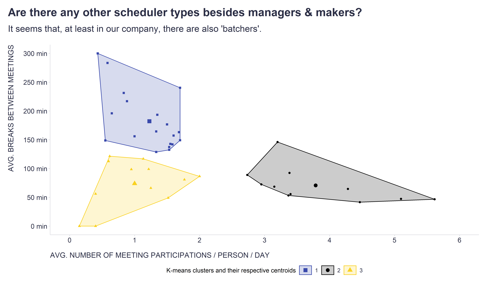
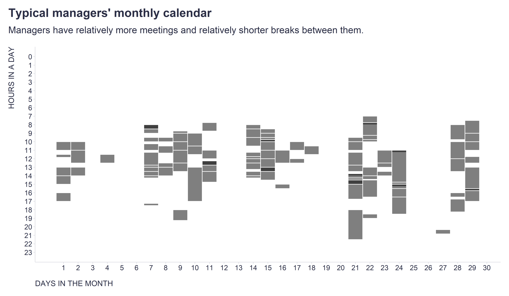
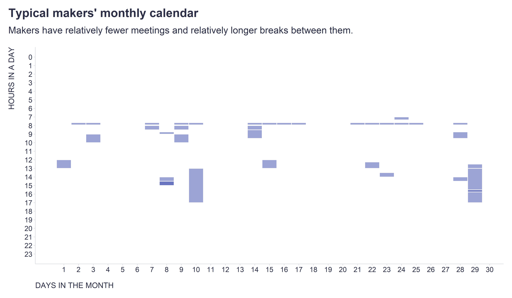
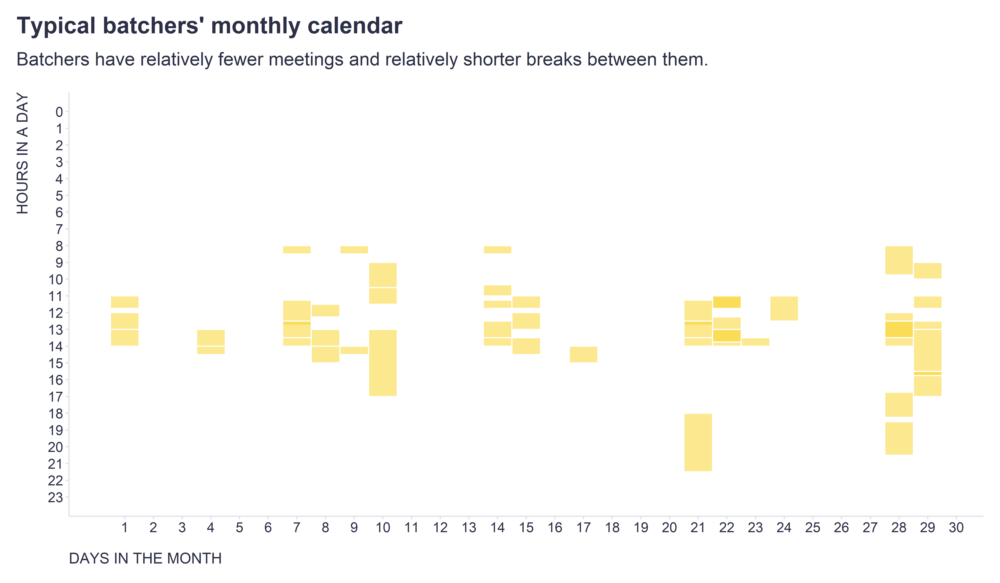

I am sure that many of you have heard of the two types of schedules as described by Paul Graham in his famous article [Maker's Schedule, Manager's Schedule](http://www.paulgraham.com/makersschedule.html): 

*The manager's schedule [is] embodied in the traditional appointment book, with each day cut into one hour intervals. [By] default you change what you're doing every hour. But [makers] generally prefer to use time in units of half a day at least. You can't write or program well in units of an hour. That's barely enough time to get started. When you're operating on the maker's schedule, meetings are a disaster. A single meeting can blow a whole afternoon, by breaking it into two pieces each too small to do anything hard in. Plus you have to remember to go to the meeting.*

I recently realized that I have only seen illustrative pictures on this topic so far, but not any real data. This inspired me to look at our own collaboration data at [Time Is Ltd.](https://www.timeisltd.com/) and see if these two schedule categories can be found there. 

When I contrasted the data on the average number of meetings per day and the average time between meetings, there were indeed categories of people who either have relatively more meetings with relatively shorter breaks (*managers*), or have relatively fewer meetings with relatively longer breaks (*makers*). 

But beyond that, there was a third type, which I called *batchers* - they have relatively fewer meetings with relatively shorter breaks, which is a good strategy when you have to be both manager and creator, which may be the case for more and more people as we move to remote working.  

In the charts below you can see how typical monthly calendars of these three types of schedulers look like.

What we cannot see in our own data, but could theoretically be there, is a fourth category I call *overtimers*, who have relatively more meetings but manage to keep relatively longer breaks in between. However, this can only be achieved by making the meetings more spread out over time, i.e. at the cost of working after hours. 

How about you? Where would you fit in? And is there anyone among you who would fit into the fourth, missing category? 

