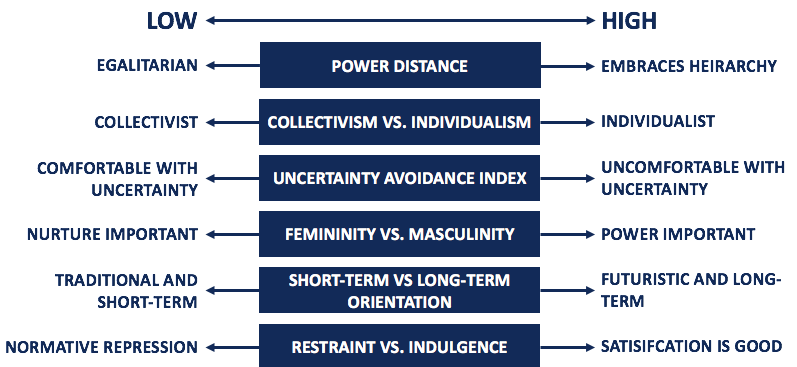

One of the advantages of switch to remote working is that companies can expand the pool of talent from which they choose their employees, without being too constrained by country or even continental boundaries. However, the resulting cultural diversity can bring not only positive effects (e.g. a broader set of perspectives, a more diverse skill base, local market knowledge and insight, better creativity and innovation, etc.) but also some challenges (e.g. risk of prejudice or negative cultural stereotypes, misinterpretation of communication, conflicting work styles, different understanding of professional etiquette, etc.). 

Better knowledge and awareness of the cultural specificities of the societies from which people come is one [way of dealing with these challenges](https://en.wikipedia.org/wiki/Approaches_to_prejudice_reduction). In this respect, **[Hofstede's theory of cultural dimensions](https://en.wikipedia.org/wiki/Hofstede%27s_cultural_dimensions_theory)** may be useful to us. Just as [Big-5 theory](https://en.wikipedia.org/wiki/Big_Five_personality_traits) facilitates our understanding of other people's personalities, Hofstede's theory facilitates our understanding of their cultural background by describing their social values and releated behaviors through the following six cultural dimensions:

[{width=100%}](https://corporatefinanceinstitute.com/resources/knowledge/other/hofstedes-cultural-dimensions-theory/)
*Image source:* https://corporatefinanceinstitute.com/resources/knowledge/other/hofstedes-cultural-dimensions-theory/

You can easily check how countries are doing on these six dimensions on [the Hofstede Insights website](https://www.hofstede-insights.com/product/compare-countries/). To make it easier to compare cultural differences/similarities between countries, I built a simple a simple app that projects the cultural profiles of countries into 2D space using dimensionality reduction technique called [UMAP (Uniform manifold approximation and projection)](https://en.wikipedia.org/wiki/Nonlinear_dimensionality_reduction). By selecting a specific cultural dimension, you can see how it is distributed across countries and continents. In addition, you can select some specific countries in the comparator and compare them across all six cultural dimensions. 

Check it out here ➡️ https://peopleanalyticsblog.shinyapps.io/Hofstede_Cultural_Dimensions/

[{width=100%}](https://peopleanalyticsblog.shinyapps.io/Hofstede_Cultural_Dimensions/)

[{width=100%}](https://peopleanalyticsblog.shinyapps.io/Hofstede_Cultural_Dimensions/)

