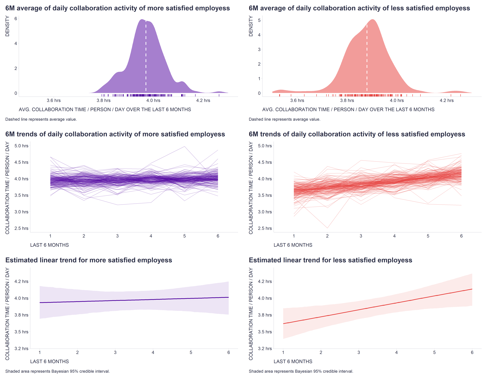

As predictive analytics practitioners know, **trend variables** can be more useful in many situations for predicting certain phenomena than **standard variables** that simply refer to the state of the world at a particular time point or period. 

For example, when trying to predict [employee attrition](https://www.aihr.com/blog/employee-attrition/), a downward trend in the use of a piece of company equipment, such as a printer/copier, over the 6 months prior to the resignation may be more predictive than the absolute number of pages printed/copied over the same period. 

This is also true for our domain we focus at [Time is Ltd.](https://www.timeisltd.com/) where, among other things, we try to use collaboration data to infer some aspects of [employee experience](https://www.cultureamp.com/blog/what-is-employee-experience).

To illustrate, the attached chart shows the distribution of the typical daily amount of time people spend by collaboration for two groups of employees - one with above-average scores and the other with below-average scores on the employee satisfaction survey. As you can see, there is little difference between the two groups in terms of the average daily amount of time people spend by collaboration over the last six months (see the density plots), but there is a fairly clear difference in the trend of this metric over the same period, suggesting that less satisfied employees may be suffering from increasing collaboration overload (see the line charts with trend lines for individual employees and the estimated overall linear trend).  

  

 

  

Do you have a similar experience with or just a strong hunch about other metrics in your area of expertise? Let me know in the comments. 

