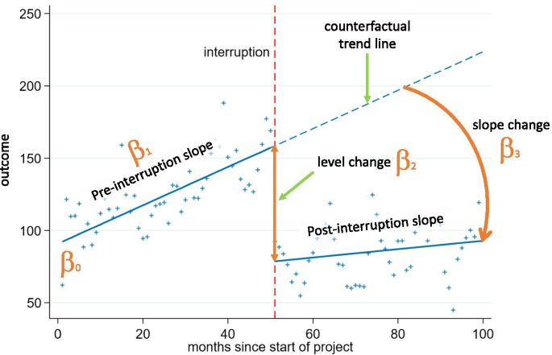

## People analytics popularity after pandemic  

There is a fairly common perception among the people analytics professionals with whom I am in contact that after the COVID pandemic, companies are much more willing to use the insights provided by people analytics teams and incorporate them into their business-related decision-making processes. 

I wondered if I could find any empirical support for this feeling in the surge of global web search interest in "people analytics" and "HR analytics" terms on Google after the pandemic outbreak, assuming the pandemic broke out in March 2020.

Let's start our quest with a simple visual inspection of a line chart showing the trend of worldwide web search interest in "people analytics" and "HR analytics" terms on Google from January 2007 to July 2022. (You can replicate this chart using the [Google Trends](https://trends.google.com/trends){target="_blank"} website and the search terms, time range, location, and source for searches described above. If you are familiar with R, you can use the code below.)

```{r message=FALSE, warning=FALSE}

# uploading library for getting data from Google Trends
library(gtrendsR)
# uploading libraries for data manipulation
library(tidyverse)
library(lubridate)

# setting parameters for Google Trends
searchTerms   <- c("people analytics", "hr analytics")
location      <- "" # global
time          <- "2007-01-01 2022-07-31"
source         <- "web"

# getting Google Trends data
gtrendsResult <- gtrendsR::gtrends(
    keyword = searchTerms, 
    geo     = location, 
    time    = time,
    gprop   = source
    )

# cleaning data
gtrendsResultDf <- gtrendsResult %>%
    purrr::pluck("interest_over_time") %>%
    dplyr::select(date, hits, keyword) %>%
    dplyr::mutate(date = lubridate::ymd(date))

```


Towards the end of the time series, somewhere between September 2019 and March 2020, it seems that the trend stops increasing and starts to stagnate, except for the very last part of the graph, which shows a sharp increase in searches for both terms, but this may just be the result of the improved data collection system from January 2022 onwards (as indicated by the vertical line in the graph with a note). Thus, the data seems to suggest the opposite of what we would expect if a pandemic were to have a positive effect on interest in people analytics.  

However, after combining the results for the two search terms and plotting them on a graph together with the unadjusted regression trend lines, the resulting picture gives a slightly different impression. There appears to be little to no decline in interest in people analytics immediately after the pandemic outbreak, but a steeper slope of change after the pandemic. 

```{r fig.width = 8, fig.height = 5}

# normalize function
normalize <- function(x) {
  return ((x - min(x)) / (max(x) - min(x)))
}


gtrendsResultDf %>%
  tidyr::pivot_wider(names_from = "keyword", values_from = "hits") %>%
  dplyr::mutate(
    interestInPeopleAnalytics = `people analytics` + `hr analytics`,
    interestInPeopleAnalytics = normalize(interestInPeopleAnalytics)*100
  ) %>%
    # creating new pandemic variable 
  dplyr::mutate(
    pandemic = case_when(
      date >= '2020-03-01' ~ "After the pandemic outbreak",
      TRUE ~ "Before the pandemic outbreak"
    )
  )%>%
  ggplot2::ggplot(aes(x = date, y = interestInPeopleAnalytics, color = pandemic)) +
  ggplot2::geom_point() +
  ggplot2::geom_smooth(method = "lm", se = FALSE) +
  ggplot2::scale_color_viridis_d(option = "plasma", end = 0.8, name = "") +
  ggplot2::scale_x_date(breaks = "1 year", date_labels = "%Y") +
  ggplot2::labs(
    x = "",
    y = "Interest in people analytics",
    title = "Interest in people analytics before and after the pandemic outbreak",
    caption = "The solid lines represent unadjusted regression model trend lines before and after the pandemic outbreak."
  ) +
  ggthemes::theme_clean() +
  ggplot2::theme(
    legend.position = "bottom",
    legend.background = element_blank()
  )

```


To make the picture a little bit clearer, let us take the help of inferential statistics to answer the question we are interested in. The ideal analytical tool for our use case is a segmented regression analysis of interrupted time series that enables estimation of the changes in levels and trends of search interest before and after after a known ‘intervention’ or ‘interruption’ (i.e., a change that could potentially affect the outcome variable). It does so by segmenting the time series data into different periods based on the known interruption points and modeling these segments separately. The model used has the following general structure:  

$$Y_{t} = β_{0} + β_{1}*time_{t} + β_{2}*intervention_{t} + β_{3}*time after intervention_{t} + e_{t}$$

The *β<sub>0</sub>* coefficient estimates the baseline level of the outcome variable at time zero; *β<sub>1</sub>* coefficient estimates the change in the mean of the outcome variable that occurs with each unit of time before the intervention (i.e. the baseline trend); *β<sub>2</sub>* coefficient estimates the level change in the mean of the outcome variable immediately after the intervention (i.e. from the end of the preceding segment); and *β<sub>3</sub>* estimates the change in the trend in the mean of the outcome variable per unit of time after the intervention, compared with the trend before the intervention (thus, the sum of *β<sub>1</sub>* and *β<sub>3</sub>* equals to the post-intervention slope). For a better understanding of the model, take a look at the illustrative chart taken from [Turner et al. (2021)](https://bmcmedresmethodol.biomedcentral.com/articles/10.1186/s12874-021-01306-w){target="_blank"} below.



Since we are dealing with correlated and truncated data, we should also include two additional terms in our model, an autocorrelation term and a truncation term, to handle these specific properties of our data.

## Data preparation  

But first, let's prepare the data we will need for this type of analysis. Specifically, we will need the following five variables: 

* **search interest in people analytics** – a numerical variable representing search interest in people analytics relative to the highest point on the chart for the given region and time; this variable is truncated within the interval between values of 0 and 100; a value of 100 is the peak popularity for the term; a value of 50 means that the term is half as popular; a score of 0 means that there was not enough data for this term; search interest for two monitored terms ("people analytics" and "HR analytics") was combined by simple summation and then normalized to a range of 0 to 100; this variable serves as a dependent (criterion) variable;  
* **elapsed time** – a numerical variable representing the number of months that elapsed from the beginning of the time series; this variable enables estimation of the size and direction of the overall trend in the data before the intervention;  
* **pandemic** – a binary variable indicating the presence/absence of pandemic; as already mentioned above, for the purpose of this analysis, the beginning of the pandemic is assumed to have started in March 2020; this variable enables estimation of the level change in the interest in people analytics immediately after the pandemic outbreak;  
* **elapsed time after pandemic outbreak** – a numerical variable representing the number of months that elapsed from the beginning of pandemic; this variable enables estimation of the change in the trend in the interest in people analytics after the outbreak of pandemic;    
* **month** – a categorical variable representing specific month within a year; this variable enables controlling for the effect of seasonality.

```{r message=FALSE, warning=FALSE}

# munging data
mydata <- gtrendsResultDf %>%
  tidyr::pivot_wider(names_from = "keyword", values_from = "hits") %>%
  dplyr::mutate(
    interestInPeopleAnalytics = `people analytics` + `hr analytics`,
    interestInPeopleAnalytics = normalize(interestInPeopleAnalytics)*100,
    month = lubridate::month(date,label = TRUE, abbr = TRUE),
    month = factor(month, levels = c("Jan","Feb","Mar","Apr","May","Jun","Jul","Aug","Sep","Oct","Nov","Dec"), labels = c("Jan","Feb","Mar","Apr","May", "Jun","Jul","Aug","Sep","Oct","Nov","Dec"), ordered = FALSE)
  ) %>%
  # arranging data in ascending order by date
  dplyr::arrange(date) %>%
    # creating new variables elapsed time, pandemic, and time elapsed after pandemic outbreak
  dplyr::mutate(
    elapsedTime = row_number(),
    pandemic = case_when(
      date >= '2020-03-01' ~ 1,
      TRUE ~ 0
    ),
    elapsedTimeAfterPandemic = cumsum(pandemic),
    pandemic = as.factor(ifelse(pandemic == 1, "After the pandemic outbreak", "Before the pandemic outbreak"))
  ) %>%
  # final selection of variables
  dplyr::select(
    date, interestInPeopleAnalytics, elapsedTime, month, pandemic, elapsedTimeAfterPandemic
  )

```

Here is a table with the resulting data we will use for our analysis.

```{r message=FALSE, warning=FALSE}

# uploading library for making more user-friendly data table
library(DT)

DT::datatable(
  mydata,
  class = 'cell-border stripe', 
  filter = 'top',
  extensions = 'Buttons',
  fillContainer = FALSE,
  rownames= FALSE,
  options = list(
    pageLength = 5, 
    autoWidth = TRUE,
    dom = 'Bfrtip',
    buttons = c('copy'), 
    scrollX = TRUE, 
    selection="multiple"
    )
  )

```

## Modeling  

We can now fit the model to the data and test what it tells us about the impact of the pandemic on people's search interest in people analytics. We will use [the brms r package](https://cran.r-project.org/web/packages/brms/vignettes/brms_overview.pdf){target="_blank"} for this, which allows us to make inferences about the model parameters within a Bayesian inferential framework. For this reason, we must also specify some additional parameters (e.g. `chains`, `iter` or `warmup`) of [the Markov Chain Monte Carlo (MCMC) algorithm](https://en.wikipedia.org/wiki/Markov_chain_Monte_Carlo){target="_blank"} that generates posterior samples of our model's parameters.  

The Bayesian framework also allows us to specify priors for the estimated parameters and use them to incorporate our domain knowledge into the analysis. The specified priors are important for both parameter estimation and hypothesis testing because they define our initial information state before we consider our data. Here, we will use relatively broad, uninformative, and only slightly regularizing priors (that is, the inference results will be very close to the results of standard, frequentist parameter estimation/hypothesis testing). 

```{r message=FALSE, warning=FALSE, results = "hide"}

# uploading library for Bayesian statistical inference
library(brms)
library(cmdstanr)

# checking available priors for the models 
brms::get_prior(
  interestInPeopleAnalytics | trunc(lb = 0, ub = 100) ~ elapsedTime + pandemic + elapsedTimeAfterPandemic + month + ar(p = 1),
  data = mydata,
  family = gaussian())

```


```{r message=FALSE, warning=FALSE, results = "hide"}

# specifying wide, uninformative, and only mildly regularizing priors 
priors <- c(brms::set_prior("normal(0,50)", class = "b", coef = "elapsedTime"),
            brms::set_prior("normal(0,50)", class = "b", coef = "elapsedTimeAfterPandemic"),
            brms::set_prior("normal(0,50)", class = "b", coef = "pandemicBeforethepandemicoutbreak"),
            brms::set_prior("normal(0,50)", class = "b", coef = "monthApr"),
            brms::set_prior("normal(0,50)", class = "b", coef = "monthAug"),
            brms::set_prior("normal(0,50)", class = "b", coef = "monthDec"),
            brms::set_prior("normal(0,50)", class = "b", coef = "monthFeb"),
            brms::set_prior("normal(0,50)", class = "b", coef = "monthJul"),
            brms::set_prior("normal(0,50)", class = "b", coef = "monthJun"),
            brms::set_prior("normal(0,50)", class = "b", coef = "monthMar"),
            brms::set_prior("normal(0,50)", class = "b", coef = "monthMay"),
            brms::set_prior("normal(0,50)", class = "b", coef = "monthNov"),
            brms::set_prior("normal(0,50)", class = "b", coef = "monthOct"),
            brms::set_prior("normal(0,50)", class = "b", coef = "monthSep"))

# defining the statistical model
model <- brms::brm(
  interestInPeopleAnalytics | trunc(lb = 0, ub = 100) ~ elapsedTime + pandemic + elapsedTimeAfterPandemic + month + ar(p = 1),
  data = mydata,
  family = gaussian(),
  prior = priors,
  chains = 4,
  iter = 20000,
  warmup = 2000,
  seed = 1234,
  sample_prior = TRUE, 
  control = list(adapt_delta = 0.9),
  backend = "cmdstanr",
  refresh = 0,
  silent = 2 
)

```  

Before making any inferences, we should perform several validation checks to ensure that the mechanics of the MCMC algorithm worked well and that we can use the generated posterior samples to make inferences about the parameters of our model. There are many ways to do this, but here we will only use a visual check of the MCMC chains. We want the plots of these chains to look like a hairy caterpillar, indicating the convergence of the underlying Markov chain to stationarity and the convergence of the Monte Carlo estimates to population quantities, respectively. As can be seen in the graph below, we can observe the characteristics we are looking for in the MCMC chains described above. (For additional MCMC diagnostics procedures, see for example [Bayesian Notes](https://jrnold.github.io/bayesian_notes/mcmc-diagnostics.html){target="_blank"} from Jeffrey B. Arnold.)

```{r message=FALSE, warning=FALSE, fig.height=12, fig.width=16}

# uploading library for plotting Bayesian models
library(bayesplot)

# plotting the MCMC chains
bayesplot::mcmc_trace(
  model,
  facet_args = list(nrow = 6)
) +
  ggplot2::labs(
    title = "Plots of the MCMC chains used for estimation of the model parameters"
  ) +
  ggplot2::scale_color_viridis_d(option = "plasma", end = 0.8, name = "") +
  ggthemes::theme_clean() +
  ggplot2::theme(
    legend.position = "bottom",
    legend.background = element_blank()
  )
  

```  

It is also important to check how well the model fits the data. To do this, we can use the posterior predictive check, which uses a specified number of selected posterior values of the model parameters to show how well the fitted model predicts the observed data. In the graph below we see that the model fits the observed data reasonably well. 

```{r message=FALSE, warning=FALSE, fig.width=11, fig.height=6}

# investigating the model fit
# specifying the number of samples
ndraws = 100

brms::pp_check(
  model, 
  ndraws = ndraws
) +
  ggplot2::labs(
    title = stringr::str_glue("Posterior predictive check (using {ndraws} samples)")
  ) +
  ggplot2::scale_color_viridis_d(option = "plasma", end = 0.8, name = "") +
  ggthemes::theme_clean() +
  ggplot2::theme(
    legend.position = "bottom",
    legend.background = element_blank()
  )

```  

## What do the model and data tell us?  

We can now use the parameters of our model to obtain information about our main question. Specifically, we are interested in the value of the coefficient of the pandemic and the time after pandemic terms in our model. They represent how much and in what direction the search interest in people analytics changed after the pandemic outbreak. 

```{r message=FALSE, warning=FALSE, results = "markup"}

# generating a summary of the fitted model
summary(model)

```  

The following graph shows the posterior distribution of the pandemic parameter. We can see that it is on the right-hand side of the zero value, which supports the claim that there is an effect of the pandemic on people's interest in people analytics immediately after the pandemic outbreak; however, it is on the opposite side of the zero value than we would expect if the pandemic were to have a positive effect on people's interest in people analytics. Thus, this suggests that immediately after the pandemic outbreak, interest in people analysis declined slightly (somewhere between ~1 and ~20 points, as indicated by the 95% credible interval). 

```{r message=FALSE, warning=FALSE, fig.width = 8, fig.height = 5}

# uploading library for working with output from Bayesian models
library(tidybayes)

paramVizBeforethepandemicoutbreak <- model %>%
  tidybayes::gather_draws(b_pandemicBeforethepandemicoutbreak) %>%
  dplyr::rename(value = .value)

dens <- density(paramVizBeforethepandemicoutbreak$value)

paramVizBeforethepandemicoutbreak <- tibble::tibble(x = dens$x, y = dens$y)

# visualizing the posterior distribution of the model's b_pandemicBeforethepandemicoutbreak parameter 
ggplot2::ggplot(paramVizBeforethepandemicoutbreak, aes(x,y)) +
  ggplot2::geom_area(data = filter(paramVizBeforethepandemicoutbreak, x > 0), fill = "#fca636"
  ) +
  ggplot2::geom_area(data = filter(paramVizBeforethepandemicoutbreak, x <= 0), fill = "grey") +
  ggplot2::labs(
    title = "Posterior distribution of the pandemicBeforethepandemicoutbreak parameter",
    y = "Density",
    x = "pandemicBeforethepandemicoutbreak"
    ) +
  ggthemes::theme_clean()

```

```{r message=FALSE, warning=FALSE, results = "markup"}

# uploading library for working with output from Bayesian models
library(posterior)

# extracting posterior samples
samplesBeforethepandemicoutbreak <- posterior::as_draws_df(model, seed = 1234)

# probability of b_pandemicBeforethepandemicoutbreak coefficient being higher than 0
sum(samplesBeforethepandemicoutbreak$b_pandemicBeforethepandemicoutbreak > 0) / nrow(samplesBeforethepandemicoutbreak)

```  

Now let's check the second key parameter of our model, the time after the pandemic term. In this case, the posterior distribution is again on the right-hand side of zero value, but now this result is consistent with the claim that there is a positive effect of the pandemic on people's interest in people analytics, specifically in terms of the change in slope after the pandemic. Compared to the pre-pandemic trend, the post-pandemic trend is steeper by ~0 to ~1 point per month (as indicated by the 95% confidence interval). We should bear in mind, however, that this effect may in fact only be an artifact caused by the improved data collection system from January 2022, as mentioned at the very beginning of this post. 

```{r message=FALSE, warning=FALSE, fig.width = 8, fig.height = 5}

paramVizElapsedTimeAfterPandemic <- model %>%
  tidybayes::gather_draws(b_elapsedTimeAfterPandemic) %>%
  dplyr::rename(value = .value)

dens <- density(paramVizElapsedTimeAfterPandemic$value)

paramVizElapsedTimeAfterPandemic <- tibble::tibble(x = dens$x, y = dens$y)

# visualizing the posterior distribution of the model's b_elapsedTimeAfterPandemic parameter 
ggplot2::ggplot(paramVizElapsedTimeAfterPandemic, aes(x,y)) +
  ggplot2::geom_area(data = filter(paramVizElapsedTimeAfterPandemic, x > 0), fill = "#fca636"
  ) +
  ggplot2::geom_area(data = filter(paramVizElapsedTimeAfterPandemic, x <= 0), fill = "grey") +
  ggplot2::labs(
    title = "Posterior distribution of the elapsedTimeAfterPandemic parameter",
    y = "Density",
    x = "elapsedTimeAfterPandemic"
    ) +
  ggthemes::theme_clean()

```

```{r message=FALSE, warning=FALSE, results = "markup"}

# extracting posterior samples
samplesElapsedTimeAfterPandemic <- posterior::as_draws_df(model, seed = 1234)

# probability of b_elapsedTimeAfterPandemic coefficient being higher than 0
sum(samplesElapsedTimeAfterPandemic$b_elapsedTimeAfterPandemic > 0) / nrow(samplesElapsedTimeAfterPandemic)

```  

The overall resulting picture thus partially supports the impression of many of my people analytics fellows about the growing importance of people analytics in HR and business leaders' decision making. However, given that the Google search interest in people analytics is a fairly distant proxy for its actual use in HR and business practice, we should take these results with a grain of salt and try to find other data sources that would support our results. For example, [Frank Corrigan](https://www.linkedin.com/in/frankxc/){target="_blank"}, head of analytics at Ponder, came up with the idea of analyzing changes in postings for people analytics job positions over time. A good inspiration for anyone willing to spend some time getting at and analyzing such data.