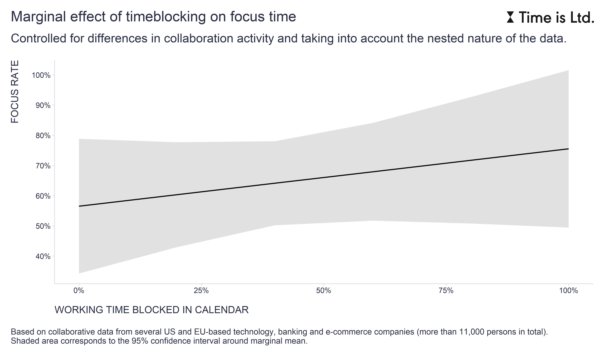

In one of my [previous posts](https://blog-about-people-analytics.netlify.app/posts/2022-06-11-visual-inference-statistics/), I addressed the question of why people don't make more use of **[timeboxing](https://clockify.me/timeboxing)**, a time management tool relying on a well-researched self-regulatory technique called **[implementation intention](https://en.wikipedia.org/wiki/Implementation_intention)** - planning what you will do, when, and how.

Quite surprisingly, I found in our collaborative data that there is not a positive but a slightly negative relationship between the amount of time for focused work and the amount of blocked working time in the calendar, which I interpreted to mean that people who have plenty of time for focused work usually do not have a strong need to block time for focused work in their calendars.

However, based on these results, one colleague wondered whether this result actually speaks against the usefulness of this tool. To answer her question properly, we should avoid comparing apples with pears and control for the effect of the number of collaborative activities people participate in, as it can be assumed that those who spend more time collaborating with others have less time for focused work and also use the timeboxing technique more. 

Using this approach and our clients' collaborative data, I looked at the relationship between the proportion of work time blocked on the calendar and the time available for focused work (i.e. no meetings, no ad-hoc calls, no email or instant messaging), and found that the marginal effect of timeboxing is in line with the positive effect of the timeboxing technique on the time available for focused work. The effect is not huge (each percentage point of working time blocked in the calendar yields on average .19% of focus rate), however, timeboxing seems to be saved, phew 😉

