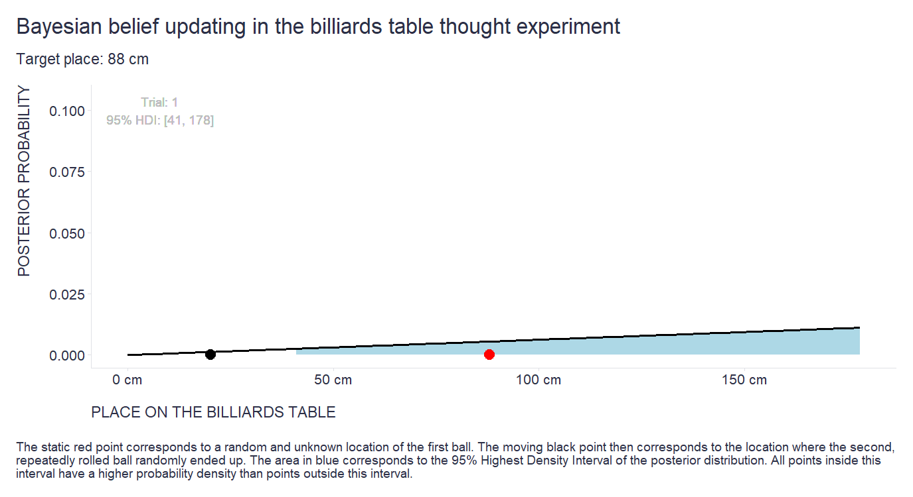

When trying to reduce uncertainty, even very small pieces of information count if you are patient and have some tool to combine them effectively. I recently re-read [Philip Tetlock's](https://en.wikipedia.org/wiki/Philip_E._Tetlock) book [Superforecasting](https://en.wikipedia.org/wiki/Superforecasting:_The_Art_and_Science_of_Prediction) and came across an excellent illustration of such a tool: [Bayesian belief updating](https://en.wikipedia.org/wiki/Bayesian_inference).

"*Imagine you are sitting with your back to a billiards table. A friend rolls a ball onto the table and it stops at a random spot. You want to locate the ball without looking. How? Your friend rolls a second ball, which stops at another random spot. You ask, “Is the second ball to the left or the right of the first?” Your friend says, “To the left.” That’s an almost trivial scrap of information. But it’s not nothing. It tells you that the first ball is not on the extreme left edge of the table. And it makes it just a tad more likely that the first ball is on the right side of the table. If your friend rolls another ball on the table and the procedure is repeated, you get another scrap of information. If he says, “It’s to the left,” the likelihood of the first ball being on the right side of the table increases a little more. Keep repeating the process and you slowly narrow the range of the possible locations, zeroing in on the truth—although you will never eliminate uncertainty entirely.*”

After reading this paragraph, I thought it would be much more pedagogically compelling (and fun 😉) to see this update process live and in action. What a great opportunity to learn how to work with the [gganimate](chrome-extension://efaidnbmnnnibpcajpcglclefindmkaj/https://cran.r-project.org/web/packages/gganimate/gganimate.pdf) R package.

Here is the code I put together.

```{r, include = TRUE, echo=TRUE, eval=FALSE}

# uploading libraries
library(tidyverse) # data manipulation and visualization
library(gganimate) # animation of the charts
library(bayestestR) # Highest Density Interval computation

# specifying the width of the billiards table  
field <- seq(0,178,1)

# likelihoood function for the situation when the second ball stops to the right of the first one 
rightLikelihood <- (178-field)/178
# likelihoood function for the situation when the second ball stops to the left of the first one 
leftLikelihood <- 1-rightLikelihood
# flat prior for the very beginning of the updating process  
firstPrior <- rep(1/179, 179)

# position where the first ball stopped
point <- 88

# Bayesian belief updating
# creating shell dataframe for final results
posteriors <- data.frame()

# setting random seed for ensuring reproducibility
set.seed(1234)

# specifying the number of trials
for(i in 1:500){
  
  # throwing the second ball
  pointTrial <- runif(n = 1, min = 0, max = 178)
  
  # determining whether the second ball stopped to the left or to the right of the first one 
  side <- ifelse(pointTrial > point, "right", "left")
  
  # selecting appropriate prior
  if(i==1){
    
    prior <- firstPrior
    
  } else{
    
    prior <- posteriors %>% 
      dplyr::filter(trial == i-1) %>% 
      dplyr::pull(posterior)
    
  }
  
  # combining prior and likelihood (evidence) and transforming the result into probabilities
  if(side == "right"){
    
    likelihood <- rightLikelihood * prior 
    probability <- likelihood/sum(likelihood)
    
  } else{
    
    likelihood <- leftLikelihood * prior
    probability <- likelihood/sum(likelihood)
    
  }
  
  # putting results into the dataframe
  suppDf <- data.frame(
    posterior = probability,
    trial = i,
    side = side,
    pointTrial = pointTrial
  )
  
  # computing Highest Density Interval
  sampling <- sample(x = field, size = 10000, replace = TRUE, prob = probability)
  
  hdi <- bayestestR::hdi(sampling, ci = 0.95)
  
  suppDf <- suppDf %>%
    dplyr::mutate(
      lhdi = hdi$CI_low,
      hhdi = hdi$CI_high
    )
  
  # putting results into the shell dataframe 
  posteriors <- dplyr::bind_rows(posteriors, suppDf)

}

# adjusting data for visualization purposes
posteriorsDf <- posteriors %>%
  dplyr::group_by(trial) %>%
  dplyr::mutate(place = dplyr::row_number()-1) %>%
  dplyr::ungroup() %>%
  dplyr::mutate(
    hdi = ifelse(place >= lhdi & place <= hhdi, "yes", "no")
  )

# creating charts
myAnimation <- ggplot2::ggplot(data = posteriorsDf, aes(x = place, y = posterior)) +
  ggplot2::geom_area(data = posteriorsDf %>% dplyr::filter(hdi == 'yes'), fill = 'light blue') +
  ggplot2::geom_line(size = 1) +
  ggplot2::geom_point(aes(x = pointTrial, y = 0), size = 4) +
  ggplot2::geom_point(aes(x = point, y = 0), size = 4, color = "red") +
  ggplot2::geom_text(aes(x = 8, y = 0.1, label = stringr::str_glue("Trial: {trial}\n95% HDI: [{lhdi}, {hhdi}]")), color = "grey") +
  ggplot2::scale_y_continuous(limits = c(0,0.105)) +
  ggplot2::scale_x_continuous(labels = scales::number_format(suffix = " cm")) +
  ggplot2::theme(plot.title = element_text(color = '#2C2F46', face = "plain", size = 19, margin=margin(0,0,12,0)),
                 plot.subtitle = element_text(color = '#2C2F46', face = "plain", size = 13, margin=margin(0,0,15,0)),
                 plot.caption = element_text(color = '#2C2F46', face = "plain", size = 11, hjust = 0),
                 axis.title.x.bottom = element_text(margin = margin(t = 15, r = 0, b = 0, l = 0), color = '#2C2F46', face = "plain", size = 13, lineheight = 16, hjust = 0),
                 axis.title.y.left = element_text(margin = margin(t = 0, r = 15, b = 0, l = 0), color = '#2C2F46', face = "plain", size = 13, lineheight = 16, hjust = 1),
                 axis.title.y.right = element_text(margin = margin(t = 0, r = 0, b = 0, l = 15), color = '#2C2F46', face = "plain", size = 13, lineheight = 16, hjust = 0),
                 axis.text = element_text(color = '#2C2F46', face = "plain", size = 12, lineheight = 16),
                 axis.line.x = element_line(colour = "#E0E1E6"),
                 axis.line.y = element_line(colour = "#E0E1E6"),
                 legend.position= "bottom",
                 legend.key = element_rect(fill = "white"),
                 legend.key.width = unit(1.6, "line"),
                 legend.margin = margin(0,0,0,0, unit="cm"),
                 legend.text = element_text(color = '#2C2F46', face = "plain", size = 10, lineheight = 16),
                 legend.background = element_rect(fill = "transparent"),
                 panel.background = element_blank(),
                 panel.grid.major.y = element_blank(),
                 panel.grid.major.x = element_blank(),
                 panel.grid.minor = element_blank(),
                 axis.ticks.x = element_line(color = "#E0E1E6"),
                 axis.ticks.y = element_line(color = "#E0E1E6"),
                 plot.margin=unit(c(5,5,5,5),"mm"),
                 plot.title.position = "plot",
                 plot.caption.position =  "plot"
  ) +
  ggplot2::labs(
    title = "Bayesian belief updating in the billiards table thought experiment",
    subtitle = "Target place: 88 cm",
    x = 'PLACE ON THE BILLIARDS TABLE', 
    y = 'POSTERIOR PROBABILITY',
    caption = "\n\nThe static red point corresponds to a random and unknown location of the first ball. The moving black point then corresponds to the location where the second,\nrepeatedly rolled ball randomly ended up. The area in blue corresponds to the 95% Highest Density Interval of the posterior distribution. All points inside this\ninterval have a higher probability density than points outside this interval."
    ) +
  gganimate::transition_time(trial) +
  gganimate::ease_aes('linear')

# animating chart
gganimate::animate(myAnimation, nframes = 125, fps = 5, height = 6, width = 11, units = "in", res = 125)

# saving animated chart as a .gif file
gganimate::anim_save(filename = "./bayesianBelifUpdating.gif", animation = last_animation())


```


And here is the resulting animation of the Bayesian belief updating process across 500 trials.




For those who would like to incorporate Bayesian reasoning into their managerial decision-making under uncertainty, I can recommend [this article](https://journals.sagepub.com/doi/full/10.1177/0008125620948264) by [Brian T. McCann](https://www.linkedin.com/in/brian-t-mccann-7a322617/). 

