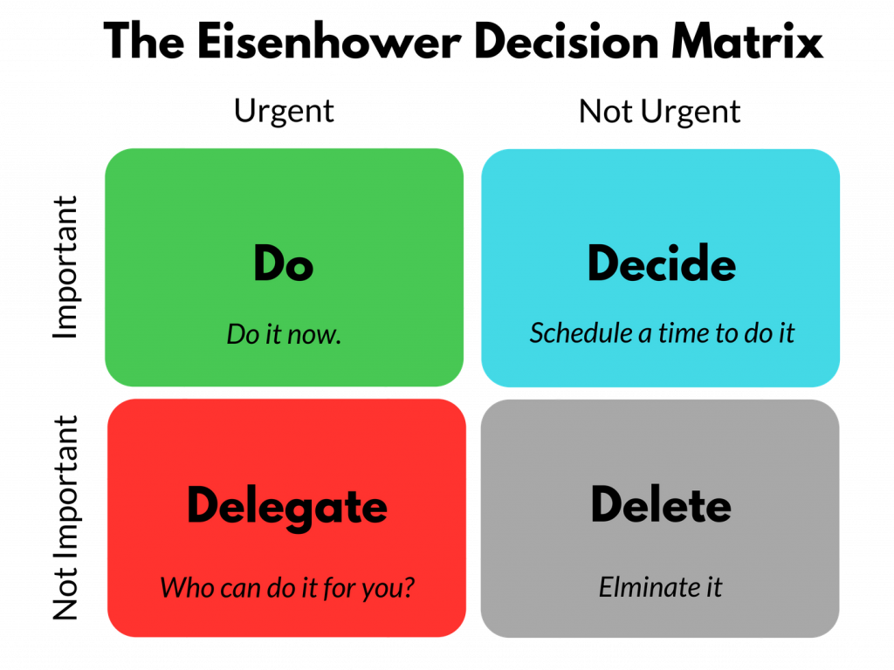
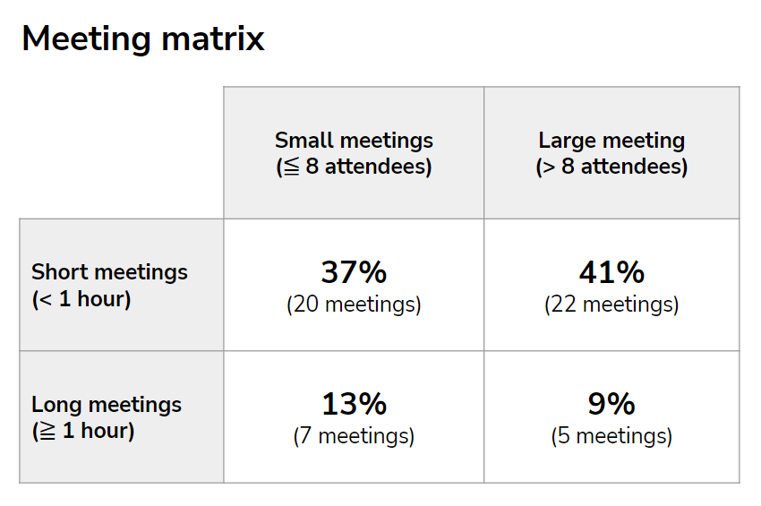

I assume many, if not all, of you are familiar with [the Eisenhower matrix](https://en.wikipedia.org/wiki/Time_management#The_Eisenhower_Method), a simple tool for prioritizing tasks based on a combination of their importance and urgency. It assumes 4 types of tasks - important & urgent, important & not urgent, not important & urgent, not important & not urgent - and for each of them offers a simple recommendation on what to do with them - do it, schedule it, delegate it, and delete it. By following these rules, people should be able to more successfully combat the “mere-urgency” effect, eliminate time-wasters in their lives, and create more space to make progress toward their goals.

 

Something similar can be created also for meetings, which are big time and money guzzlers and deserve to be treated accordingly. Only instead of the dimensions of importance and urgency, we will use the size and length of meetings. The resulting matrix assumes 4 types of meetings with corresponding recommendations on what to do with them:

1. **Small & Short:** These meetings are a bit tricky because they often involve useful meetings, e.g., short syncs of teams working on some specific task or project or one-on-one meetings between managers and their direct reports, however, when there is a lot of them, they may cause calendar fragmentation and drop in available focus time; to avoid this, one can think of batching such meetings into larger blocks of two or three meetings with appropriate small breaks in between to avoid meeting fatigue and late arrivals.    
2. **Small & Long:** These meetings are great for brainstorming, problem-solving, or decision-making, so make sure you use them primarily for that purpose and don't waste them on low-value-added activities.
3. **Large & Short:** These meetings often serve only to disseminate information and can therefore be safely replaced by less intrusive asynchronous collaboration tools such as email, instant messaging or some kind of knowledge management tool.
4. **Large & Long:** These meetings are quite often a waste of people’s time by not allowing everyone to meaningfully contribute and by making them both physically and mentally exhausted, so try to move these meetings into the third quadrant if your goal is simple information dissemination or into the second quadrant if the goal is to solve some problem or to make some important decision.       

The meeting matrix is by no means a panacea for meeting overload, but by following the rules above, people should be able to better protect their time for focused work and make meetings more efficient, meaningful, and valuable for themselves and the company. Just be aware that unlike the Eisenhower matrix, in the case of the meeting matrix, people need to rely more on others to follow these rules in order for its positive effect to materialize. So get ready to update your (hopefully already existing) team agreement on your collaboration culture. 

Btw, what is your guess as to how much time you spend in each cell of the meeting matrix? For comparison I attach my monthly numbers from October.

  

