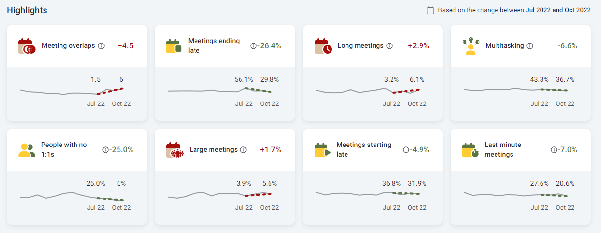

Since the beginning of our efforts at [Time is Ltd.](https://www.timeisltd.com/) to develop a comprehensive collaboration analytics platform, we have created several hundred collaboration metrics. As you can probably imagine, with such a huge amount of metrics, it was quite difficult for users to get something useful out of the platform.

To make the metrics provided more digestible, we've enhanced the platform using several approaches, from simply selecting metrics with the most straightforward call to action and creating apps for very specific use cases to providing users with comparative, historical, intuitively scaled, and equivalent information. [Brent Dykes](https://www.linkedin.com/in/brentdykes/) described many of these sense-making methods very neatly in his article [Contextualized Insights: Six Ways To Put Your Numbers In Context](https://www.effectivedatastorytelling.com/post/contextualized-insights-six-ways-to-put-your-numbers-in-context). 

However, even after several rounds of these improvements, there was still a need to help users quickly find areas that might be worth their attention and deeper exploration. One approach we took was based on the (validated) assumption that collaboration metrics are relatively stable over time and that the intentional and unintentional behavioral changes behind these metrics evolve rather slowly. We therefore decided to detect the most significant changes over the last 3 months.       

For this purpose, we chose a method that is related to the [Bollinger Bands](https://en.wikipedia.org/wiki/Bollinger_Bands) method used in time series analysis or "Heartbeat Analysis" used in survey response analysis. Specifically, we look at the standard deviation and average of the month-to-month changes for each metric, scale the changes to z-scores, and then identify the metrics with the highest absolute value of average change over the last 3 months. To illustrate, see the attached chart where the metrics are sorted by magnitude of their change in descending order from left to right and top to bottom.

  

If you want to try this method on your own data, you can use its Python implementation, which is on [my GitHub page](https://github.com/lstehlik2809/Change-detection-in-time-series-data/blob/main/standardizedChangeSizeComputation.py).

What other methods do you find useful in identifying values or changes that might be worth users' attention? Feel free to share them in the comments for inspiration.
