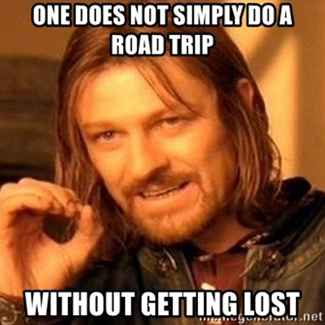
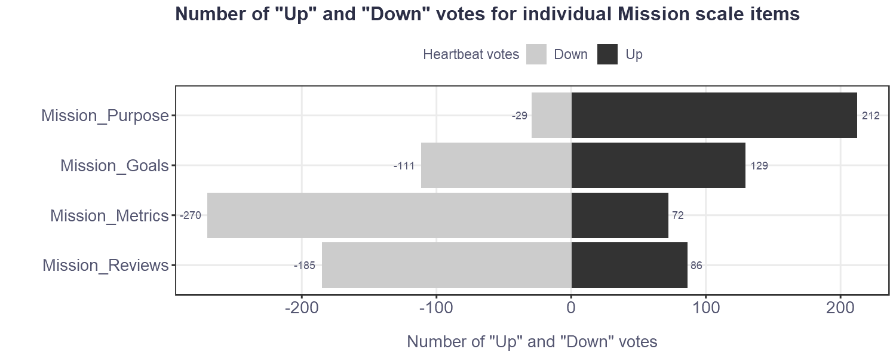

```{r echo=FALSE, warning=FALSE}

# uploading library for emojis
library(emoji)

```

As I was scrolling through one of my feeds over the weekend, I came across a funny meme that resonated with my recent experience on a family trip that expressed the deep truth that “One does not simply do a road trip without getting lost.” `r emoji::emoji("smile")`

 

Besides that, and that's why I'm writing about it here on my blog, it also reminded me of the results of a study I did together with [Rastislav Duris](https://www.linkedin.com/in/rastislavduris/) and Slavka Silberg, on the characteristics of more than 80 teams from different industries and composed of more than 800 people using the [Team Assessment Survey](http://www.therocketmodel.com/team-assessment-survey), [Dr. Gordon Curphy's](https://www.linkedin.com/in/gordoncurphy/) survey that measures some of the basic factors that determine team performance. 

Specifically, I was reminded of the results on the Mission scale, which consists of the following four items:

1. **Purpose:** Team members are clear about the team's purpose.
2. **Goals:** The team has a set of overall goals. 
3. **Metrics:** Metrics and benchmarks have been identified for each team goal. 
4. **Reviews:** The team regularly reviews progress on team goals. 

As you can see in the attached chart, the results of the “Heartbeat analysis” can be briefly summarized as "We know where we're going, at least some of us know the points to get there, but we're not sure if we're on the right track and if we should change our original plans."

  

That sounds a lot like the description of our last family trip. `r emoji::emoji("sweat_smile")` Do you think you're better off in this regard in your team or company? And if so, what tips would you give others on how to improve in this respect?