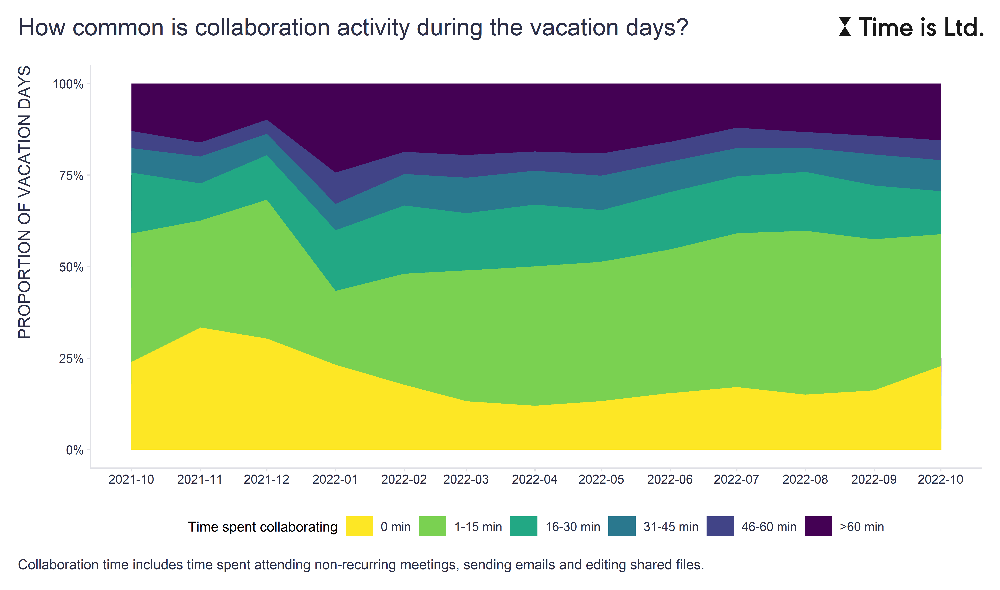
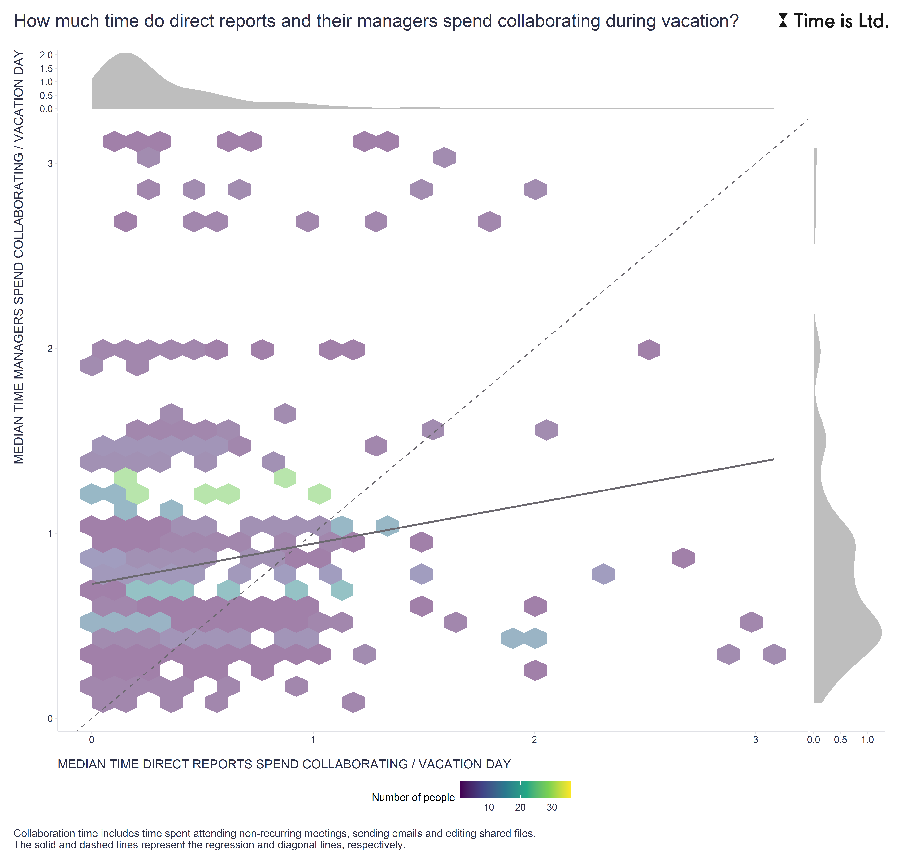

Although most people know they need time off to stay mentally sharp, productive, and resilient over the long term, many confess they work when they're on vacation.

The data we collect and analyze at [Time is Ltd.](https://www.timeisltd.com/) confirms this sad truth. As the first chart illustrates, on more than 75% of vacation days people show some collaborative activity, here measured by attending non-recurring meetings, sending emails, and editing shared files. 

 

However, the same data also suggests what could be part of the remedy for this unsatisfactory state of affairs. The second chart shows that there is a small but not insignificant positive relationship between the time that managers and their direct reports spend collaborating during vacation. The chart also shows that managers tend to collaborate more intensely during vacation than their direct reports, which is probably not too much of a surprise.

 

The data is thus in line with the quite often mentioned suggestion that managers should be better role models for their direct reports on how to behave during vacation. As in other areas of people management, it is not enough to lay down the rules - the "playing captain" must play by those rules as well.

How are you doing in this respect? And do you have any tricks that help you unplug from work during vacations?