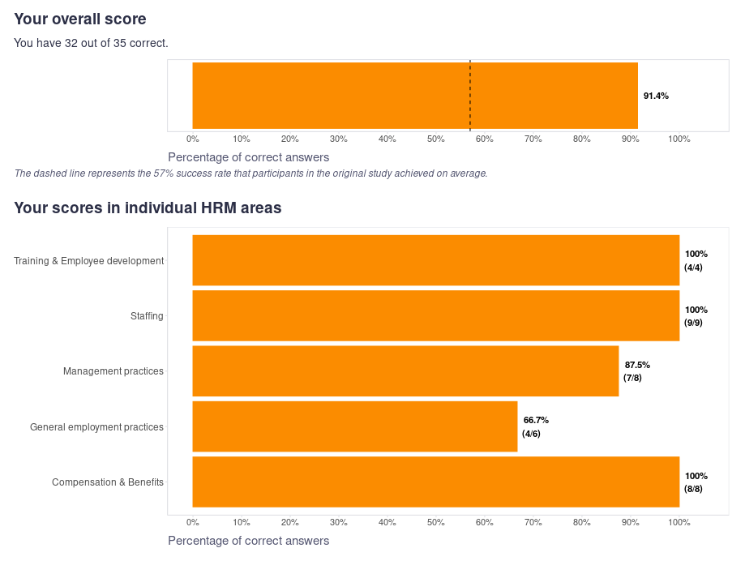

```{r echo=FALSE, warning=FALSE}

# uploading library for emojis
library(emoji)

```

If you are interested in testing your knowledge of evidence-based HRM practices in the following five areas...

* Management practices
* General employment practices
* Training & Employee development
* Staffing
* Compensation & Benefits

... then give a try on the test, which is based on the items used in Rynes, Colbert, and Brown's 2002 study ["HR practitioners' beliefs about effective HR practices: a comparison of research and practice"](https://psycnet.apa.org/record/2003-99255-001).

I built a simple shiny app that administers you the test, scores your answers, and compares your results to the results of the participants in the original study (959 HR professionals, mostly HR managers, with an average of 13.8 years of experience in HR). You can also use it to check the accuracy of your answers at the item level to fill in specific gaps in your knowledge.

Here is [the link to the app](https://peopleanalyticsblog.shinyapps.io/evidence_based_hrm_test/). 

Feel free to share your results in the comments. Think of it as a form of public commitment to making some progress in evidence-based HRM in the coming year `r emoji::emoji("wink")` To walk the talk, I attached my own results. As you can see, it's not bad, but there is still room for improvement, especially in the general employment practices area `r emoji::emoji("smiley")`

 

P.S. Keep in mind that the test is based on evidence available up to 2002, so it is possible that some correct answers or their contingencies may have changed in that time. For all of them, consider, for example, the adjustment of the estimate of the magnitude of the predictive validity of personnel selection procedures in their most recent [meta-analysis by Sackett et al. (2022)](https://psycnet.apa.org/record/2022-17327-001). If you come across any such discrepancy, it would be great if you share it with others in the comments. 

Update: With more than 140 people completing the test, I was able to compare our current results with those of the participants in the original study. You can see the results of the comparison in the post [Evaluation of the results of the evidence-based HRM knowledge test](https://blog-about-people-analytics.netlify.app/posts/2023-01-08-evidence-based-hrm-knowledge-test-results/). Spoiler: It’s not very good `r emoji::emoji("hushed")`

