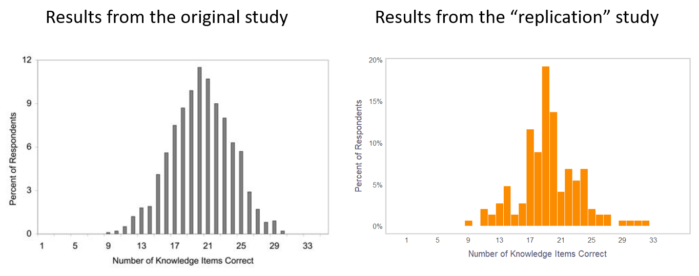

In one of my [previous posts](https://blog-about-people-analytics.netlify.app/posts/2022-12-17-evidence-based-hrm-knowledge-test/), I shared an [app](https://peopleanalyticsblog.shinyapps.io/evidence_based_hrm_test/) that tests knowledge of evidence-based HRM practices using items from [Rynes, Colbert, and Brown's 2002 study](https://psycnet.apa.org/record/2003-99255-001) on HR practitioners' beliefs about effective HR practices. The fact that more than 140 people completed the test allowed me to compare our current results with those of the participants in the original study (959 HR practitioners, mostly HR managers, with an average of 13.8 years of HR experience).

**So how did we do overall?**

On average, we had 19.4 items out of 35 correct, i.e., we had a 55% success rate, which is very close to the results of the original study where respondents had an average 57% success rate (and also pretty close to the 50% success rate corresponding to random choice). So these results suggest that we have not progressed much as a group over the last 20 years, however, see the disclaimer at the very end of the post.

 

**In which HRM area did we have the largest & smallest knowledge gaps?**

The biggest gap was in the staffing area (44% success rate) and the smallest was in the training & employee development area (67% success rate).

**In which items did we do best?**

* Leadership training is effective because good leaders are made, not born (95% success rate).
* Lecture-based training is not generally superior to other forms of training delivery (92% success rate).
* When pay must be reduced or frozen, a company can do something to reduce employee dissatisfaction and dysfunctional behaviors (90% success rate).

**In which items did we do the worst?**

* Scoring positive on drug tests doesn’t mean one will be any less reliable or productive employee (11.6% success rate).
* Setting performance goals is, on average, more effective for improving organizational performance than encouraging employees to participate in decision-making (12.3% success rate).
* Most errors in performance appraisals cannot be eliminated by providing training that describes the kinds of errors managers tend to make and suggesting ways to avoid them (15% success rate).

**In which items were we most unsure?**

* Older adults don’t learn more from training than younger adults (38% uncertain).
* Integrity tests that try to predict whether someone will steal, be absent, or otherwise take advantage of an employer work well in practice (34% uncertain).
* Companies with merit pay systems tend to have higher performance than companies without them (17% uncertain).

Please keep in mind that the comparison presented here is not entirely an apples-to-apples comparison due to several limitations of the data collection method (e.g., we don’t know the sociodemographics of the new participants, new evidence may have emerged that does not match the correct answers in the original study, some people may have taken the test multiple times, etc.). 

