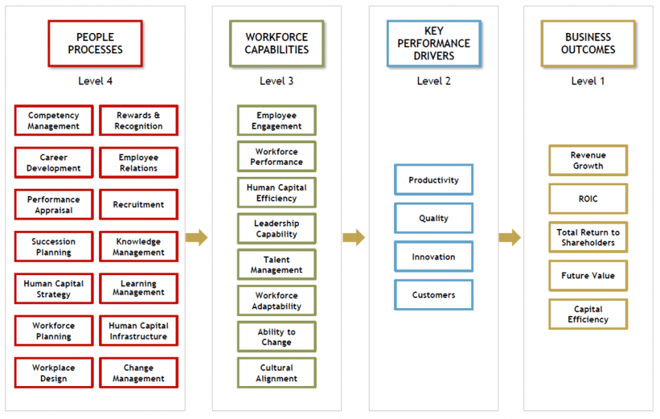
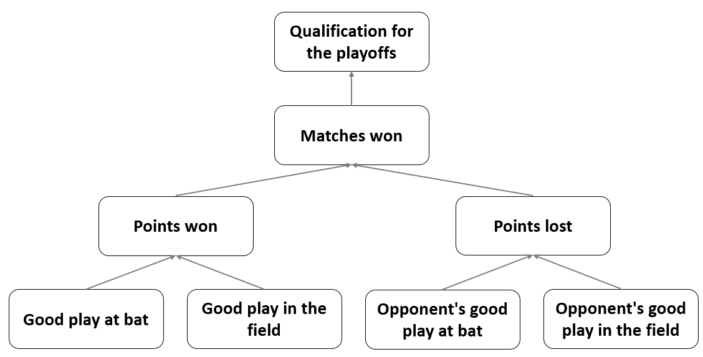

As the economy cooled, more posts started appearing in my social bubble about how people analytics can prove its value, justify its existence, and increase its resilience to layoffs.

One of the often-mentioned conceptual tools in this context is the **HRM value chain** which shows how people processes lead to achieving companies’ desired business outcomes. There are more versions of this tool, e.g. one from [Jaap Paauwe and Ray Richardson](https://www.tandfonline.com/doi/abs/10.1080/095851997341621?journalCode=rijh20) or another one from [Max Blumberg](https://www.hrzone.com/lead/strategy/why-hr-needs-to-up-its-game-in-strategic-people-analytics), but what they have in common is a kind of causal flow from HRM activities to HRM outcomes to business outcomes.

 
*Example of the HRM value chain model from [Paauwe & Richardson (1997)](https://www.tandfonline.com/doi/abs/10.1080/095851997341621?journalCode=rijh20).* 

<br />

 
*Example of the HRM value chain model from [Blumberg (2018)](https://www.hrzone.com/lead/strategy/why-hr-needs-to-up-its-game-in-strategic-people-analytics).* 

However, as potentially useful as this metaphor of the organization as a kind of "machine" with certain inputs, processes, and outputs is, it is still only a conceptual tool that may or may not correspond to the reality of a particular organization.  

In this regard, it may help if we try to operationalize this metaphor. In this effort, **[structural equation modeling](https://en.wikipedia.org/wiki/Structural_equation_modeling)** can be very handy, as it allows us to formalize our ideas about the relationships between several different variables and to assess the extent to which these ideas are consistent with the available data. After all, no one wants to make decisions based on false assumptions.  

To illustrate this with a more tangible example, let’s use [sabermetric](https://en.wikipedia.org/wiki/Sabermetrics) data from the famous **[Moneyball](https://en.wikipedia.org/wiki/Moneyball)** case and let’s try to formally model the [Oakland A's](https://en.wikipedia.org/wiki/Oakland_Athletics) (OAK) as a “machine” that produces playoffs by trying to win more games or score more points than opposing teams, using inputs in the form of players' ability to play well at bat and in the field. 

Based on our expert knowledge of the game of baseball, our working hypotheses, and the results of some previous analyses, we can construct a conceptual model of how a baseball team functions, as outlined below.

 
*Conceptual model of how a baseball team works.*

The diagram shows clearly how this “machine” works: Its outputs are qualifications for the playoffs, which it achieves by trying to win more games or score more points than the opposing teams; to do this, it uses inputs in the form of the players' ability to play well at bat and in the field; the inputs affecting the “machine's” operation are also the similar abilities of the opposing teams' players. This is, of course, a very simplistic causal model of how the OAK team operates, but as the famous statistical aphorism states, [all models are wrong, but some are useful](https://en.wikipedia.org/wiki/All_models_are_wrong). 

However incomplete our models of how an organization works will always be, it is essential to check that these models sufficiently reflect reality as conveyed by the available data. Only after such an assessment of the plausibility of the model it is reasonable to base further, e.g. hiring or L&D decisions on it. And, as hinted at the beginning of this post, we will use the statistical method of structural equation modeling to do this. So let's apply this method to our model of the OAK and test its plausibility.

We will use data from a publicly available [database of MLB historical statistics](https://drive.google.com/file/d/0B5YUO0Asd9KfMG1UaXpEVjJqQWc/view). Specifically, we will use the following variables:

* qualification for the playoffs in a given season (*Playoffs*), 
* number of wins in a given season (*W*), 
* number of points won in a given season (*RS*),
* number of points lost in a given season (*RA*), 
* average frequency with which a player reaches base per plate appearance in a given season (*OBP* - On-Base Percentage) and analogous statistics for opponent teams (*OOBP*),
* average number of bases players earn per at bat in a given season (*SLG* - Slugging Percentage) and analogous statistics for opponent teams (*OSLG*).

In terms of time, we will work with data from the years 1996-2001, which precede 2002, when the story of Moneyball mostly takes place.

```{r message=FALSE, warning=FALSE}

# uploading set of libraries for data manipulation and visualization
library(tidyverse)

# uploading data
baseball <- readr::read_csv("./baseball.csv")

# filtering data used for the analysis
myData <- baseball %>%
  dplyr::filter(
    Year < 2002, 
    Year > 1995
    ) %>%
  dplyr::select(Team, OBP, SLG, OOBP, OSLG, RS, RA, W, Playoffs)

# user-friendly table with data used for the analysis
DT::datatable(
  myData,
  class = 'cell-border stripe', 
  filter = 'top',
  extensions = 'Buttons',
  fillContainer = FALSE,
  rownames= FALSE,
  options = list(
    pageLength = 5, 
    autoWidth = TRUE,
    dom = 'Bfrtip',
    buttons = c('copy'), 
    scrollX = TRUE, 
    selection="multiple"
  )
)


```


Now let's define a formal model of the OAK and fit it to the data using the [brms R package](https://cran.r-project.org/web/packages/brms/index.html) which allows us to make inferences about the model parameters within a [Bayesian inferential framework](https://nyu-cdsc.github.io/learningr/assets/kruschke_bayesian_in_R.pdf). Specifically, we will build and fit a so-called *[path analysis](https://en.wikipedia.org/wiki/Path_analysis_(statistics))* model, which is a special type of structural equation modeling used to describe directed dependencies among a set of variables. Given that we have data for a group of the same teams over several seasons, we must also incorporate the hierarchical nature of the data into the model.

```{r message=FALSE, warning=FALSE, results = "hide"}

# uploading libraries for fitting Bayesian generalized (non-)linear multivariate multilevel models using Stan for full Bayesian inference
library(brms)
library(cmdstanr)

# specifying individual parts of the SEM (without modeling the correlation between response variables and using Student's t distribution instead of the Gaussian distribution to make the model more robust) 
a <- brms::bf(W ~ 1 + RS + RA + (1 + RS + RA | Team), family = student())
b <- brms::bf(RA ~ 1 + OOBP + OSLG + (1 + OOBP + OSLG | Team), family = student())
c <- brms::bf(RS ~ 1 + OBP + SLG + (1 + OBP + SLG | Team), family = student())
d <- brms::bf(Playoffs ~ 1 + W + (1 + W | Team), family = bernoulli())

# fitting the model
fit <- brms::brm(
  a + b + c + d + set_rescor(FALSE), 
  data = myData,
  iter = 3000,
  chains = 3,
  warmup = 500,
  thin = 1,
  seed = 123,
  cores = 5,
  backend = "cmdstanr",
  refresh = 0,
  silent = 2 
  )

# checking MCMC convergence
# plot(fit)
# summary(fit)

```

After verifying that the mechanics of the MCMC algorithm work well (not shown here for brevity reasons), we should also verify how well the model fits the data by using the posterior predictive check for each of the observed response variables in our model.

```{r message=FALSE, warning=FALSE, fig.width=11, fig.height=9}

# uploading library for arbitrarily complex composition of ggplot plots
library(patchwork)

# posterior predictive check for all predicted observed variables 
playoffsPpc <- brms::pp_check(fit, resp = "Playoffs", ndraws = 100) + ggplot2::labs(title = "Playoffs variable")
wPpc <- brms::pp_check(fit, resp = "W", ndraws = 100) + ggplot2::labs(title = "W variable")
rsPpc <- brms::pp_check(fit, resp = "RS", ndraws = 100) + ggplot2::labs(title = "RS variable")
raPpc <- brms::pp_check(fit, resp = "RA", ndraws = 100) + ggplot2::labs(title = "RA variable")

ppc <- (playoffsPpc + wPpc) / (rsPpc + raPpc)

print(ppc)

```

As you can see, the model fits the data pretty well. Now we can look at the coefficients in the individual parts of the model. All of them show non-zero values and are in directions that are consistent with our expectations embodied in our conceptual model, i.e., all are positive except for the coefficient of the *RA* variable (number of points lost) as a predictor of the number of games won (*W*). These results thus give us greater confidence in following our conceptual model of team functioning when making decisions about allocating our limited resources. 

```{r message=FALSE, warning=FALSE, fig.width=11, fig.height=9}

# uploading library for plotting functions for posterior analysis, MCMC diagnostics, prior and posterior predictive checks, and other visualizations to support the applied Bayesian workflow
library(bayesplot)

# getting overview of all parameters 
# get_variables(fit)
# relevant parameters: "b_RS_OBP", "b_RS_SLG", "b_RA_OOBP", "b_RA_OSLG", "b_W_RS", "b_W_RA", "b_Playoffs_W"

b_RS_OBP <- bayesplot::mcmc_areas(
  fit, 
  pars = "b_RS_OBP", 
  prob = 0.95,
  point_est = "median"
) +
  ggplot2::labs(
    title = "OBP variable in the RS ~ OBP part"
    ) +
  ggplot2::theme(
    axis.text.y = element_blank(),
    axis.ticks.y = element_blank()
    )


b_RS_SLG <- bayesplot::mcmc_areas(
  fit, 
  pars = "b_RS_SLG", 
  prob = 0.95,
  point_est = "median"
) +
  ggplot2::labs(
    title = "SLG variable in the RS ~ SLG part"
  ) +
  ggplot2::theme(
    axis.text.y = element_blank(),
    axis.ticks.y = element_blank()
  )


b_RA_OOBP <- bayesplot::mcmc_areas(
  fit, 
  pars = "b_RA_OOBP", 
  prob = 0.95,
  point_est = "median"
) +
  ggplot2::labs(
    title = "OOBP variable in the RA ~ OOBP part"
  ) +
  ggplot2::theme(
    axis.text.y = element_blank(),
    axis.ticks.y = element_blank()
  )


b_RA_OSLG <- bayesplot::mcmc_areas(
  fit, 
  pars = "b_RA_OSLG", 
  prob = 0.95,
  point_est = "median"
) +
  ggplot2::labs(
    title = "OSLG variable in the RA ~ OSLG part"
  ) +
  ggplot2::theme(
    axis.text.y = element_blank(),
    axis.ticks.y = element_blank()
  )


b_W_RS <- bayesplot::mcmc_areas(
  fit, 
  pars = "b_W_RS", 
  prob = 0.95,
  point_est = "median"
) +
  ggplot2::labs(
    title = "RS variable in the W ~ RS part"
  ) +
  ggplot2::theme(
    axis.text.y = element_blank(),
    axis.ticks.y = element_blank()
  )


b_W_RA <- bayesplot::mcmc_areas(
  fit, 
  pars = "b_W_RA", 
  prob = 0.95,
  point_est = "median"
) +
  ggplot2::labs(
    title = "RA variable in the W ~ RA part"
  ) +
  ggplot2::theme(
    axis.text.y = element_blank(),
    axis.ticks.y = element_blank()
  )


b_Playoffs_W <- bayesplot::mcmc_areas(
  fit, 
  pars = "b_Playoffs_W", 
  prob = 0.95,
  point_est = "median"
) +
  ggplot2::labs(
    title = "W variable in the Playoffs ~ W part"
  ) +
  ggplot2::theme(
    axis.text.y = element_blank(),
    axis.ticks.y = element_blank()
  )


coefCharts <- (b_RS_OBP + b_RS_SLG + b_RA_OOBP) / (b_RA_OSLG + b_W_RS + b_W_RA) / (b_Playoffs_W + patchwork::plot_spacer() + patchwork::plot_spacer()) +
  plot_annotation(
    title = 'Posterior interval estimations',
    caption = "The solid vertical lines represent the point (median) estimates and the shaded areas represent the 95% credible interval.",
    theme = theme(
      plot.title = element_text(size = 18),
      plot.caption = element_text(size = 11)
      )
    )

print(coefCharts)

```

```{r message=FALSE, warning=FALSE}

# summary of the fitted model  
summary(fit)

```

However, the main advantage of such a formalized model is that we can now make specific predictions or simulations that will help us make more granular decisions about where and how much to invest our limited resources, e.g. in terms of hiring and/or L&D activities. For example, we know from the available data that teams need to win approximately 95 games to have a high chance of making the playoffs - see the two graphs below.

```{r message=FALSE, warning=FALSE, fig.width=11, fig.height=6}

# wins to make playoffs - chart 1
set.seed(1234)
myData %>%
  # creating random numbers for dispersing points across the y axis of the graph
  dplyr::mutate(rnd = runif(176,0,1)) %>%
  ggplot2::ggplot(aes(x = W, y = rnd, color = as.factor(Playoffs))) +
  ggplot2::geom_point(size = 3, alpha = 0.8) +
  ggplot2::scale_x_continuous(limits=c(50,120), breaks = seq(50,120,5)) +
  ggplot2::scale_color_manual(values = c("#9e9e9e", "#ff1919"), labels = c("The team has not made it to the playoffs", "The team has made it to the playoffs")) +
  ggplot2::labs(
    title = "Teams that didn't/made the playoffs from 1996-2001",
    x = "NUMBER OF GAMES WON IN THE REGULAR SEASON",
    y = "",
    color = ""
  ) +
  ggplot2::theme(plot.title = element_text(color = '#2C2F46', face = "bold", size = 18, margin=margin(0,0,12,0)),
                 plot.subtitle = element_text(color = '#2C2F46', face = "plain", size = 16, margin=margin(0,0,20,0)),
                 plot.caption = element_text(color = '#2C2F46', face = "plain", size = 11, hjust = 0),
                 axis.title.x.bottom = element_text(margin = margin(t = 15, r = 0, b = 0, l = 0), color = '#2C2F46', face = "plain", size = 13, lineheight = 16, hjust = 0),
                 axis.title.y.left = element_text(margin = margin(t = 0, r = 0, b = 0, l = 0), color = '#2C2F46', face = "plain", size = 13, lineheight = 16, hjust = 1),
                 axis.text.x = element_text(color = '#2C2F46', face = "plain", size = 12, lineheight = 16),
                 axis.text.y = element_blank(),
                 axis.line.x = element_line(colour = "#E0E1E6"),
                 axis.line.y = element_blank(),
                 legend.position="top",
                 legend.key = element_rect(fill = "white"),
                 legend.text = element_text(color = '#2C2F46', face = "plain", size = 12),
                 panel.background = element_blank(),
                 panel.grid.major.x = element_line(color = "#E0E1E6", linetype = "dashed"),
                 panel.grid.major.y = element_blank(),
                 panel.grid.minor = element_blank(),
                 axis.ticks.x = element_line(color = "#E0E1E6"),
                 axis.ticks.y = element_blank(),
                 plot.margin=unit(c(5,5,5,5),"mm"), 
                 plot.title.position = "plot",
                 plot.caption.position =  "plot"
  )


```


```{r message=FALSE, warning=FALSE, fig.width=11, fig.height=6}

# wins to make playoffs - chart 2

# creating a table with several different values for the number of wins in the regular season
nWins <- seq(60,115,5)
makingPlayoffsProb <- vector(mode="numeric", length=length(nWins))
playoffsData <- data.frame(nWins = nWins, makingPlayoffsProb = makingPlayoffsProb)

# calculating the probability of advancing to the playoffs with different number of wins in the regular season
for(i in 1:nrow(playoffsData)){
  
  playoffsData$makingPlayoffsProb[i] <- length(myData$W[myData$W >= playoffsData$nWins[i] & myData$Playoffs == 1])/length(myData$W[myData$W >= playoffsData$nWins[i]]) 
  
}

# creating the graph
playoffsData %>%
  ggplot2::ggplot(aes(x = nWins, y = makingPlayoffsProb)) +
  ggplot2::geom_point(size = 3) +
  ggplot2::geom_line(size = 1) +
  ggplot2::labs(
    x = "NUMBER OF GAMES WON IN THE REGULAR SEASON",
    y = "PROBABILITY OF MAKING IT TO THE PLAYOFFS",
    title = "Relation between the number of wins in the regular season and the probability\nof advancing to the playoffs (1996-2001)"
    ) +
  ggplot2::scale_x_continuous(limits=c(60,115), breaks = seq(60,115,5))+
  ggplot2::scale_y_continuous(limits=c(0,1), breaks = seq(0,1,0.1), labels = scales::percent_format()) +
  ggplot2::theme(plot.title = element_text(color = '#2C2F46', face = "bold", size = 18, margin=margin(0,0,20,0)),
                 plot.subtitle = element_text(color = '#2C2F46', face = "plain", size = 16, margin=margin(0,0,20,0)),
                 plot.caption = element_text(color = '#2C2F46', face = "plain", size = 11, hjust = 0),
                 axis.title.x.bottom = element_text(margin = margin(t = 15, r = 0, b = 0, l = 0), color = '#2C2F46', face = "plain", size = 13, lineheight = 16, hjust = 0),
                 axis.title.y.left = element_text(margin = margin(t = 0, r = 15, b = 0, l = 0), color = '#2C2F46', face = "plain", size = 13, lineheight = 16, hjust = 1),
                 axis.text.x = element_text(color = '#2C2F46', face = "plain", size = 12, lineheight = 16),
                 axis.text.y = element_text(color = '#2C2F46', face = "plain", size = 12, lineheight = 16),
                 axis.line.x = element_line(colour = "#E0E1E6"),
                 axis.line.y = element_line(colour = "#E0E1E6"),
                 legend.position="top",
                 legend.key = element_rect(fill = "white"),
                 legend.text = element_text(color = '#2C2F46', face = "plain", size = 12),
                 panel.background = element_blank(),
                 panel.grid.major.x = element_line(color = "#E0E1E6", linetype = "dashed"),
                 panel.grid.major.y = element_line(color = "#E0E1E6", linetype = "dashed"),
                 panel.grid.minor = element_blank(),
                 axis.ticks.x = element_line(color = "#E0E1E6"),
                 axis.ticks.y = element_line(color = "#E0E1E6"),
                 plot.margin=unit(c(5,5,5,5),"mm"), 
                 plot.title.position = "plot",
                 plot.caption.position =  "plot"
  )


```


Considering the last known OAK performance statistics from 2001, what number of games can OAK expect to win and what is the likelihood of making the playoffs next year? Let's plug the 2001 OAK numbers into the model and check the prediction including all uncertainties.

```{r message=FALSE, warning=FALSE, fig.width=11, fig.height=6}

# summary prediction of the number of matches won by OAK in 2002 using OAK's statistics from 2001 as input
# set.seed(123)
# predict(
#   fit, 
#   resp = "W", 
#   newdata = baseball %>% dplyr::filter(Year == 2001, Team == "OAK") %>% dplyr::select(Team, RS, RA, W, Playoffs, OBP, SLG, OOBP, OSLG)
# )

# generating predictions using OAK's statistics from 2001 as input
set.seed(123)
wp <- brms::posterior_predict(
  fit, 
  resp = "W", 
  newdata = baseball %>% dplyr::filter(Year == 2001, Team == "OAK") %>% dplyr::select(Team, RS, RA, W, Playoffs, OBP, SLG, OOBP, OSLG)
  )

# actual number of matches won by OAK in 2002
realNWins <- baseball %>%
  filter(Year == 2002, Team == "OAK") %>%
  pull(W)

# uploading library for visualizations of distributions and uncertainty
library(ggdist)

# creating the graph
wp %>%
  as.data.frame() %>% 
  ggplot2::ggplot(aes(x = V1)) +
  ggdist::stat_halfeye(
    fill = "lightblue",
    .width = c(0.80, 0.95),
      ) +
  ggplot2::geom_vline(xintercept = realNWins, linetype = "dashed") +
  ggplot2::geom_text(x = realNWins+8.3, y = 1, label = "Actual number of matches won by OAK in 2002") +
  ggplot2::scale_x_continuous(breaks = seq(80,120,5)) +
  ggplot2::labs(
    x = "PREDICTED NUMBER OF MATCHES WON (W)",
    y = "DENSITY",
    linetype = "",
    title = "Predicted number of matches won by OAK in 2002",
    caption = "\nThe black horizontal lines at the bottom of the graph represent the 80% and 95% probability intervals, respectively."
  ) +
  ggplot2::theme(plot.title = element_text(color = '#2C2F46', face = "bold", size = 18, margin=margin(0,0,20,0)),
                 plot.subtitle = element_text(color = '#2C2F46', face = "plain", size = 16, margin=margin(0,0,20,0)),
                 plot.caption = element_text(color = '#2C2F46', face = "plain", size = 11, hjust = 0),
                 axis.title.x.bottom = element_text(margin = margin(t = 15, r = 0, b = 0, l = 0), color = '#2C2F46', face = "plain", size = 13, lineheight = 16, hjust = 0),
                 axis.title.y.left = element_text(margin = margin(t = 0, r = 15, b = 0, l = 0), color = '#2C2F46', face = "plain", size = 13, lineheight = 16, hjust = 1),
                 axis.text.x = element_text(color = '#2C2F46', face = "plain", size = 12, lineheight = 16),
                 axis.text.y = element_text(color = '#2C2F46', face = "plain", size = 12, lineheight = 16),
                 axis.line.x = element_line(colour = "#E0E1E6"),
                 axis.line.y = element_line(colour = "#E0E1E6"),
                 legend.position= "none",
                 legend.key = element_rect(fill = "white"),
                 legend.text = element_text(color = '#2C2F46', face = "plain", size = 12),
                 panel.background = element_blank(),
                 panel.grid.major = element_blank(),
                 panel.grid.minor = element_blank(),
                 axis.ticks.x = element_line(color = "#E0E1E6"),
                 axis.ticks.y = element_line(color = "#E0E1E6"),
                 plot.margin=unit(c(5,5,5,5),"mm"), 
                 plot.title.position = "plot",
                 plot.caption.position =  "plot"
  )

```

We can see that the 95% probability interval of the predicted number of games won by the OAK in 2002 is safely above the 95-point threshold. And when we compare the prediction to the 2002 reality, we see that they are pretty close. Also, the projected probability of OAK advancing to the playoffs is very high, which is consistent with the fact that OAK successfully qualified for the playoffs in 2002.

```{r message=FALSE, warning=FALSE}

# prediction of OAK making the playoffs in 2002 using OAK's statistics from 2001 as input 
set.seed(123)
predict(
  fit, 
  resp = "Playoffs", 
  newdata = baseball %>% dplyr::filter(Year == 2001, Team == "OAK") %>% dplyr::select(Team, RS, RA, W, Playoffs, OBP, SLG, OOBP, OSLG),
  probs = c(0.025, 0.5, 0.975)
)

```

Based on this information, we may conclude that there is no urgent need to invest heavily now in increasing the current quality of the team's play at bat and in the field (variables *OBP* and *SLG*), assuming that the opposing teams do not significantly increase the quality of their play next year (variables *OOBP* and *OSLG*). Using the model, we can also obtain a specific range of the quality of the OAK’s play at bat and in the field that would still allow it to reach at least 95 games won. Such information could be useful, for example, in deciding which players can be safely traded without having a detrimental effect on the likelihood of making the playoffs.

```{r message=FALSE, warning=FALSE, fig.width=11, fig.height=6}

# simulation of the effect of SLG and OBP on the number of OAK games won in 2002

# getting plausible range of values of OBP and SLG variables
stats <- baseball %>%
  dplyr::filter(
    Year < 2002, 
    Year > 1995, 
    Team == "OAK"
    ) %>%
  dplyr::summarise(
    dplyr::across(c(OBP, SLG), list(mean = mean, sd = sd))
  )

# creating a sequence of plausible values for OBP and SLG variables (3 SDs around the mean value)   
OBPSeq <- seq(from = stats$OBP_mean + (3*stats$OBP_sd), to = stats$OBP_mean - (3*stats$OBP_sd), length.out = 20)
SLGSeq <- seq(from = stats$SLG_mean + (3*stats$SLG_sd), to = stats$SLG_mean - (3*stats$SLG_sd), length.out = 20)

# creating df with all possible combinations of plausible values of OBP and SLG variables
simDf <- expand.grid(OBP = OBPSeq, SLG = SLGSeq)

# getting variables necessary for prediction (statistics of OAK's opponent teams from 2001)
statsO <- baseball %>%
  dplyr::filter(Year == 2001, Team == "OAK") 

# adding Team and W variables
simDf <- simDf %>%
  dplyr::mutate(
    Team = "OAK",
    W = NaN
  )

# running the simulation
for(i in 1:nrow(simDf)){
  
  #print(i)
  
  # prediction of the RS response variable
  RSPred <- predict(
    fit, 
    resp = "RS", 
    newdata = simDf[i,]
  )[1]
  
  # prediction of the W response variable
  WPred <- predict(
    fit, 
    resp = "W", 
    newdata = data.frame(Team = "OAK", RS = RSPred, RA = statsO$RA)
  )[1]
  
  simDf[i,"W"] <- WPred  
  
}

# creating the graph
simDf %>%
  ggplot2::ggplot(aes(x = OBP, y = SLG, color = W)) +
  ggplot2::geom_point(alpha = 18, size = 3) +
  ggplot2::scale_y_continuous(breaks = seq(0.36, 0.52, 0.02)) +
  ggplot2::scale_x_continuous(breaks = seq(0.32, 0.38, 0.01)) +
  ggplot2::scale_colour_gradient2(
    low = "blue",
    mid = "white",
    high = "red",
    midpoint = 95,
    space = "Lab",
    na.value = "grey50",
    guide = "colourbar",
    aesthetics = "colour"
  ) +
  ggplot2::labs(
    title = "Simulation of the effect of SLG and OBP on the number of OAK games won in 2002",
    caption = "The white color corresponds to the 95-point threshold to qualify for the playoffs."
  ) +
  ggplot2::theme(plot.title = element_text(color = '#2C2F46', face = "bold", size = 18, margin=margin(0,0,20,0)),
                 plot.subtitle = element_text(color = '#2C2F46', face = "plain", size = 16, margin=margin(0,0,20,0)),
                 plot.caption = element_text(color = '#2C2F46', face = "plain", size = 11, hjust = 0),
                 axis.title.x.bottom = element_text(margin = margin(t = 15, r = 0, b = 0, l = 0), color = '#2C2F46', face = "plain", size = 13, lineheight = 16, hjust = 0),
                 axis.title.y.left = element_text(margin = margin(t = 0, r = 15, b = 0, l = 0), color = '#2C2F46', face = "plain", size = 13, lineheight = 16, hjust = 1),
                 axis.text.x = element_text(color = '#2C2F46', face = "plain", size = 12, lineheight = 16),
                 axis.text.y = element_text(color = '#2C2F46', face = "plain", size = 12, lineheight = 16),
                 axis.line.x = element_line(colour = "#E0E1E6"),
                 axis.line.y = element_line(colour = "#E0E1E6"),
                 legend.position= "bottom",
                 legend.key = element_rect(fill = "white"),
                 legend.text = element_text(color = '#2C2F46', face = "plain", size = 12),
                 panel.background = element_blank(),
                 panel.grid.major = element_blank(),
                 panel.grid.minor = element_blank(),
                 axis.ticks.x = element_line(color = "#E0E1E6"),
                 axis.ticks.y = element_line(color = "#E0E1E6"),
                 plot.margin=unit(c(5,5,5,5),"mm"), 
                 plot.title.position = "plot",
                 plot.caption.position =  "plot"
  )

```

As many of you know, thanks to similar analyses, the OAK management began to select players for their team who, although they did not meet the traditional criteria by which scouts judged the quality of baseball players, exhibited exactly those characteristics that, according to conducted analyses, predicted the number of points won and lost, and thus the likelihood of advancing to the playoffs, which was the management's main goal. Because competing teams underestimated the importance of these player statistics and overestimated other, less important variables (e.g., batting average), OAK management was able to purchase players relatively inexpensively who enabled them to achieve their goals. As a result, the OAK won 20 more games per season than similarly "poor" teams and about the same number of games as 2 to 3 times richer competition. The power of data in practice! 

```{r message=FALSE, warning=FALSE, fig.width=11, fig.height=6}

# salaries vs number of matches won 
# uploading data from the Lahman's Baseball Database, which is publicly available at https://www.seanlahman.com/baseball-archive/statistics/

playersSalaries <- readr::read_csv("./salaries.csv")
teamsWins <- readr::read_csv("./teams.csv")

# computing average sum of salaries paid by each team to its players in 1998-2001
playersSalariesAvg <- playersSalaries %>%
  dplyr::filter(
    yearID > 1997,
    yearID < 2002
    ) %>%
  dplyr::group_by(teamID) %>%
  dplyr::summarise(playersSalariesAvg = sum(salary)/length(unique(yearID)))

# calculating the average number of wins per season for each team from 1998-2001
teamsWinsAvg <- teamsWins %>%
  dplyr::filter(
    yearID > 1997,
    yearID < 2002
  ) %>%
  dplyr::group_by(teamID) %>%
  dplyr::summarise(teamsWinsAvg = sum(W)/length(unique(yearID)))


playersSalariesAvg %>%
  dplyr::left_join(teamsWinsAvg , "teamID") %>%
  dplyr::mutate(OAK = ifelse(teamID == "OAK", "yes", "no")) %>%
  ggplot2::ggplot(aes(x= playersSalariesAvg, y = teamsWinsAvg, fill = OAK)) +
  ggplot2::geom_point()+
  ggplot2::labs(
    title = "Player salaries and number of wins in 1998-2001",
    x = "AVERAGE SUM OF PLAYERS' SALARIES (USD)",
    y = "AVERAGE NUMBER OF WINS PER SEASON"
    ) +
  ggrepel::geom_label_repel(
    aes(label = teamID),
    box.padding = 0.25, point.padding = 0.25,
    segment.color = 'grey50') +
  ggplot2::scale_fill_manual(
    values = c("#ffffff", "#ffd400"), 
    labels = c("no","yes")
    ) +
  ggplot2::scale_y_continuous(limits=c(65,100), breaks = seq(65,100,5)) +
  ggplot2::scale_x_continuous(limits=c(2e+07,9e+07), breaks = seq(2e+07,9e+07,1e+07), labels = scales::number_format(scale = 0.000001, suffix = "M")) +
  ggplot2::theme(plot.title = element_text(color = '#2C2F46', face = "bold", size = 18, margin=margin(0,0,20,0)),
                 plot.subtitle = element_text(color = '#2C2F46', face = "plain", size = 16, margin=margin(0,0,20,0)),
                 plot.caption = element_text(color = '#2C2F46', face = "plain", size = 11, hjust = 0),
                 axis.title.x.bottom = element_text(margin = margin(t = 15, r = 0, b = 0, l = 0), color = '#2C2F46', face = "plain", size = 13, lineheight = 16, hjust = 0),
                 axis.title.y.left = element_text(margin = margin(t = 0, r = 15, b = 0, l = 0), color = '#2C2F46', face = "plain", size = 13, lineheight = 16, hjust = 1),
                 axis.text.x = element_text(color = '#2C2F46', face = "plain", size = 12, lineheight = 16),
                 axis.text.y = element_text(color = '#2C2F46', face = "plain", size = 12, lineheight = 16),
                 axis.line.x = element_line(colour = "#E0E1E6"),
                 axis.line.y = element_line(colour = "#E0E1E6"),
                 legend.position="node",
                 legend.key = element_rect(fill = "white"),
                 legend.text = element_text(color = '#2C2F46', face = "plain", size = 12),
                 panel.background = element_blank(),
                 panel.grid.major = element_blank(),
                 panel.grid.minor = element_blank(),
                 axis.ticks.x = element_line(color = "#E0E1E6"),
                 axis.ticks.y = element_line(color = "#E0E1E6"),
                 plot.margin=unit(c(5,5,5,5),"mm"), 
                 plot.title.position = "plot",
                 plot.caption.position =  "plot"
  )

```

Finally, let's breathe some life into the dry numbers by watching a short clip from the [Moneyball film](https://www.imdb.com/title/tt1210166/), which nicely summarizes some of the ideas presented in this blog post.

<video src="MoneyballClip1.mp4" controls preload></video>

