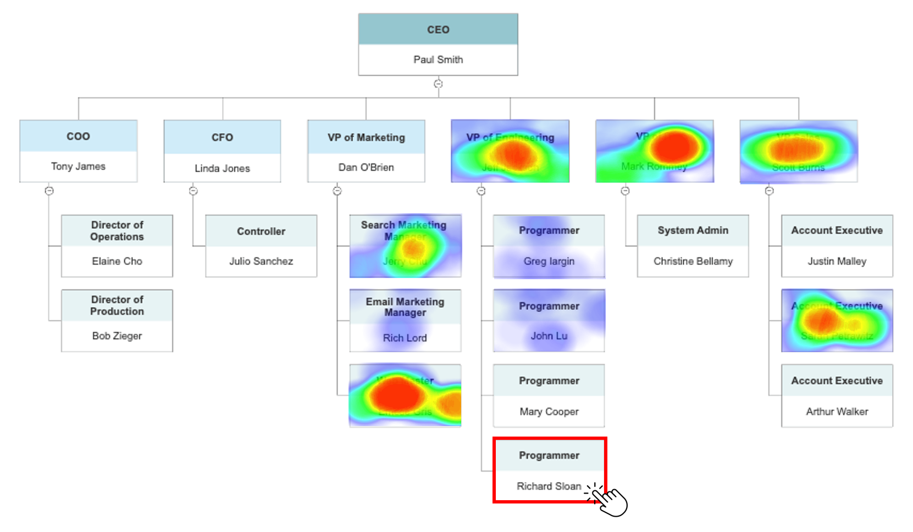

How to effectively combine information about the formal organizational structure of a company and the actual collaborative activities of its employees?

At [Time is Ltd.](https://www.timeisltd.com/) we are primarily focused on collaboration data analytics, whether it's meetings, emails, chat, CRM, project management or version control systems, but besides that we also have a product that helps companies map their formal organisational structure. Btw, you can give it a try because many of its features are available for free on the [Google Workspace Marketplace](https://orgchart.timeisltd.com).

We are currently trying to connect these two "worlds" because in situations of organizational transformation it can be very useful to have information about the relationship between the current and/or intended formal structure of the organization on the one hand and the actual patterns of collaboration on the other.

One option we're considering is using a kind of heatmap, which you may be familiar with from eye-tracking studies used in marketing, to see where people focus their attention when interacting with products and making purchasing decisions. Now imagine if we overlayed a similar heatmap showing the intensity of collaboration between a selected unit and the rest of the organization over an org chart - see the figure below for illustration.

 

Would you consider such a visualization useful if you were engaged in organizational transformation? Would you suggest any other kind of visualization or specific metric related to collaboration? Thank you in advance for any input you may have - it will help us broaden the range of perspectives we are currently considering.
