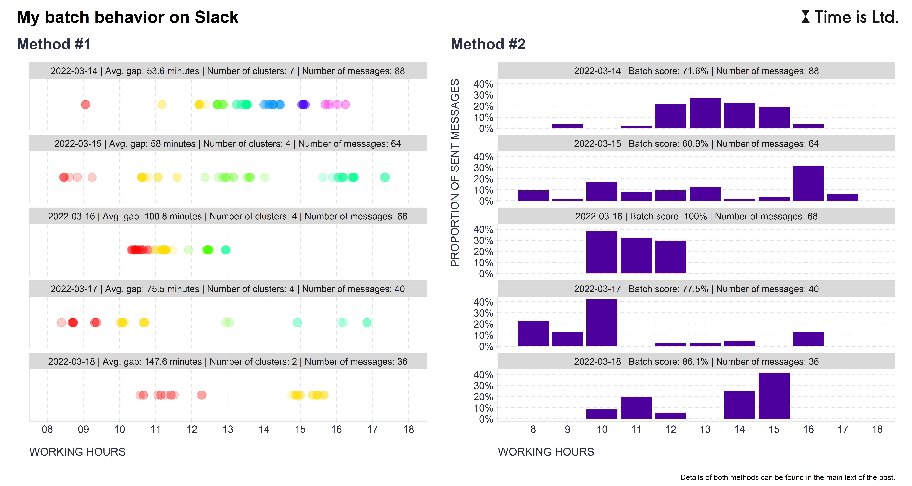

When dealing with a large number of tasks and frequent task switching, two related concepts originating from computer science can be used: **[batch processing](https://en.wikipedia.org/wiki/Batch_processing)** and **[interrupt coalescing](https://en.wikipedia.org/wiki/Interrupt_coalescing)**. 

In computing, these terms refer to a situation where computers wait until a fixed interval and check everything, rather than contextually switching and processing separate, uncoordinated interrupts from their various sub-components.

When transposed into the world of human workers, this design principle can manifest in checking emails or instant messages every one or two hours instead of continuously handling all incoming emails and messages. Such an arrangement prevents fragmentation of people’s time and provides them with more focus time they need for deep work and experiencing flow.

But how to measure this behavior so that a number can be put on it to enable people to better shape their behavior in this regard? At Time is Ltd. we are currently experimenting with two different approaches:    

1. Clustering of sent emails/messages using [K-Means](https://cs.wikipedia.org/wiki/K-means) or [PAM](https://en.wikipedia.org/wiki/K-medoids) and calculation of time gaps between start/end points of identified clusters, including the start and end of the working day. The larger the gaps, the stronger the signal of batch behavior.
2. Percentage of emails/messages sent during the 3 busiest working hours (defined by the number of emails/messages sent) during a given day. The higher the proportion, the stronger the signal of batch behavior. This approach is inspired by the [2016 study by Mark et al.](https://www.researchgate.net/publication/301935517_Email_Duration_Batching_and_Self-interruption_Patterns_of_Email_Use_on_Productivity_and_Stress) "Email Duration, Batching and Self-interruption: Patterns of Email Use on Productivity and Stress", where the authors used similar approach in the domain of email communication.

 

There are advantages and disadvantages to both methods (face validity, accuracy, sensitivity to edge cases, computational complexity, etc.), but irrespective of these, which one would you prefer to see in your collaboration report? To get a better idea of what outputs both of the above approaches generate, you can take a look at the attached graphs showing the prevalence of batch behavior during one of my work weeks on Slack according to these two approaches.
