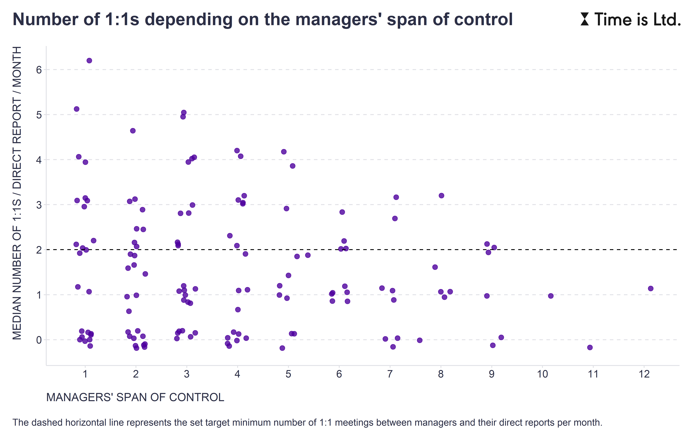

In determining the "optimal" span of control (SOC) for the company and specific departments and teams, it is always advisable to consider the context and strategy of the company, the way in which individual departments and teams should perform their work, and the level of competence of individual managers.

For example, [McKinsey](https://lnkd.in/e8_Gq6z4) suggested the following four specific aspects of managerial complexity that should be considered in this endeavor:

* The time a manager spends doing her or his own work vs. managing others. 
* The extent to which the work process is not standardized and formally structured. 
* The variety of work of the manager's direct reports. 
* The amount of experience and training that team members need to do their jobs.

The more of the above, the smaller the SOC should be.

In addition to these factors, we can use as other useful inputs some measures of collaboration that can reasonably be expected to be related both to SOC and to the obligations that managers have to their direct reports. A good example is the metric of the number of 1-on-1 meetings that managers have with their direct reports. As the attached chart illustrates, when pitted against each other, we can look for points on the SOC scale where managers start to fall short of the goal of a certain minimum number of 1:1s they have with their people, e.g. 2 meetings per month.

 

What factors do you typically consider when determining the optimal span of control in your company? And do you regularly reassess the adequacy of the current SOC in the context of your current situation?

