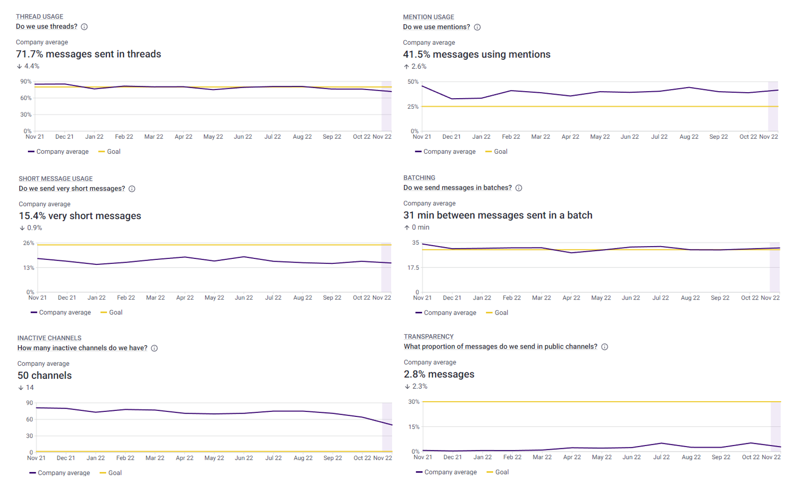

As many of you can probably confess, Slack and other instant messaging (IM) platforms can be both a blessing and a curse. To support the former and suppress the latter, authors of these tools and their users themselves have come up with several recommendations on how to use them effectively.
   
Specific numbers can be attached to some of these best practices to help teams and entire companies systematically shape their behavior on IM platforms in the desired direction. At [Time Is Ltd.](https://www.timeisltd.com/), we currently measure the following seven best practices:

1. **Thread use:** It helps create organized discussions around specific messages, and they let users discuss a topic in more detail without adding clutter to a channel or direct message conversation.
2. **Mention use:** Mentioning specific people in messages in both public and private channels is one effective way to avoid overwhelming users with a large number of messages that are not relevant to them.
3. **Short messages use:** Shorter messages often mean more messages, more messages mean more notifications, and more notifications mean more distractions, more frequent context switching, and decreased productivity.
4. **Emoji use:** People should use emojis instead of short messages as they are less distracting and more friendly to other people's attention.
5. **Batching:** Responding to chat messages round the clock can be detrimental to employees' productivity as it can distract them from focused work. Better strategy is checking messages every one or two hours instead of continuous handling of all incoming messages.
6. **Inactive channels:** Non-archived channels that show no activity are just clutter that makes it difficult to navigate and collaborate on the chat platform.
7. **Transparency:** Direct and group messages have their place in chat, especially when discussing sensitive issues or when trying to avoid spamming other employees. However, when majority of chat communication occurs in direct and group messages, there is a higher risk that information important for task alignment, problem-solving, or decision will be hidden in them and out of view from relevant people.

 

Would you add some other best practices for IM that have worked well for you and that would make sense to measure?

