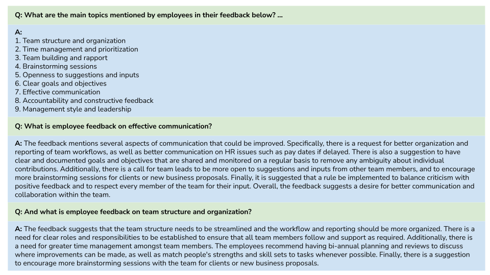

IMHO, ChatGPT and similar tools may be quite useful in the near future (and probably to some extent even today) to quickly summarize and explore the feedback provided by employees through open-ended questions in employee engagement and satisfaction surveys.

I just experimented with a small sample of anonymized employee feedback (just dozens of lines of text from a question about what employees would change in the company) and asked ChatGPT to summarize the feedback, identify the main topics covered in the feedback, and provide me with details about the selected topics - see the attached image of the conversation for illustration.

 

Just based on my very limited sample, I found that there was a pretty good balance between information compression and accuracy, while the interaction was very natural, similar to asking HRBP what the results of the last ESS were for my department/team. Certainly, there are still too many known and unknown risks associated with these tools to rely blindly on them alone, but I can imagine that in the foreseeable future, when many of these risks are successfully mitigated, this will be one of the ways managers will listen to the voice of their people.

Has anyone experimented with ChatGPT on similar kinds of HR data?