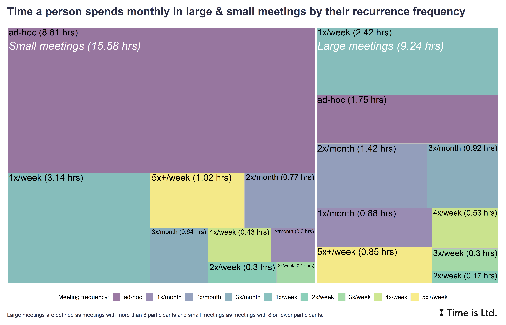

When thinking about the meeting reset like they did in [Asana](https://hbr.org/2022/10/meeting-overload-is-a-fixable-problem), IMHO, it's not a bad idea to focus on one specific category of meetings first. 

I am thinking of **large recurring meetings** that combine two big time wasters, and thus hide a greater opportunity for time savings:

1. **Large meetings** are quite often a waste of people’s time as they don’t allow everyone to meaningfully contribute. These meetings often serve only to disseminate information and can therefore be safely replaced by less intrusive asynchronous collaboration tools such as email, instant messaging or some kind of knowledge management tool.

2. **Recurring meetings** have their place, but often tend to outlive their purpose over time and waste the time of everyone involved. One should therefore regularly ask oneself the following questions in this context and act accordingly: Are meetings being planned automatically, rather than out of necessity? Are attendees invited as a formality, or will they bring value? Is there still clear agenda for these meetings? Are we already sufficiently aligned or do we need some additional platform for doing so? Does the current frequency of our meetings meet our needs? etc.

As illustrated in the attached chart, large and recurring meetings can represent a relatively large chunk of time in an employee's work month. Large meetings here account for approximately 37% of all meeting time and more than 80% of large meetings are recurring. This represents a relatively large room for optimizing the time spent in meetings.

 

