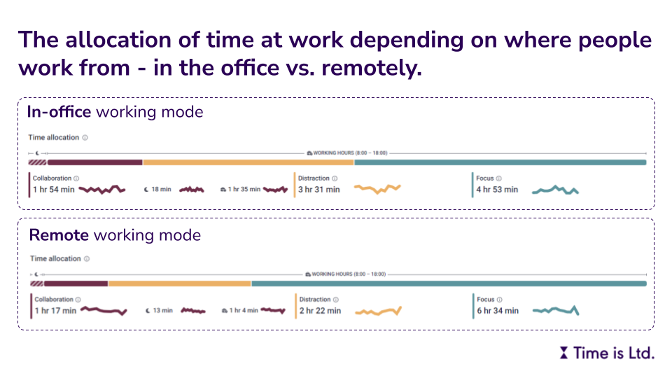

We have only recently started to measure the **allocation of work time to collaborative and non-collaborative activities** at [Time is Ltd.](https://www.timeisltd.com/).

 

When checking the resulting numbers in the context of **where people work from**, it wasn't that much of a surprise that people spend less time (on average ~37 minutes less per person per day) on collaborative activities when working remotely vs. in the office. Such a pattern is probably a good thing in many cases as it means that people have more time for focused work when working remotely, and use their time for intensive collaboration when in the office.

What was quite surprising to me, however, was the rather large difference in the amount of **distracted time**. When working in the office there was much more distracted time, i.e. time when people were working on their tasks while being distracted by various collaborative activities. Therefore, they didn't have enough time to get into the flow. On average, the difference was a staggering ~69 minutes per person per day.

However, when I thought about it a bit more (and also after I realized how we actually calculate distraction time️), it started to make more sense to me. After all, collaborative activities don't just "rob" us of time per se, they also fragment our available time into smaller chunks, which carries a cost in the form of **cognitive overhead** associated with **task switching**.

I suppose it's a **trade-off** that can't be completely solved in principle, but can only be mitigated with tools like **batching** or **timeboxing**. What is your own experience with this phenomenon and what tools do you use to deal with it?