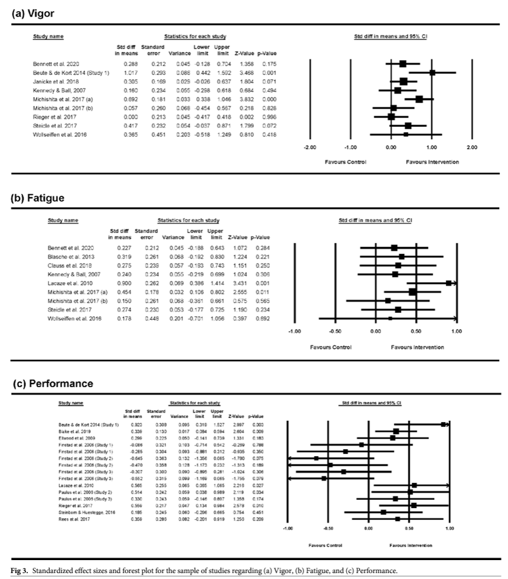

If you feel you need a short break, take one - even if it is no longer than 10 minutes, it can increase your perceived well-being and some types of performance.

As the authors of the study, [Albulescu et al. (2022)](https://www.ncbi.nlm.nih.gov/pmc/articles/PMC9432722/#!po=23.4300), conclude: “*Our results revealed that micro-breaks are efficient in preserving high levels of vigor and alleviating fatigue. It seems that the effects are univocal and generalizable for the well-being outcomes. These were relatively homogeneous, and none of the included moderators were significant. Hence, the data suggest that micro-breaks may be a panacea for fostering well-being during worktime.*

*When it comes to performance, the data revealed some nuances. The break duration was a significant covariate of the effect of micro-breaks: the longer the break, the better the performance. Moreover, the type of task from which participants were taking the break also emerged as a significant moderator. Micro-breaks could significantly increase performance for clerical work or creative exercises and not for a cognitively demanding task.*”

There is nothing like having a meta-analysis to back up your habits, or better yet, initially bad habits 😉

 