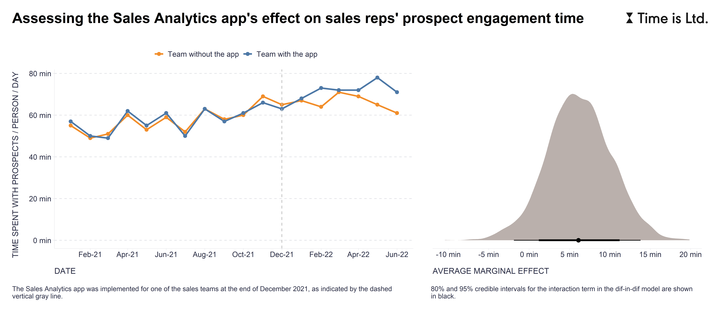

When considering the introduction of a new business app, one of the benefits of piloting it is that it provides a great opportunity to test its causal impact on business processes or outcomes of interest. For example, in our pilots, apps are typically implemented for 3 or 6 months only in some teams and not in others. Such a situation creates ideal conditions for applying the difference-in-differences (DiD) method, which is used to approximate an experimental research design with observational data only.  

To use one specific example, one of the problems addressed by our Sales Analytics app is that sales reps spend more time collaborating internally instead of communicating with prospects. The premise may be that the better visibility into time spent that the app enables will help sales reps and their managers better plan activities during their regular weekly 1-on-1 meetings, all with (hopefully) a positive impact on time spent with prospects.

By piloting the app in just one team and finding another team with a similar, parallel trend in the selected criterion, we can try to estimate its effectiveness. As shown in the attached chart, the fitted DiD model in this particular case slightly supports the effectiveness of the app, at least in terms of the amount of time spent with prospects, but can easily be switched to another criterion that is closer to the company’s bottom line, e.g., the number of closed deals. Moreover, if we are aware of certain systematic differences between the teams, such as the experience level of the sales reps, we can include relevant control variables in the model to achieve a more accurate estimation of the app's effectiveness.

So, next time you consider introducing a new business app, consider piloting it in combination with the DiD method to better understand its impact on your organization's goals. Happy piloting! ✌️

