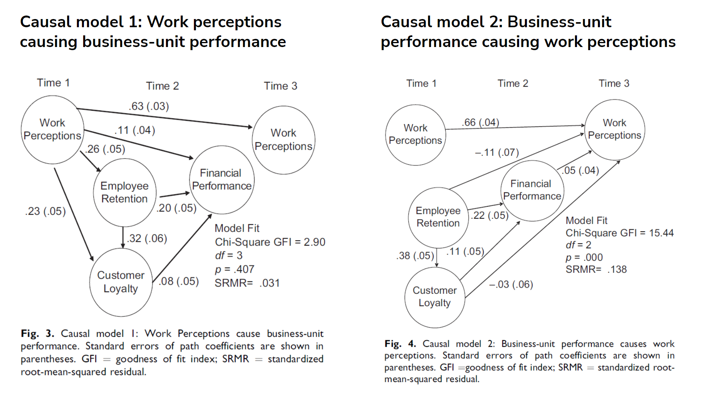

There is now little doubt that employee attitudes, such as employee satisfaction or employee engagement, are to some extent related to performance - for some evidence in support of this claim, see, for example, the meta-analysis of the relationships between employee satisfaction, employee engagement and business unit-level performance conducted by [Harter, Schmidt, & Hayes (2002)](https://psycnet.apa.org/doiLanding?doi=10.1037%2F0021-9010.87.2.268).

But does it mean that higher employee satisfaction causes higher performance? As any statistically savvy person knows, not necessarily.

Fortunately, there are research designs that can help us untangle this conundrum a bit. One of these designs is path analysis of longitudinal/time-series data. This approach was also taken by [Harter et al. (2010)](https://journals.sagepub.com/doi/abs/10.1177/1745691610374589) in their meta-analysis “Causal Impact of Employee Work Perceptions on the Bottom Line of Organizations” with the following results:

“*Using a massive longitudinal database that included 2,178 business units in 10 large organizations, we found evidence supporting the causal impact of employee perceptions on [...] bottom-line measures [customer loyalty, employee retention, revenue, and profit]; reverse causality of bottom-line measures on employee perceptions existed but was weaker.*”

The attached figure with the two alternative path models clearly shows that the causal path from employee perceptions to outcomes is stronger than the other way around, especially when it comes to theoretically more proximal outcomes such as employee retention and customer loyalty.

Despite not being free of potential biases, these results add more weight to the argument that investing in improving employee job satisfaction also makes sense for improving a company's bottom line, rather than "only" improving employee well-being. The question now is what interventions to improve employee satisfaction might work. Let’s review the available evidence on this issue in one of the next posts.

