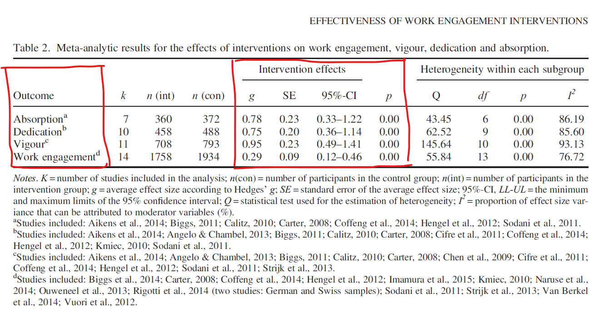

There is some evidence that engagement of employees has positive causal impact on the bottom line of organizations (see, for example, the meta-analysis by [Harter et al. (2010)](https://journals.sagepub.com/doi/abs/10.1177/1745691610374589), however, be aware of the specific definition of engagement used there, which focuses more on the contextual factors and conditions enabling engagement and less on the psychological states of engagement). Consequently, we might be naturally interested in whether we can positively influence engagement of employees through the use of certain interventions.

Based on a systematic review and meta-analysis of studies with controlled workplace interventions by [Knight, Patterson, and Dawson (2017)](https://pubmed.ncbi.nlm.nih.gov/28781428/), it seems the answer might be yes. The authors found a small positive effect on work engagement and each of its three sub-components: vigor, dedication, and absorption, as measured by the [Utrecht Work Engagement Scale](https://www.wilmarschaufeli.nl/publications/Schaufeli/Test%20Manuals/Test_manual_UWES_English.pdf) (UWES) from Bakker and Schaufeli.

When it comes to the types of intervention (personal resource building, job resource building, leadership training, and health promotion), a moderator analysis did not find evidence for their differing effectiveness. However, there was evidence for a medium to strong effect of intervention style in favor of group interventions (vs. individual), with the possible explanation being that group interventions effectively influence certain work engagement antecedents, such as social support and influence in decision-making.

Regarding the sustainability of effects, there was no significant effect of time in the case of overall work engagement. However, for the vigor sub-component, there were stronger effects immediately post-intervention than at follow-up, with the opposite being true for dedication and absorption sub-components.

Have you implemented any interventions to boost engagement of employees in your organization? Did you measure their effectiveness? What were your experiences and results? Feel free to share your thoughts in the comments below. 

