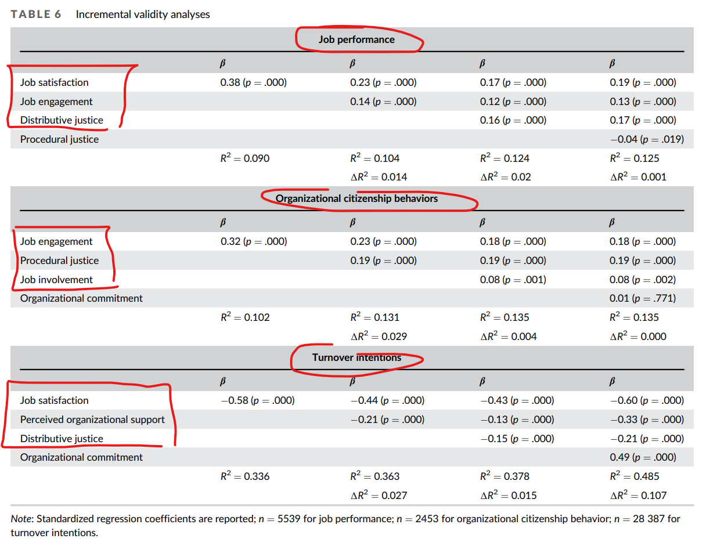

If you've ever measured employee job attitudes (i.e. constructs such as organizational commitment, procedural justice, distributive justice, job involvement,  job engagement, job satisfaction, etc.), you probably won't be surprised to learn that job attitudes are usually quite strongly correlated.

This is also the conclusion of a meta-analytic review of job attitudes by [Woznyj et al. (2022)](https://www.researchgate.net/publication/357568433_Job_Attitudes_A_Meta-Analytic_Review_and_an_Agenda_for_Future_Research), which showed that job attitudes are moderately to strongly correlated with each other, with most relations falling between ρ = .50 and .69.

Despite this, relative weights and incremental validity analyses revealed that some attitudes have greater validity in predicting key employee outcomes. As shown in the table attached, 

* performance is most strongly predicted by job satisfaction, job engagement, and distributive justice (an employee's perceived fairness of outcomes),
* turnover intentions is most strongly predicted by job satisfaction, perceived organizational support (a general evaluation regarding the extent to which employees feel their organization values their contribution and cares about their well-being), and distributive justice, and 
* organizational citizenship behaviors is most strongly predicted by job engagement, procedural justice (perceived fairness of the means, or procedures, used to determine outcomes), and job involvement (the degree to which a person identifies psychologically with his or her work, or the importance of work in his or her total self-image).  

 

IMO, knowing this can be quite useful in planning what candidate constructs to measure in your company in an effort to support specific employee outcomes. 

What job attitudes do you regularly measure in your company? And does it pay off in any way, i.e. does it have any tangible impact?

