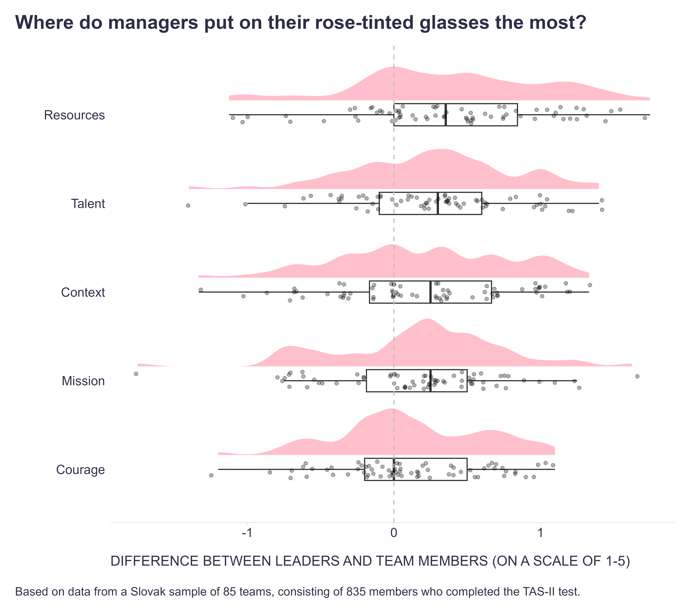

The "illusory superiority" or "better-than-average effect" causes individuals to overestimate their abilities compared to others. Unsurprisingly, even managers and leaders fall for this trap. After all, they're human too, right? 😉 For a review of studies on this topic, see, for example, the systematic review by [Heavey et al. (2022)](https://journals.sagepub.com/doi/full/10.1177/01492063211062566).

To pinpoint particular areas where managers and leaders are prone to overconfidence, data from the [Team Assessment Survey](https://www.therocketmodel.com/team-assessment-survey) (TAS), a team assessment tool rooted in the [Rocket Model of team performance](https://www.therocketmodel.com/what-is-rocket-model), can be valuable as it enables comparisons between how team leaders and team members perceive their team's functioning. For example, based on data from a Slovak sample of 85 teams with 835 members, it seems that team leaders rate their team's effectiveness way better than team members in the following five areas in descending order:

1. **Resources:** Does the team have the budget, equipment, authority, and political capital it needs to accomplish its goals?
2. **Talent:** Is the team sized correctly? Are team members’ roles clear? Does the team have the right skills to succeed? Are people developing new skills? Do rewards encourage or discourage teamwork?
3. **Context:** Are team members in agreement about the team’s political and economic realities, customers, competitors, suppliers, and key assumptions and challenges?
4. **Mission:** What is the team’s purpose? What are its goals? How does the team define winning? What are its strategies and plans for accomplishing its goals?
5. **Courage:** Do team members trust each other? Is there an optimal level of tension and collaboration on this team? Do team members challenge each other in a constructive manner?

When managers get overconfident in these areas, it can lead to all sorts of issues like underinvestment in critical resources, inefficient resource allocation, ignoring skill gaps, insufficient role clarity, making bad decisions, disjointed strategic planning, confusion, misaligned priorities, uncoordinated efforts, blocking innovation, etc.

What's the fix? Among other things, managers need to be aware of their own biases and work on open communication, feedback, and collaboration with team members. Easier said than done, but it's crucial to avoid hurting the performance of the team.

Obviously, the size and demographics of the sample used are limited and conclusions are therefore difficult to generalize, but I may try to check with [Dr. Gordon Curphy](https://www.linkedin.com/in/gordoncurphy/), the author of the Rocket Model of team performance and TAS, to see if this pattern is also replicated in a larger, international sample.

