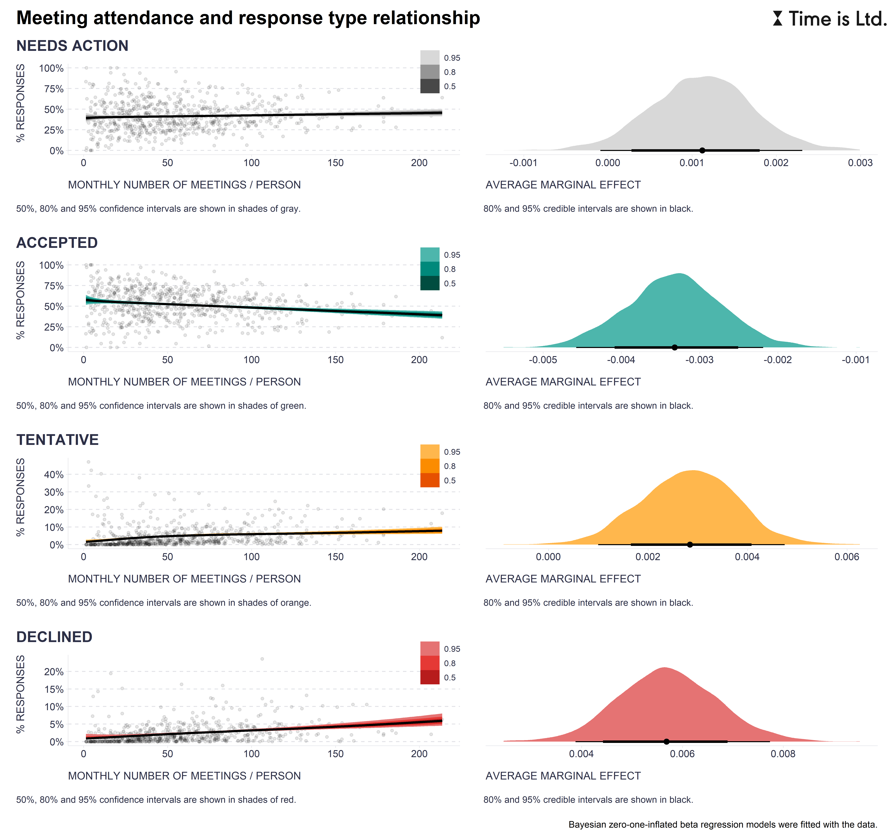

To test this hypothesis, they looked at the monthly number of meetings people attended and the relative frequency of their responses to meeting invitations. Here's what they found:

* People seemed to be similarly explicit in signaling their intentions about the meetings they were invited to, regardless of how many meetings they had on their plate.
* People accepted fewer meeting invites the more meetings they attended.
* Those who went to a bunch of meetings were more likely to say they're not sure if they can make it or not.
* People who were busy with meetings declined more meeting invites than those who had fewer meetings.

Thus, contrary to initial expectations, the data showed that people who attended more meetings, on average, tended to accept fewer invites, were more likely to be unsure about their availability, and actually declined more invites than those with fewer meetings.

While the client couldn’t rule out that there might be some individuals fitting "yes-men" description in their company (in fact, one can easily spot a few people in the corresponding chart who attended many meetings and at the same time underutilized the option of declining the meeting invites), these results suggested that there isn't a systematic problem in this specific area. Time for our client to explore other avenues through which the problem with meeting overload could be addressed. More on that in some of the next posts.

