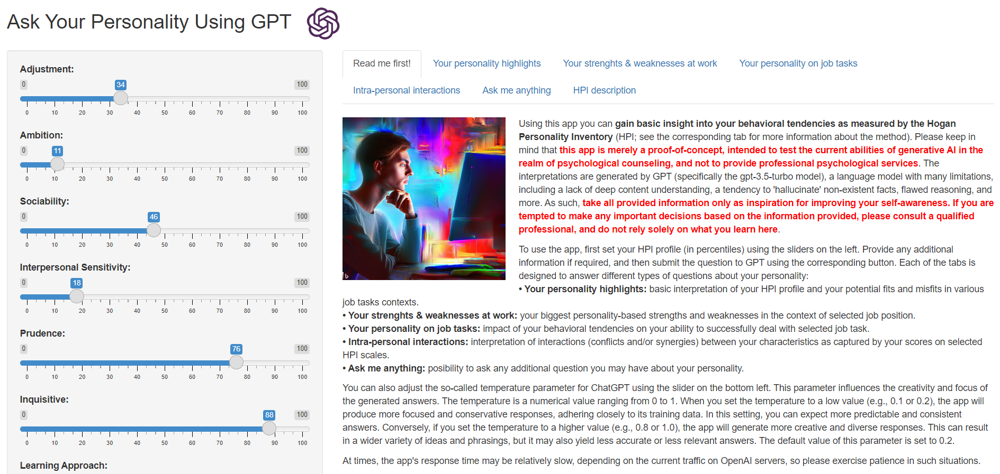

One of my friends recently asked me if I could provide him with an interpretation of a free personality test he took on the internet. As a joke, I asked him if he had already tried using GPT for this.

This sparked my interest in how GPT would actually handle this kind of task. So, I provided it with my Hogan Personality Inventory (HPI) profile (in percentile scores, as requested), and to my surprise, it performed quite well - even when asked about more complex questions like interactions between my scores on selected scales or my strengths and weaknesses for specific jobs and tasks.

Based on this experience, I created a simple POC app where users can input their HPI profile and some contextual information, such as their current or desired job, and ask GPT predefined or their own questions about their personality.

Link to the app: https://aanalytics.shinyapps.io/ask_your_personality/

I've only tested it on a few profiles, so if you know your HPI profile (or your Big Five traits that are behind HPI), I would be happy to hear how you perceive the face validity and potential usefulness of the generated interpretations. Perhaps I have just become a victim of the well-known Barnum effect 😉

I am well aware that there are clear risks associated with using a generic GPT for such a task. However, I believe that with proper fine-tuning, an explicit disclaimer, and access to a qualified professional for possible consultation, it could be a useful tool for helping people gain self-awareness more easily - in many situations a crucial prerequisite for high-quality decisions. What do you think?
