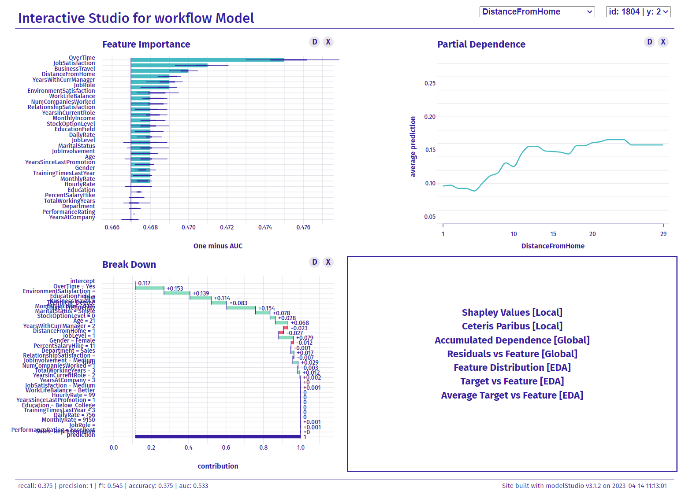

There's a great new R package, [modelStudio](https://cran.r-project.org/web/packages/modelStudio/index.html), that makes it much easier for analysts to create both global and local interpretations of predictive models using an interactive interface.

Once you've trained the model, you just get the [DALEX](https://cran.r-project.org/web/packages/DALEX/index.html) explainer object ready and start up modelStudio that will run the following analyses (among others) and show the corresponding plots:

* **Feature Importance:** A visual representation that ranks and displays the significance of each input variable in a predictive model, helping to identify the most influential features for model predictions.
* **Partial Dependence:** A visualization that shows the relationship between a feature and the predicted outcome while averaging out the effects of all other features, to understand the marginal impact of a specific feature on the model's predictions.
* **Accumulated Dependence:** Similar to the previous method, but reducing the influence of the assumption of uncorrelated features, providing a more robust and reliable representation of the feature's impact on the model's predictions.
* **Break Down Plot:** A graphical explanation tool that demonstrates the contribution of each feature to a specific instance's prediction, allowing for individual-level interpretation of model outcomes.
* **Shapley Values:** A cooperative game theory-based approach for fairly attributing each feature's contribution to a specific prediction, providing interpretable and consistent explanations for machine learning models.
* **Ceteris Paribus:** A method that helps with understanding the influence of individual features on specific predictions by isolating the effect of a single variable while holding all other variables constant.

If you use ML in HR or any other field where it's crucial to explain why you make specific predictions, classifications, and the resulting recommendations or decisions, definitely give it a try.

What follows is a short demonstration of the tool using the well-known [artificial IBM attrition dataset](https://www.kaggle.com/datasets/pavansubhasht/ibm-hr-analytics-attrition-dataset). First, let's import the attrition dataset from the `modeldata` library and change the coding of the criterion variable, which will later make it easier to set up the DALEX explainer, which requires numerical data type for criterion variable even in classification tasks.    

```{r}

# uploading libraries
library(modeldata)
library(tidyverse)

# uploading data
data("attrition")

# changing the coding of the criterion variable
attrition <- attrition %>%
  mutate(Attrition = recode(Attrition, "Yes" = "1", "No" = "0") %>% factor(levels = c("1", "0")))

```

We now split the data into training, test, and validation datasets so that we can tune the prediction model, fit the model, and test its performance on new, previously unseen data.

```{r}

# uploading libraries
library(rsample)

# splitting data into train, validation, and test datasets
set.seed(123)
data_split <- rsample::initial_split(attrition, strata = Attrition, prop = 0.8)

data_train <- rsample::training(data_split)
data_test  <- rsample::testing(data_split)
data_val <- rsample::validation_split(data_train, strata = "Attrition", prop = 0.8)

```

Now let's define the whole model training workflow, which includes the data adjustment pipeline and the specification of the model used. We will use XGBoost, presumably the best ML algorithm for tabular type of data.   

```{r}

# uploading libraries
library(recipes)
library(parsnip)
library(workflows)

fmla <- as.formula(paste("Attrition", " ~ ."))

# defining recipe for adjusting data for fitting the model
xgb_recipe <- 
  recipes::recipe(fmla, data = data_train) %>%
  recipes::step_ordinalscore(recipes::all_ordered_predictors()) %>%
  recipes::step_dummy(recipes::all_factor_predictors())

# defining the model
xgb_model <- 
  parsnip::boost_tree(mtry = tune(), min_n = tune(), tree_depth = tune(), trees = 1000) %>% 
  parsnip::set_engine("xgboost") %>% 
  parsnip::set_mode("classification")

xgb_workflow <- 
  workflows::workflow() %>% 
  workflows::add_model(xgb_model) %>% 
  workflows::add_recipe(xgb_recipe)

```

Although the XGBoost algorithm works quite well with the default hyper-parameters, we will use the validation dataset to tune some of its hyper-parameters to get the best performance out of it. As can be seen below, after tuning the best model performs quite well in terms of AUC, which has a value of around 0.8.

```{r}

# uploading libraries
library(tune)
library(yardstick)

# tuning hyper-parameters
set.seed(123)
xgb_tuning <- 
  xgb_workflow %>% 
  tune::tune_grid(
    data_val,
    grid = 25,
    control = control_grid(save_pred = TRUE),
    metrics = yardstick::metric_set(roc_auc)
    )

# selecting the best combination of hyper-parameters 
xgb_best <- 
  xgb_tuning %>% 
  tune::select_best(metric = "roc_auc")

# best model performance on validation dataset as measured by AUC 
(
  xgb_tuning %>% 
  tune::collect_predictions(parameters = xgb_best) %>% 
  yardstick::roc_auc(truth = Attrition,  .pred_1) 
)

# plotting the ROC curve
xgb_tuning %>% 
  tune::collect_predictions(parameters = xgb_best) %>% 
  yardstick::roc_curve(truth = Attrition,  .pred_1) %>%
  autoplot()

```

Now we can set up the final model training workflow and fit the model to the entire training dataset and check its performance on out-of-sample data using k-fold cross-validation and testing dataset. As we see below, in both cases the model performance as measured by AUC is around the value of 0.8. 

```{r}

# setting the final model
final_xgb_model <- 
  parsnip::boost_tree(mtry = xgb_best$mtry, min_n = xgb_best$min_n, tree_depth = xgb_best$tree_depth, trees = 1000) %>% 
  parsnip::set_engine("xgboost") %>% 
  parsnip::set_mode("classification")

# updating the model training workflow
final_xgb_workflow <- 
  xgb_workflow %>% 
  workflows::update_model(final_xgb_model)

# fitting model on train set
set.seed(123)
xgb_fit <- 
  final_xgb_workflow %>% 
  fit(data_train)

# checking the final model's performance (AUC) using k-fold cross-validation
set.seed(123)
folds <- rsample::vfold_cv(data_train, v = 10)

set.seed(123)
xgb_fit_kf <- 
  final_xgb_workflow %>% 
  tune::fit_resamples(folds)

(
  tune::collect_metrics(xgb_fit_kf, summarize = TRUE) %>% dplyr::filter(.metric == "roc_auc")
)

# checking the final model's performance (AUC) using the testing dataset
xgb_testing_pred <- 
  predict(xgb_fit, data_test) %>% 
  bind_cols(predict(xgb_fit, data_test, type = "prob")) %>% 
  dplyr::bind_cols(data_test %>% select(Attrition))

(
  xgb_testing_pred %>%           
  yardstick::roc_auc(truth = Attrition, .pred_1)
)

```

Now we're ready to explore the inner workings of our trained model. After setting up the explainer from the DALEX package, we simply insert this object into the modelStudio function and run it. We then get an interactive interface in our browser that we can use to easily check what our model is doing to make its predictions. You can try it out for yourself using the interactive interface below.

```{r}

# uploading libraries
library(DALEX)
library(modelStudio)

# setting up the DALEX explainer object
# creating predict function
pred <- function(model, newdata)  {
  results <- (predict(model, newdata, type = "prob")[[1]])
  return(results)
}

explainer <- DALEX::explain(
  model = xgb_fit,
  data = data_test %>% mutate(Attrition = as.integer(Attrition)),
  y = data_test %>% mutate(Attrition = as.integer(Attrition)) %>% pull(Attrition),
  predict_function = pred,
  type = "classification",
  verbose = FALSE 
)

# running ModelStudio
modelStudio::modelStudio(
  explainer,
  max_features = 100, # Maximum number of features to be included in BD, SV, and FI plots
  N = 300, # Number of observations used for the calculation of PD and AD
  new_observation_n = 3, #Number of observations to be taken from the data
  show_info = TRUE,
  viewer = "browser",
  facet_dim = c(2,2) # layout of the resultiing charts
  )

```

