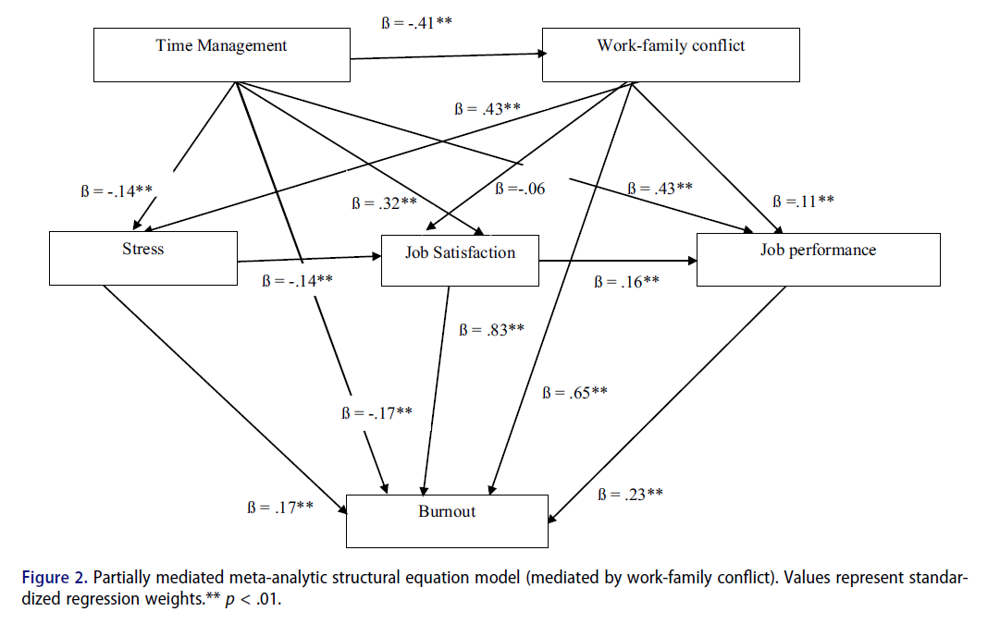

[Bedi & Sass (2022)](https://www.tandfonline.com/doi/abs/10.1080/00224545.2022.2159302?journalCode=vsoc20) conducted a meta-analytic review of the consequences of employee time management behaviors on several employee outcomes. What are the main insights?  

* It may not come as a big surprise, but it is encouraging that **data support the association between time management and various beneficial employee outcomes, such as increased job satisfaction, job performance, and lower levels of stress and burnout**. Unfortunately, the "proven" association is not causal, as the majority of studies were cross-sectional. In fact, there are not many studies on the causal effects of time management. The exception to this is procrastination, for which there is evidence that time management can help - see, for example, the meta-analysis by [Van Eerde & Klingsieck (2018)](https://www.sciencedirect.com/science/article/abs/pii/S1747938X18300472) on this topic.

* **The relationship between time management and employee outcomes is not only direct but also partially mediated by work-family conflict**. This finding underscores the importance of work-life balance and highlights the need for organizations to help employees better address this specific issue, as it may positively affect a variety of employee outcomes.

* **Perceived control over time**, achieved through the use of time management, **shows incremental validity in predicting job satisfaction, job performance, and stress with respect to the personality trait of conscientiousness**. This suggests that regardless of an individual's innate level of prudence, they may benefit from adopting time management in their professional lives.

