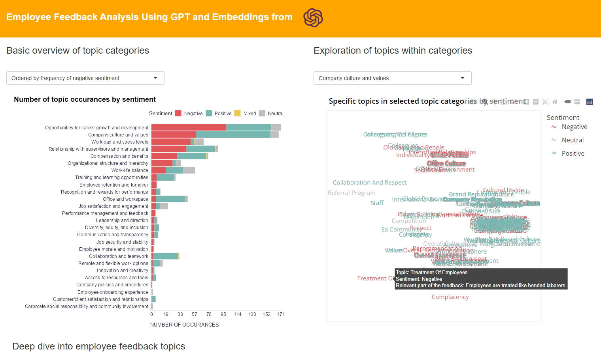

A while ago, I posted about the [potential of using GPT for processing open-ended feedback from employees](https://blog-about-people-analytics.netlify.app/posts/2023-02-26-chatgpt-and-employee-feedback/){target="_blank"}. I simply inputted a block of text into GPT and asked for a summary of the major topics found in the feedback. Although the output was quite accurate and the information compression achieved was very useful, this approach was somewhat limited in terms of scalability and granularity of the information provided.

To address these limitations, I experimented with another approach that includes the following steps:

1. Looping over feedback from individual employees and sending them one by one to GPT.
2. Prompting GPT to identify all present topics in each feedback, determining their respective sentiments (positive, negative, mixed, or neutral), and extracting the relevant parts of the feedback based on which the topic was identified.
3. Prompting GPT to categorize identified topics using a provided list of topic categories (e.g., compensation and benefits, work-life balance, collaboration and teamwork, etc.), while taking into account contextual information in the relevant parts of the feedback. Alternatively, categorizing by matching embeddings of identified topics, contextual information, and topic categories.
4. Plotting the topic categories by the number of their occurrences and type of associated sentiment.
5. Interactive exploration of specific topics clustered by their semantic similarity based on their respective embeddings and visualized with the help of t-SNE dimensionality reduction technique.
6. Creating a filterable table with identified topics and all original and extracted information that may be useful for further exploration of the feedback and for checking the precision of the topic identification.

I had to experiment a bit with the prompts and include some data-munging inter-steps to get useful outputs, however, it now works relatively smoothly and provides pretty good results. To test the plausibility of this approach, I tried it on publicly available feedback from more than 300 current and former employees of an unnamed company published on Glassdoor and shared on [Kaggle](https://www.kaggle.com/datasets/davidgauthier/glassdoor-job-reviews/code){target="_blank"}. You can check the results of the analysis yourself in [this simple dashboard](https://aanalytics.shinyapps.io/employeeFeedback/){target="_blank"}. 

In my opinion, it works quite well and could represent a very time- and cost-effective way to gain useful insights from employee open-ended feedback at scale, with the caveat that one has to ensure the security of the processed data, for example, by using a local LLM. Let me know what you think about this approach. And if you are interested in the Python code behind the analysis so you can play with it on your own data, here's the [link to the GitHub page](https://github.com/lstehlik2809/Employee-Feedback-Analysis-Using-OpenAI){target="_blank"} with the Python code.

