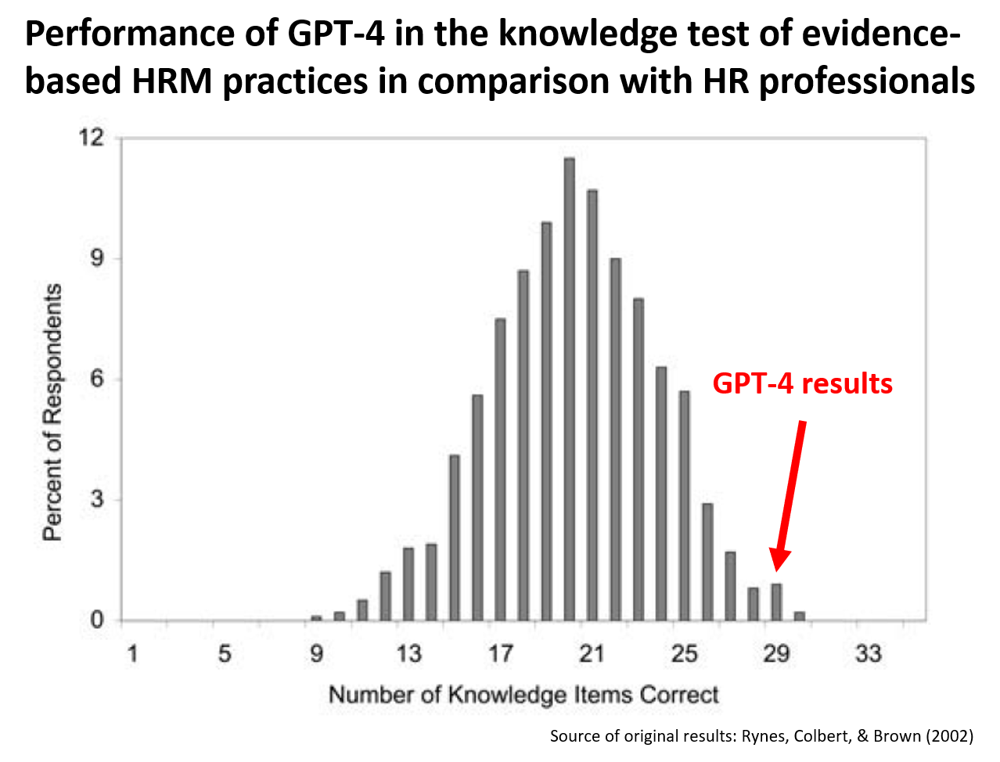

Some time ago, I "replicated" [Rynes, Colbert, and Brown's 2002 study](https://psycnet.apa.org/record/2003-99255-001) on HR practitioners' beliefs about effective HR practices on a convenience sample of more than 140 LinkedIn users. [The results of this "replication"](https://blog-about-people-analytics.netlify.app/posts/2023-01-08-evidence-based-hrm-knowledge-test-results/) closely resembled the results of the original study. On average, respondents correctly answered 19.4 out of 35 items, achieving a 55% success rate, which was very close to the 57% average success rate in the original study (and also quite close to the 50% success rate that corresponds to random choice, given the TRUE/FALSE response format).

I was curious to see how GPT-4 would perform in this test, as it had been evaluated on various standardized tests such as the SAT, GRE, Bar Exam, and AP. The prompts used had the following form: Read the following statement and indicate whether it is true or false. Keep in mind that the statement refers to general trends and patterns that apply on average but not necessarily to all cases. When evaluating the statement, ensure that you correctly interpret the words used in the statement and take into account existing scientific evidence. Give me the answer either true or false, without intermediate values, in a boolean way. Finally, briefly explain your reasoning behind your answer. The statement is as follows:...

So, what were the results? GPT-4 answered 29 out of 35 items right, i.e., it achieved an 83% success rate, which corresponds to the 99th and 97th percentiles in the original and "replicated" studies, respectively. GPT-4's results were thus superior to majority of people who took the test.



However, even when it gave a correct answer, it did not always rely on correct facts and/or valid reasoning, which could be a problem if management decided to act on the answers provided. See the table below to check the details of its responses.

```{r}

# uploading libraries
library(tidyverse)
library(readxl)
library(DT)

# uploading data
mydata <- readxl::read_xlsx("./gpt4Responses.xlsx")

# creating user-friendly table
DT::datatable(
  mydata %>% 
    dplyr::select(itemId, item, gpt4Response, correctAnswer, gpt4Reasoning, researchEvidence, possibleContingencies) %>%
    dplyr::rename("Item ID"=itemId, Item=item, "GPT-4 response"=gpt4Response, "Correct answer"=correctAnswer, "GPT-4 reasoning"=gpt4Reasoning, "Research evidence"=researchEvidence, "Possible contingencies"=possibleContingencies),
  class = 'cell-border stripe', 
  filter = 'top',
  extensions = 'Buttons',
  fillContainer = FALSE,
  rownames= FALSE,
  options = list(
    pageLength = 3,
    autoWidth = TRUE,
    columnDefs = list(list(width = '500px', targets = c("Item", "GPT-4 reasoning", "Research evidence", "Possible contingencies"))),
    dom = 'Bfrtip',
    buttons = c('copy'), 
    scrollX = TRUE, 
    selection="multiple"
  )
) %>%
  DT::formatStyle(1:7, 'vertical-align'='top')
```

The possible takeaway from this finding? Although GPT-4 can be a handy tool for exploring possible solutions to specific HR-related problems, on its own and in its current form it cannot replace the good old systematic search for and retrieval of evidence, critical evaluation of its reliability and relevance, and its weighing and synthesis as conducted and/or supervised by human experts.

P.S. I didn't test the reliability of GPT-4's responses, nor did I set its temperature to 0, so it's possible that you might obtain somewhat different results if you decide to replicate the test. In addition, keep in mind that the comparison presented here is not entirely an apples-to-apples comparison, mainly due to the fact that new evidence may have emerged that does not match the correct answers in the original study conducted more than 20 years ago.  


