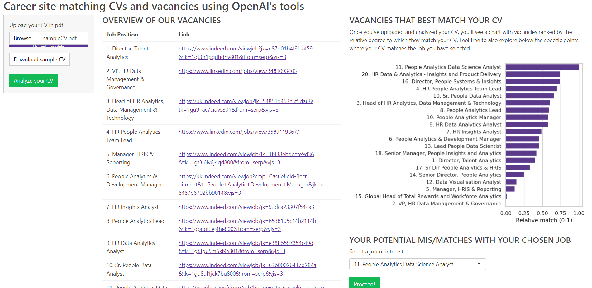

My recent exploration of new job opportunities has inspired me to consider what I would appreciate as a job candidate when visiting the career site of a company I'd like to work for. Specifically, I would appreciate the following flow:

1. Uploading my CV on the company's career site.
2. Receiving a list of jobs sorted by the degree of match to my CV. 
3. Obtaining an overview of my major mis/matches for the selected job.
4. Having the option to ask specific questions about the job (e.g. What could be the biggest challenge for me?)
5. Not/Applying for the job after considering the provided information.

It's clear that a process like this would make life easier not only for job candidates but also for companies, as more relevant candidates would likely apply for posted vacancies on average (as far as people are looking for similar jobs they have done in the past).

I tested the feasibility of this idea by creating a functional POC career site, with OpenAI tools working behind the scenes, that supports this exact flow for 20 people-analytics-related job ads taken from [One Model's website with open roles in the people analytics space](https://www.onemodel.co/roles-in-people-analytics-hr-technology){target="_blank"} (by the way, kudos for that, One Model team 👏). You can try it for yourself with your own or sample CV on [this webpage](https://aanalytics.shinyapps.io/cv-job-fit-analysis/){target="_blank"}.

Let me know in the comments what you think about the flow and/or how you would improve it to make it even more useful for job candidates and companies.

P.S. It was also a good opportunity to try out [Shiny for Python by Posit](https://shiny.rstudio.com/py/){target="_blank"}. Being a regular user of the R version of Shiny, I may be a little bit biased, but IMO it's more user-friendly compared to Dash, so if you need to present the results of your Python code in an interactive web application, definitely give it a try.

