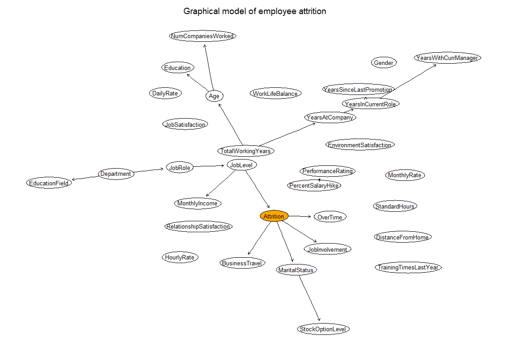

In a people analytics project I'm involved in, we were asked to come up with a prediction model that would perform reasonably well while being very easy to understand and interpret for non-technical users.

In considering various options, we also came across [Bayesian networks](https://en.wikipedia.org/wiki/Bayesian_network){target="_blank"} (BNs), [probabilistic graphical models](https://en.wikipedia.org/wiki/Graphical_model){target="_blank"} consisting of nodes and directed edges that represent conditional (and under certain assumptions, causal) relationships between random variables. They seem to have several interesting properties that would suit our needs, namely:

* BN models are not "black boxes", but all their parameters have a comprehensible interpretation, which may reduce users' algorithm aversion and increase their willingness to take algorithm outputs into account in their decision-making. 
* Expert knowledge can easily be used in the development of BN models by building the network structure using expert knowledge of im/plausible (causal) relationships between the variables under study.
* The model lends itself to a user-friendly visualization of its structure, helping to design new models that take into account both data-based constraints and the knowledge of experts in the field. 
* It is possible to use the data itself to estimate the possible network topology and thus gain preliminary insight into the structure of the problem domain defined by the available variables. 
* After fitting the model, it can be used for reasoning, i.e., calculating probabilities of interest conditional on the available evidence. This reasoning can be done even with incomplete data, based only on the known values of any combination of the available variables. 

*The attached graph is for illustrative purposes only - the output from early experiments with BNs on [artificial IBM employee attrition data](https://www.kaggle.com/datasets/pavansubhasht/ibm-hr-analytics-attrition-dataset){target="_blank"}.*

However, when searching for information about this method, we found that it is not particularly popular among people analytics and I/O psychology practitioners. Would anyone of the readers happen to have a good or bad experience using this tool and would also be willing to share it? 🙏  

