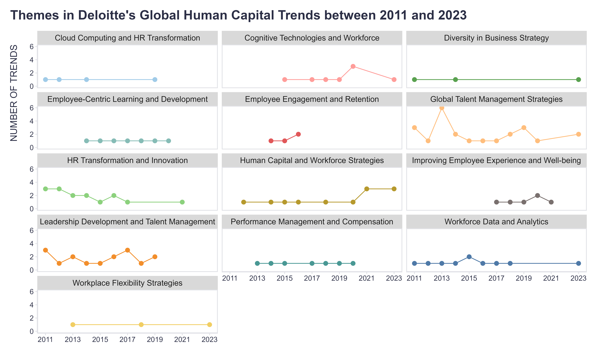
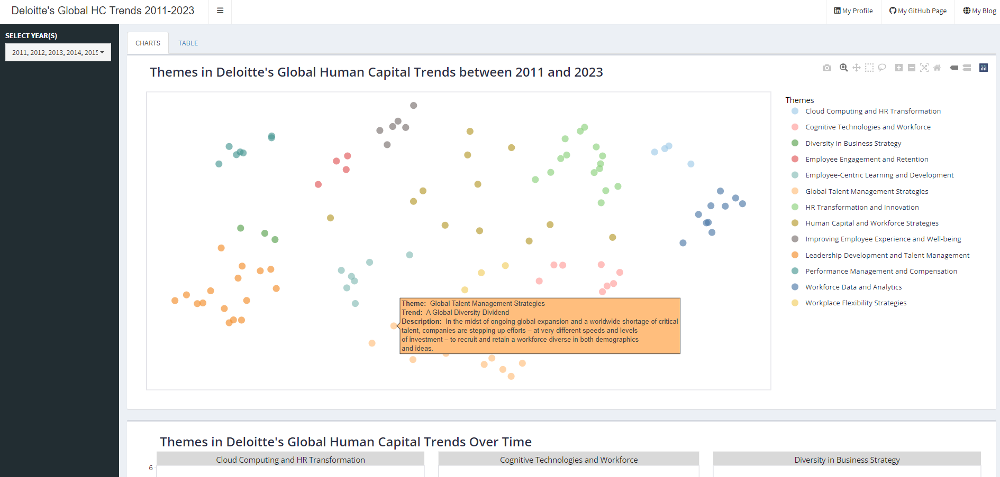

Aside from satisfying a simple curiosity, it was also a good opportunity to try out a nerdy combination of various cool DS tools: openAI’s embeddings for determining trends similarity, UMAP for dimensionality reduction, DBSCAN for cluster analysis, openAI’s chat completion for cluster summarization and naming, Plotly for interactive dataviz, Shiny for dashboarding, and Python and R for orchestrating it all.

The result? The analysis revealed 13 distinct themes among the 118 specific trends:

1. Global Talent Management Strategies (23)
2. Leadership Development and Talent Management (16)
3. HR Transformation and Innovation (15)
4. Human Capital and Workforce Strategies (12)
5. Workforce Data and Analytics (10)
6. Cognitive Technologies and Workforce (8)
7. Employee-Centric Learning and Development (7)
8. Performance Management and Compensation (7)
9. Improving Employee Experience and Well-being (6)
10. Cloud Computing and HR Transformation (4)
11. Employee Engagement and Retention (4)
12. Diversity in Business Strategy (3)
13. Workplace Flexibility Strategies (3)

It's no wonder I've had dejavu feelings about some trends over the years, but that's why they are called trends, because they persist over time, right? 😉

If you would like to check the analysis output interactively and in greater detail, you can use [this simple dashboard](https://lsanalytics.shinyapps.io/trendsApp/){target="_blank"}.

