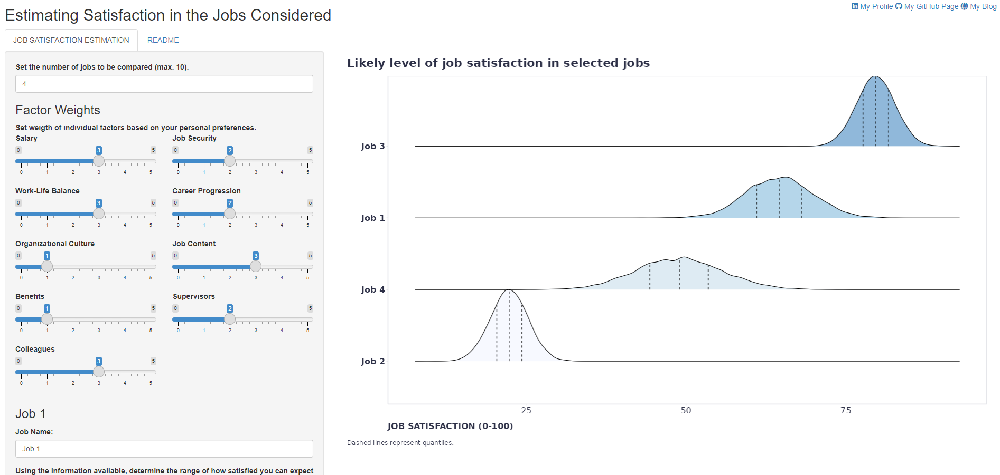

Being in the final phase of my new job search, I wanted to be able to aggregate the information and impressions I gathered during the hiring process, with all the uncertainties, to make the best decision possible. 

To do this, I put together a sort of “back-of-the-envelope” calculation that combines, in a Bayesian way, the impressions one has of various aspects of the jobs one is applying for.  

It works with several factors that research suggests are related to job satisfaction and that a person has the chance to estimate subjectively to some degree during the hiring process from job ads, interviews, sample tasks, company reviews from current or former employees on Glassdoor, etc. Specifically, it takes into account the following factors:

* Salary
* Job security
* Work-life balance
* Career progression
* Organizational culture
* Job description
* Benefits
* Relationships with supervisors and colleagues

One's task is to "simply" determine, based on the available information, the range of how much he or she can expect to be satisfied with these factors in a given job. The app then aggregates the evidence and estimates the expected overall level of job satisfaction, including a level of uncertainty that can provide a guide as to where the person should try to obtain some additional information to reduce this uncertainty. One can also adjust the weights of each factor based on one's personal preferences.

If you have at least two job offers to choose from, you may find the app as useful as I did. Here’s a [link to the app](https://lsanalytics.shinyapps.io/jobComparator/){target="_blank"}.

Good luck with your decisions and choices 🤞
