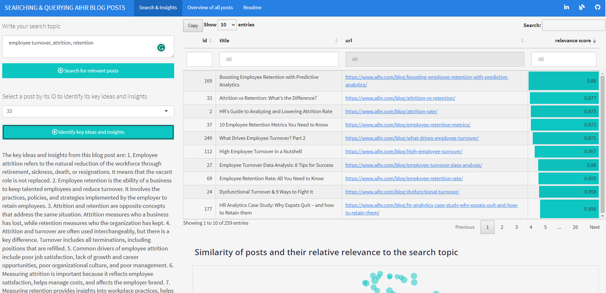

It’s an app that allows you to quickly search for People Analytics topics in a database of almost 260 [AIHR blog posts](https://www.aihr.com/blog/){target="_blank"} and get key ideas and insights from the posts that best match your search topic, with the possibility to go to the original post via a provided link. 

The cluster analysis revealed that the posts cover more than 30 topics, so there's a lot to choose from. Feel free to give it a try and let me know how it works for you. Here's a [link to the app](https://lsanalytics.shinyapps.io/aihrPostsSearchInsights/#section-search-insights){target="_blank"}.

Last but not least, a big "thank you" goes to AIHR and all the contributing authors for putting together such an amazing resource on People Analytics 🙏 
