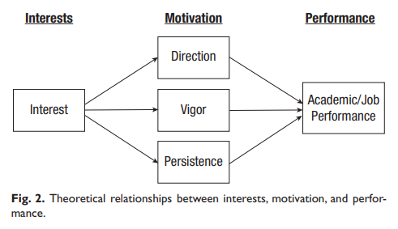
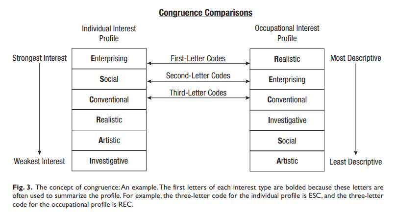

To be honest, until recently, I tended to underestimate the importance of vocational interests in job performance prediction and considered questions about them during a job interview as a formality. In my defense, this view has also been supported by the low estimates of their predictive validity reported by classics such as [Schmidt & Hunter (1998)](https://psycnet.apa.org/record/1998-10661-006){target="_blank"}.

However, I adjusted my view after coming across the updated validity estimate in the [Sackett et al. meta-analysis (2022)](https://psycnet.apa.org/record/2022-17327-001){target="_blank"} and the results of the [Nye et al. meta-analysis (2017)](https://psycnet.apa.org/record/2016-62203-013){target="_blank"} on the validity of interests for predicting job performance.

The latter study reported the following interesting findings:

* Correlation between interest scores and job performance (corrected for both indirect range restriction and unreliability in the criterion) is 0.16 (SE=0.03).

* Interest congruence/match between an individual's interests and his or her work is a much stronger predictor of performance outcomes than interest scores alone, with baseline correlations of 0.32 and 0.16, respectively.

* Interests are significantly better predictors of organizational citizenship behavior than other criteria (job performance, task performance, OCB, persistence, CWB, and training performance) but are less valid for predicting CWB and task performance.

If you tend to think about vocational interests as I have until recently, perhaps these two studies will help you update your priors a little bit 😉

Note: The attached schemes are taken from another excellent resource on this topic by [Nye et al. (2012)](https://psycnet.apa.org/record/2012-17649-006){target="_blank"}.
