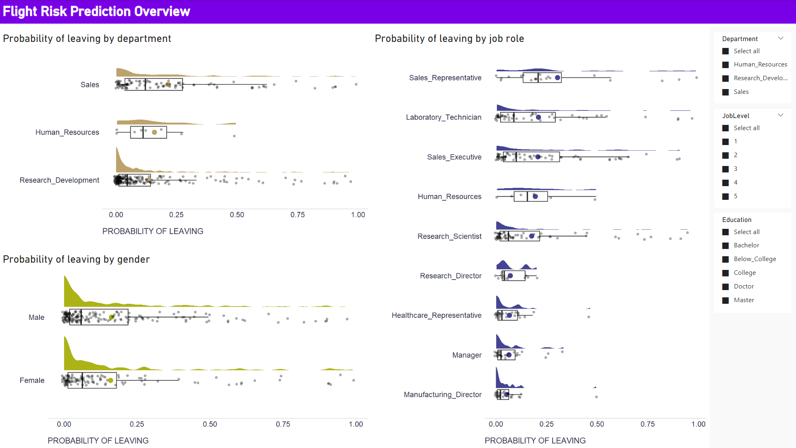

Note to start: Although the example presented in this post is demonstrated in R, it could be analogously implemented in Python as well.Note to start: Although the example presented in this post is demonstrated in R, it could be analogously implemented in Python as well.

For demonstration, I will use the well-known [IBM artificial attrition dataset](https://www.kaggle.com/datasets/pavansubhasht/ibm-hr-analytics-attrition-dataset). First, we need to train the model. I suppose you know the drill and know all the steps to go through to get a useful and reliable model. The following R script implements the whole process of data preparation, (XGBoost) model tuning, training, and validation. After we have the prediction model ready, we have to save it, as we will use it later in the Power BI (PBI) dashboard.

```{r eval=FALSE}

# uploading libraries
library(rsample)
library(modeldata)
library(tidyverse)
library(recipes)
library(themis)
library(parsnip)
library(workflows)
library(tune)
library(yardstick)

# uploading data
data("attrition")

# changing the coding of the criterion variable
attrition <- attrition %>%
  mutate(Attrition = recode(Attrition, "Yes" = "1", "No" = "0") %>% factor(levels = c("1", "0")))

# splitting data into train, validation, and test datasets
set.seed(123)
data_split <- rsample::initial_split(attrition, strata = Attrition, prop = 0.8)
data_train <- rsample::training(data_split)
data_test  <- rsample::testing(data_split)
data_val <- rsample::validation_split(data_train, strata = "Attrition", prop = 0.8)


# defining recipe for adjusting data for fitting the model
fmla <- as.formula(paste("Attrition", " ~ ."))

xgb_recipe <- 
  recipes::recipe(fmla, data = data_train) %>%
  recipes::step_ordinalscore(recipes::all_ordered_predictors()) %>%
  recipes::step_dummy(recipes::all_factor_predictors()) %>%
  themis::step_smote(Attrition, over_ratio = 1)

# defining the model
xgb_model <- 
  parsnip::boost_tree(mtry = tune(), min_n = tune(), tree_depth = tune(), trees = 1000) %>% 
  parsnip::set_engine("xgboost") %>% 
  parsnip::set_mode("classification")

xgb_workflow <- 
  workflows::workflow() %>% 
  workflows::add_model(xgb_model) %>% 
  workflows::add_recipe(xgb_recipe)


# tuning hyper-parameters
set.seed(123)
xgb_tuning <- 
  xgb_workflow %>% 
  tune::tune_grid(
    data_val,
    grid = 25,
    control = control_grid(save_pred = TRUE),
    metrics = yardstick::metric_set(roc_auc)
  )

# selecting the best combination of hyper-parameters 
xgb_best <- 
  xgb_tuning %>% 
  tune::select_best(metric = "roc_auc")

# best model performance on validation dataset as measured by AUC 
(
  xgb_tuning %>% 
    tune::collect_predictions(parameters = xgb_best) %>% 
    yardstick::roc_auc(truth = Attrition,  .pred_1) 
)


# plotting the ROC curve
xgb_tuning %>% 
  tune::collect_predictions(parameters = xgb_best) %>% 
  yardstick::roc_curve(truth = Attrition,  .pred_1) %>%
  autoplot()


# setting the final model
final_xgb_model <- 
  parsnip::boost_tree(mtry = xgb_best$mtry, min_n = xgb_best$min_n, tree_depth = xgb_best$tree_depth, trees = 1000) %>% 
  parsnip::set_engine("xgboost") %>% 
  parsnip::set_mode("classification")

# updating the model training workflow
final_xgb_workflow <- 
  xgb_workflow %>% 
  workflows::update_model(final_xgb_model)

# fitting model on train set
set.seed(123)
xgb_fit <- 
  final_xgb_workflow %>% 
  parsnip::fit(data_train)


# variable importance
xgb_fit %>%
  tune::extract_fit_parsnip() %>%
  vip::vip(num_features = 10, geom = "col")


# checking the final model's performance (AUC) using k-fold cross-validation
set.seed(123)
folds <- rsample::vfold_cv(data_train, v = 10)

set.seed(123)
xgb_fit_kf <- 
  final_xgb_workflow %>% 
  tune::fit_resamples(folds)

(
  tune::collect_metrics(xgb_fit_kf, summarize = TRUE) %>% dplyr::filter(.metric == "roc_auc")
)

# checking the final model's performance (AUC) using the testing dataset
xgb_testing_pred <- 
  predict(xgb_fit, data_test) %>% 
  bind_cols(predict(xgb_fit, data_test, type = "prob")) %>% 
  dplyr::bind_cols(data_test %>% select(Attrition))

(
  xgb_testing_pred %>%           
    yardstick::roc_auc(truth = Attrition, .pred_1)
)

# saving the final model
saveRDS(xgb_fit, "./final_xgb_model.RDS")

# saving testing data as a new dataset that will be used in Power BI dashboard
data_test %>%
  dplyr::select(-Attrition) %>%
  writexl::write_xlsx("./newData.xlsx")


```

Now we can move on to PBI. We use the testing data as a new dataset that we will score by the trained model and show stakeholders how the predicted flight risk varies by department, job role, and gender. 

First, we should check in the PBI settings that PBI has access to our R (or Python) instance (`File` -> `Options and setting` -> `GLOBAL/R scripting/Python scripting`). If so, we can upload new data using the `Get data` dialog and go to the `Transform` tab in the Query editor. Here, we should first check that the data types match those in R when preparing the model, and then we can load and run our scoring algorithm using the `Run R script` dialog. The following script will do the job.

```{r eval=FALSE}

# 'dataset' holds the input data for this script

# uploading libraries
library(tidyverse)
library(workflows)

# uploading trained model
model <- readRDS("PathTo/YourModel.RDS")

# generate predictions
prediction <- predict(model, dataset) %>% 
  dplyr::bind_cols(predict(model, dataset, type = "prob")) %>%
  dplyr::rename(
    predictedCat = .pred_class,
    probLeave = .pred_1,
    probStay = .pred_0
  )

# enriching original dataset
prediction <- cbind(dataset, prediction)

```

After running the script, our original data will be enriched with the generated predictions. We can apply this transformation, save it and exit the Query editor using the `Close & Apply` button. We will then have flight risk predictions that we can visualize along with the original data, allowing us to see how predicted flight risk varies by department, job role, and gender, among other things. Again, we could use R or Python for this purpose, as PBI does not offer some types of data visualization by default, especially those related to visualizing data variability. For example, to create the raincloud plots below, I used the `ggplot2` and `ggdist` packages in R. Below is a script used within the R visual that implements one of the plots. To fine-tune them, I recommend using RStudio (if you have it on your computer), which is accessible directly from the R visual editor in PBI. 

```{r eval=FALSE}

# 'dataset' holds the input data for this script
# dataset <- data.frame(probLeave, Department)

# uploading libraries
library(tidyverse)
library(ggdist)

dataset %>%
  ggplot2::ggplot(aes(x = forcats::fct_reorder(Department, probLeave, mean, .na_rm = TRUE), y = probLeave)) + 
  ggdist::stat_halfeye(
    adjust = .5, 
    width = .6, 
    .width = 0, 
    justification = -.3, 
    point_colour = NA,
    fill = "#bca36b",
    color = "#bca36b"
  ) + 
  ggplot2::geom_boxplot(
    width = .25, 
    outlier.shape = NA
  ) +
  ggplot2::stat_summary(fun.y=mean, geom="point", shape=20, size=5, color="#bca36b", fill="#bca36b") +
  geom_point(
    size = 1.3,
    alpha = .3,
    position = position_jitter(seed = 1, width = .09, height = .008
    )
  ) + 
  ggplot2::coord_cartesian(xlim = c(1.2, NA), clip = "off") +
  ggplot2::coord_flip() +
  ggplot2::labs(
    x = "",
    y = "PROBABILITY OF LEAVING"
  ) +
  ggplot2::theme(plot.title = element_text(color = '#2C2F46', face = "bold", size = 18, margin=margin(0,0,12,0)),
                 plot.subtitle = element_text(color = '#2C2F46', face = "plain", size = 16, margin=margin(0,0,20,0)),
                 plot.caption = element_text(color = '#2C2F46', face = "plain", size = 11, hjust = 0),
                 axis.title.x.bottom = element_text(margin = margin(t = 15, r = 0, b = 0, l = 0), color = '#2C2F46', face = "plain", size = 13, lineheight = 16, hjust = 0),
                 axis.title.y.left = element_text(margin = margin(t = 0, r = 15, b = 0, l = 0), color = '#2C2F46', face = "plain", size = 13, lineheight = 16, hjust = 1),
                 axis.text.x = element_text(color = '#2C2F46', face = "plain", size = 12, lineheight = 16),
                 axis.text.y = element_text(color = '#2C2F46', face = "plain", size = 12, lineheight = 16),
                 strip.text.x = element_text(size = 11, face = "plain"),
                 axis.line.x = element_line(colour = "#E0E1E6"),
                 axis.line.y = element_blank(),
                 legend.position=c(.95,.88),
                 legend.key = element_rect(fill = "white"),
                 legend.key.width = unit(1.6, "line"),
                 legend.margin = margin(-0.8,0,0,0, unit="cm"),
                 legend.text = element_text(color = '#2C2F46', face = "plain", size = 10, lineheight = 16),
                 panel.background = element_blank(),
                 panel.grid.major.y = element_blank(),
                 panel.grid.major.x = element_blank(),
                 panel.grid.minor = element_blank(),
                 axis.ticks.x = element_line(color = "#E0E1E6"),
                 axis.ticks.y = element_blank(),
                 plot.margin=unit(c(0,0,0,0),"mm"), 
                 plot.title.position = "plot",
                 plot.caption.position =  "plot"
  )

```



We may also want to allow dashboard users to enter custom values for specific personas of interest and let the scoring algorithm predict the corresponding risk of leaving the company. To make the demonstration of this feature somewhat easier, I will use a different prediction model that uses only some of the strongest predictors.

To enable this feature, we need to create several parameters that the user can set. For numeric predictors we can use the `New parameter` dialog box on the `Modeling` tab - we set the name of the parameters, their data type, their minimum, maximum, and default values, and confirm we want to show corresponding sliders in the dashboard. For categorical parameters, we need to create and then upload a table with all possible combinations of values of the categorical parameters used. When using R, we can use for example the `expand.grid` function to do this. The fields from this table are then used and displayed in the dashboard as single-selection filters. And all these parameters then serve as input to the R visual, where we load the model, change the names of some parameters to match those expected by the model, generate a prediction, and create the resulting visualization. All these steps are implemented by the following R script.  

```{r eval=FALSE}

# 'dataset' holds the input data for this script
# dataset <- data.frame(JobLevelParameter Value, YearsWithCurrManagerParameter Value, OverTime, Department, JobSatisfaction)

# uploading libraries
library(tidyverse)
library(workflows)

data <- dataset %>%
    dplyr::rename(
        JobLevel = `JobLevelParameter Value`, 
        YearsWithCurrManager = `YearsWithCurrManagerParameter Value`
    )

# uploading trained model
model <- readRDS("PathTo/YourModel2.RDS")

# generate predictions
prediction <- predict(model, data) %>% 
  dplyr::bind_cols(predict(model, data, type = "prob")) %>%
  dplyr::rename(
    predictedCat = .pred_class,
    probLeave = .pred_1,
    probStay = .pred_0
  )

# enriching original dataset
prediction <- cbind(data, prediction)

prediction %>%
  ggplot2::ggplot(aes(x = 1, y = probLeave)) +
  ggplot2::geom_bar(stat = "identity", fill = "#444492") +
  ggplot2::coord_flip() +
  ggplot2::geom_text(aes(label = round(probLeave, 2)), nudge_y = 0.04, color = "black", size = 7, fontface = "bold") +
  scale_y_continuous(limits = c(0,1.08), breaks = seq(0,1,0.1)) +
  labs(
    x = "",
    y = "PROBABILITY OF LEAVING"
  ) +
  ggplot2::theme(plot.title = element_text(color = '#2C2F46', face = "bold", size = 18, margin=margin(0,0,12,0)),
                 plot.subtitle = element_text(color = '#2C2F46', face = "plain", size = 16, margin=margin(0,0,20,0)),
                 plot.caption = element_text(color = '#2C2F46', face = "plain", size = 11, hjust = 0),
                 axis.title.x.bottom = element_text(margin = margin(t = 15, r = 0, b = 0, l = 0), color = '#2C2F46', face = "plain", size = 13, lineheight = 16, hjust = 0),
                 axis.title.y.left = element_text(margin = margin(t = 0, r = 15, b = 0, l = 0), color = '#2C2F46', face = "plain", size = 13, lineheight = 16, hjust = 1),
                 axis.text.x = element_text(color = '#2C2F46', face = "plain", size = 12, lineheight = 16),
                 axis.text.y = element_blank(),
                 strip.text.x = element_text(size = 11, face = "plain"),
                 axis.line.x = element_line(colour = "#E0E1E6"),
                 axis.line.y = element_blank(),
                 legend.position=c(.95,.88),
                 legend.key = element_rect(fill = "white"),
                 legend.key.width = unit(1.6, "line"),
                 legend.margin = margin(-0.8,0,0,0, unit="cm"),
                 legend.text = element_text(color = '#2C2F46', face = "plain", size = 10, lineheight = 16),
                 panel.background = element_blank(),
                 panel.grid.major.y = element_blank(),
                 panel.grid.major.x = element_blank(),
                 panel.grid.minor = element_blank(),
                 axis.ticks.x = element_line(color = "#E0E1E6"),
                 axis.ticks.y = element_blank(),
                 plot.margin=unit(c(0,0,0,0),"mm"), 
                 plot.title.position = "plot",
                 plot.caption.position =  "plot"
  )

```


This completed the work on our local computer. You can download the final dashboard [here](attritionPredictionModel.pbix). If you use it, be sure to update the paths to the trained model in both the Query Editor and the R visuals. The next step is to set up the Power BI Service and install and configure the on-premises data gateway so that the R scripts will work in dashboards shared with others. More on this in a future blog post.

