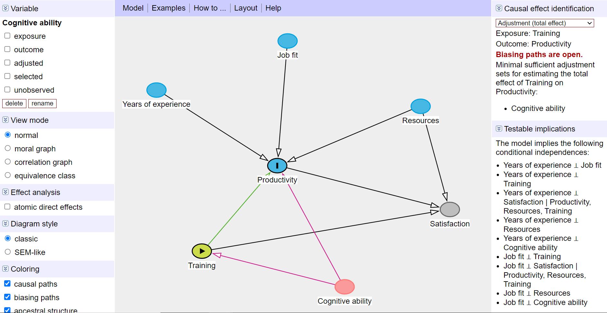

I'm just in the middle of studying the use of meta-learners for causal inference, i.e. how to repurpose conventional ML models to estimate treatment effect. One of the lessons I took away from this study so far is that no matter how fancy the ML algorithm we use, without a plausible model of the data-generating process, we cannot hope for an unbiased estimate of the treatment effect as without it, it is difficult to select relevant covariates and avoid those that introduce bias into our estimation (e.g. colliders, mediators and their descendants).

To illustrate and reinforce this lesson for myself, I coded a small example of estimating the average treatment effect of training performance on productivity using synthetic data with a known data-generating process and [the Double ML](https://towardsdatascience.com/double-machine-learning-for-causal-inference-78e0c6111f9d){target="_blank"} method.

First, we create a [DAG](https://en.wikipedia.org/wiki/Directed_acyclic_graph){target="_blank"} of the causal relationships behind our data. We see that, according to this DAG, employee productivity is affected by years of experience, job fit, available resources, and training performance, which is our variable of interest. Employee satisfaction is also part of the DAG, which is affected by available resources, employee productivity, and training performance.

```{python}

import networkx as nx
import matplotlib.pyplot as plt

# initializing DAG
G = nx.DiGraph()

# adding nodes
nodes = ['Years of experience', 'Resources', 'Job_fit', 'Training', 'Productivity', 'Satisfaction', 'Cognitive ability']
G.add_nodes_from(nodes)

# adding edges
edges = [('Years of experience', 'Productivity'),
         ('Cognitive ability', 'Productivity'),
         ('Cognitive ability', 'Training'),
         ('Resources', 'Productivity'),
         ('Resources', 'Satisfaction'),
         ('Job_fit', 'Productivity'),
         ('Training', 'Productivity'),
         ('Training', 'Satisfaction'),
         ('Productivity', 'Satisfaction')]

G.add_edges_from(edges)

# drawing DAG
pos = nx.fruchterman_reingold_layout(G, seed=5, iterations = 500, k = 2)
labels = {node: node for node in G.nodes()}
nx.draw(G, pos, with_labels=True, labels=labels, node_color='lightblue', font_weight='bold', node_size=1500, font_size=10)
plt.title("DAG")
plt.show()

```

Now let’s generate synthetic data corresponding to this DAG.

```{python}

import numpy as np
import pandas as pd

# generating synthetic data
np.random.seed(42)
n = 1000

# generating features years of experience, resources, job fit, and cognitive ability
X = np.random.normal(0, 1, (n, 4))

# setting the true causal effect of training performance 
true_causal_effect = 3.5

# training is influence by cognitive ability
training = 1.8 * X[:, 3] + np.random.normal(0, 1, n)

# productivity is influenced by all features 
productivity = 2 * X[:, 0] + 1 * X[:, 1] + 0.5 * X[:, 2] + 2.2 * X[:, 3] + true_causal_effect * training + np.random.normal(0, 1, n)

# defining an employee satisfaction variable that is influenced by resources, productivity, and training
satisfaction = 0.3 * X[:, 1] +  0.2 * productivity + 1.3 * training + np.random.normal(0, 1, n)

# creating a final dataFrame
df = pd.DataFrame(X, columns=['years_of_experience', 'resources', 'job_fit', 'cognitive_ability'])
df['training'] = training
df['productivity'] = productivity
df['satisfaction'] = satisfaction 

```

Without DAG, i.e., without understanding the data-generating process behind our data, we might be tempted to "throw" all available variables into our estimator. We can give it a try and use Double ML for that - a popular framework designed to provide unbiased and consistent estimates of treatment effects in the presence of high-dimensional controls while reducing the risk of overfitting. The common Double ML procedure looks as follows:

1. Randomly splitting the data into two parts: one for estimating the control function and the other for estimating the treatment effect.
2. Using the first part of the data to train a machine learning model to predict the outcome variable based on covariates (without the treatment variable). Similarly, training another model to predict the treatment variable based on covariates.
3. Using the second part of the data to form the residuals for outcome and treatment variable and running a simple linear regression of outcome residuals on treatment residuals.
4. Repeating steps 1-3 but switching the roles of the two data splits and averaging the estimates to get the final average treatment estimate.

Let's apply this approach to our data and use XGBoost models to estimate the control function and see how successful we will be in our efforts to estimate the known causal effect of training on productivity.


```{python}

import numpy as np
from xgboost import XGBRegressor
from sklearn.linear_model import LinearRegression

# creating a variable for data splits
np.random.seed(42)
df['part'] = np.random.choice([0, 1], size=len(df))

estimates = []

for p in [0,1]:
    
    # auxiliary variables for switching the roles of the two data splits
    firstPart = 1-p
    secondPart = p-0
    
    # used covariates
    covariates = ['years_of_experience', 'resources', 'job_fit', 'cognitive_ability', 'satisfaction']
  
    # preparing datasets
    X_First = df.loc[df['part'] == firstPart, covariates].values
    y_Outcome_First = df.loc[df['part'] == firstPart,'productivity'].values
    y_Treatment_First = df.loc[df['part'] == firstPart,'training'].values
    
    X_Second = df.loc[df['part'] == secondPart, covariates].values
    y_Outcome_Second = df.loc[df['part'] == secondPart,'productivity'].values
    y_Treatment_Second = df.loc[df['part'] == secondPart,'training'].values
    
    # controlling for covariates for productivity using XGBoost
    model_Outcome = XGBRegressor(eta = 0.1, n_estimators =25)
    model_Outcome.fit(X_First, y_Outcome_First)
    residual_Outcome = y_Outcome_Second - model_Outcome.predict(X_Second)
    
    # controlling for covariates for training using XGBoost
    model_Treatment = XGBRegressor(eta = 0.1, n_estimators =25)
    model_Treatment.fit(X_First, y_Treatment_First)
    residual_Treatment = y_Treatment_Second - model_Treatment.predict(X_Second)
    
    # Part 3: Estimate the causal effect using the residuals with Linear Regression
    model_causal = LinearRegression()
    model_causal.fit(residual_Treatment.reshape(-1, 1), residual_Outcome)
    double_ml_effect = model_causal.coef_[0]
    
    estimates.append(double_ml_effect)
  
print("The estimated Average Treatment Effect is:", sum(estimates)/len(estimates))

```

We see that the estimated causal effect of training is approximately 2.9, quite far from the known value of 3.5. How so? Well, if you look at the DAG above, you can see that by using all the variables as covariates, not only have we correctly blocked the backdoor by controlling for employee cognitive ability, but we have also introduced bias into our estimation by controlling for satisfaction, which is a collider - a variable that is affected by both the outcome (productivity) and the treatment (training). And controlling for colliders leads to spurious correlations between variables or, as in our case, deflates the size of the estimated effect. We can easily check this using [DAGitty](https://www.dagitty.net/){target="_blank"}, which is a wonderful browser-based environment for creating and analysing causal diagrams.



So let's repeat the estimation, but now without satisfaction variable as covariate. As you can see below, we are now much closer to the actual causal effect.

```{python}

# creating a variable for data splits
np.random.seed(42)
df['part'] = np.random.choice([0, 1], size=len(df))

estimates = []

for p in [0,1]:
    
    # auxiliary variables for switching the roles of the two data splits
    firstPart = 1-p
    secondPart = p-0
    
    # used covariates
    covariates = ['years_of_experience', 'resources', 'job_fit', 'cognitive_ability']
  
    # preparing datasets
    X_First = df.loc[df['part'] == firstPart, covariates].values
    y_Outcome_First = df.loc[df['part'] == firstPart,'productivity'].values
    y_Treatment_First = df.loc[df['part'] == firstPart,'training'].values
    
    X_Second = df.loc[df['part'] == secondPart, covariates].values
    y_Outcome_Second = df.loc[df['part'] == secondPart,'productivity'].values
    y_Treatment_Second = df.loc[df['part'] == secondPart,'training'].values
    
    # controlling for covariates for productivity using XGBoost
    model_Outcome = XGBRegressor(eta = 0.1, n_estimators =25)
    model_Outcome.fit(X_First, y_Outcome_First)
    residual_Outcome = y_Outcome_Second - model_Outcome.predict(X_Second)
    
    # controlling for covariates for training using XGBoost
    model_Treatment = XGBRegressor(eta = 0.1, n_estimators =25)
    model_Treatment.fit(X_First, y_Treatment_First)
    residual_Treatment = y_Treatment_Second - model_Treatment.predict(X_Second)
    
    # Part 3: Estimate the causal effect using the residuals with Linear Regression
    model_causal = LinearRegression()
    model_causal.fit(residual_Treatment.reshape(-1, 1), residual_Outcome)
    double_ml_effect = model_causal.coef_[0]
    
    estimates.append(double_ml_effect)
  
print("The estimated Average Treatment Effect is:", sum(estimates)/len(estimates))

```

Despite the simplicity of the example presented, I think it nicely demonstrates that by using fancy ML algorithms like XGBoost, we are not relieved of the need to have a plausible model of the data-generating process when estimating causal effects from observational data, and we can't just blindly rely on some magical powers of ML to squeeze what we need out of whatever input we give it. 

Just a side note: If you want to make your life a little bit easier when using Double ML, you can use [the DoubleML library for Python and R](https://docs.doubleml.org/stable/index.html){target="_blank"}. The code below illustrates this library in action on our synthetic data.


```{python}

from doubleml import DoubleMLData, DoubleMLPLR

np.random.seed(42)

# specifying data and roles of individual variables
dml_data = DoubleMLData(df, y_col='productivity', d_cols='training', x_cols=['years_of_experience', 'resources', 'job_fit', 'cognitive_ability'])

# specifying ML model(s) used for estimation of the nuisance parts
ml_xgb = XGBRegressor(eta = 0.1, n_estimators =25)

# initializing and parametrizing the model object which will be used to perform the estimation
dml_plr_xgb = DoubleMLPLR(
  dml_data,
  ml_l = ml_xgb,
  ml_m = ml_xgb,
  n_folds = 5,
  n_rep = 10,
  score = 'partialling out',
  dml_procedure = 'dml2')

# estimation and inference
dml_plr_xgb.fit()
dml_plr_xgb.summary
dml_plr_xgb.confint()

```

