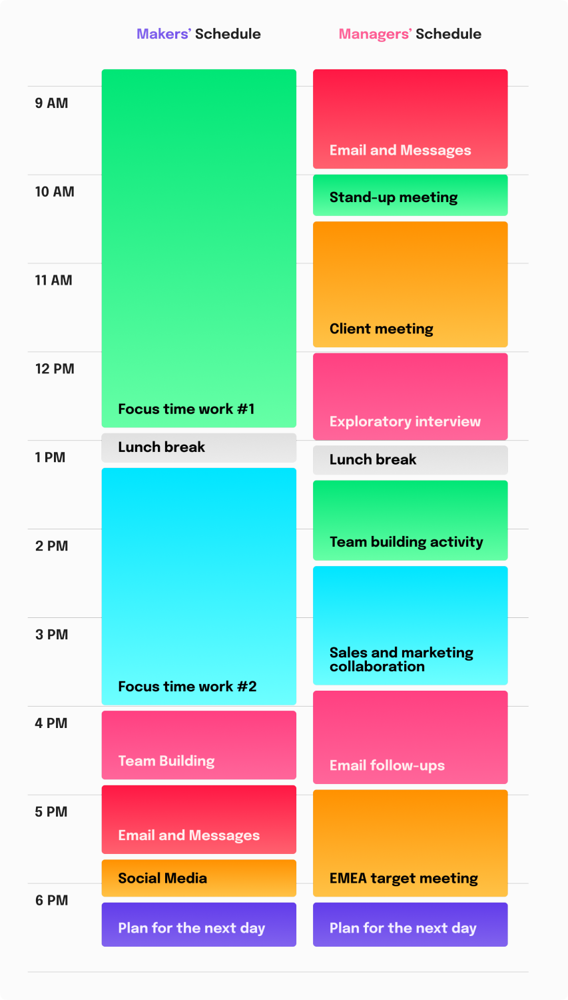

As a ["maker"](http://www.paulgraham.com/makersschedule.html){target="_blank"}, I'm used to using my time in larger blocks of time to do focused work on various data products. Now, however, my time tends to be spread out between a series of 30-45 minute long meetings that help me navigate a complex organization like Sanofi, explore opportunities for collaboration, and make valuable contacts that can help me deliver on tasks in the future.

<div style="text-align:center">
{width=50%}
</div>

I wondered if I could gain any potentially useful insights from this particular ["intuition pump"](https://en.wikipedia.org/wiki/Intuition_pump){target="_blank"}. I took the help of [the book "Algorithms to Live By"](https://algorithmstoliveby.com/){target="_blank"} by Brian Christian and Tom Griffiths and found at least five such insights:

1. Although one has a primary mode of operation (e.g. exploitation for makers, exploration for managers), one should not completely ignore the other mode and should allocate a small, consistent portion of one's time to ensure that one does not miss valuable insights or opportunities that lie outside one's primary mode of operation (based on the Epsilon-Greedy strategy to solve [the Multi-Armed Bandit problem](https://en.wikipedia.org/wiki/Multi-armed_bandit){target="_blank"}).
2. Over time, as one becomes more aware of the options available, the need for exploration may decrease, allowing for more targeted exploitation of known best opportunities (based on the Decaying Epsilon strategy to solve the Multi-Armed Bandit problem).
3. Although our primary focus is on delivery, we should remain open and try new options that have the highest potential upside, despite the associated high uncertainty (based on the Upper Confidence Bound strategy to solution of the Multi-Armed Bandit problem).
4. If you plan to stay with the company for a while, you should be open to further exploration, as newly found valuable opportunities can be used later in the future, and vice versa (btw, this could be a useful signal of intentions to leave, as some research suggests that people actually tend to resolve this type of trade-offs this way).
5. Be Bayesian, i.e., choose your paths based on your current beliefs, regularly check the balance between exploration and exploitation on your calendar, and update your beliefs and make new, more informed decisions as evidence of outcomes accumulates (based on the Thompson Sampling strategy to solution of the Multi-Armed Bandit problem).

Maybe you'll find some of these insights helpful in finding a better balance between exploring new paths and following familiar ones, leading to more effective use of your time. If nothing else, take this as a recommendation to read the book mentioned above - there's plenty in there for inspiration.

```{r echo=FALSE}

library(vembedr)
vembedr::embed_youtube("OwKj-wgXteo")

```