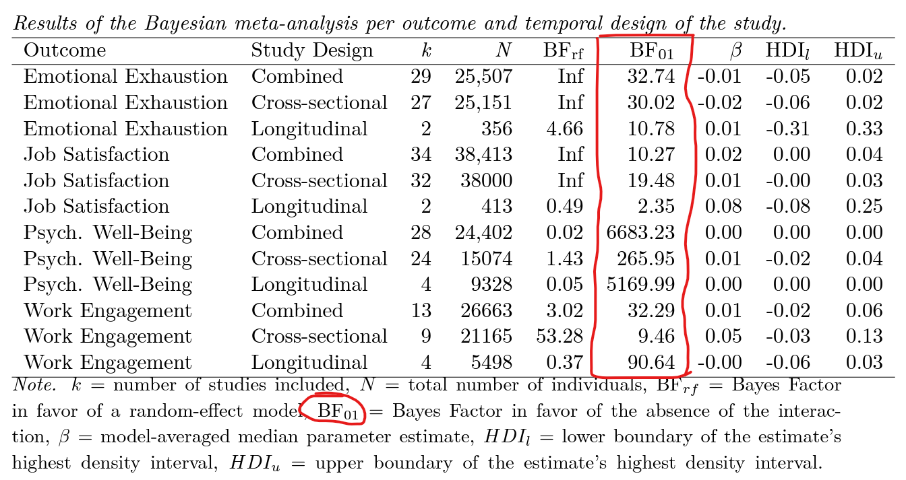

According to [Huth & Chung-Yan (2023)](https://psyarxiv.com/z5bdk/){target="_blank"}, in contradiction to the position of widely held theories, job control does not reduce the negative impact of job demands on workers' well-being.

As can be seen in the table below, the data (104 effect sizes of aggregate-level data and 14 participant-level datasets) provided strong evidence for the absence of the interaction between job demands and control.

{width=100%}

At the same time, however, the authors themselves emphasize that “*[these] findings do not suggest that job demands and job control are not important work design features when considering the well-being of workers. Their direct effects on worker well-being are well-established in past research.*” 

“*The important conclusion of [the] study is that increased job control cannot offset the deleterious impact that high workloads have on workers. [This means that assuming] that employee well-being is a priority, workload should be restricted irrespective of the positive benefits of increasing employee control.*”

