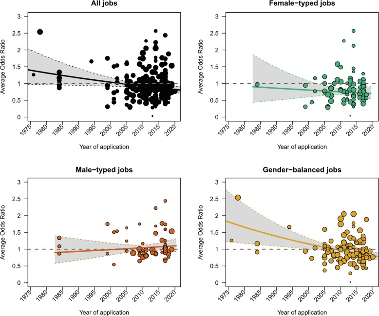

[Schaerer et al. (2023)](https://www.sciencedirect.com/science/article/pii/S0749597823000560){target="_blank"} conducted a pre-registered meta-analysis of 44 years of field experiments on gender gaps in hiring decisions with quite interesting results:

* Discrimination against women for male-typed and balanced jobs decreased across time.
* Discrimination against men for female-typed jobs remained stable across time.
* Average effect is small - the average odds of male applicants to receive a callback is 0.91 times the odds of equally qualified female applicants (with 95% CI from 0.86 to 0.97). 
* Heterogeneity of true effects is very high, specifically 83% of total variance across studies can be attributed to heterogeneity rather than random chance.
* In addition to the meta-analysis, the study also included a forecasting challenge in which researchers and laypeople attempted to accurately estimate both time-trends and the current pervasiveness of gender biases in selection settings. Forecasters expected observed decline, but overestimated the degree of remaining bias.

{width=100%}

*Note on the attached chart: In all figures, odds ratios above 1 indicate a greater preference for male applicants and odds ratios below 1 indicate greater preference for female applicants.*