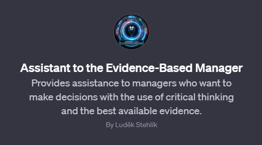

One of the reasons why managers and organizations generally don't apply the principles of Evidence-Based Management as often as they could or should is the perceived difficulty and complexity of the entire process. Hiring professional consultants is one solution, but it may be too expensive for many.

However, with the introduction of customizable GPTs, there is now an affordable way to build a kind of EBM consultant that can help managers go through all the necessary steps to increase the odds of solving the right problems with the right solutions.

As a first and modest step in this direction, I have created a GPT bot named [Assistant to the Evidence-Based Manager](https://chat.openai.com/g/g-SxPch3r5d-assistant-to-the-evidence-based-manager){target="_blank"}. It provides EBM-related consultancy based on general instructions and reliable materials about EBM. It will definitely not replace an experienced EBM consultant or practitioner, but it may help overcome the resistance threshold for adopting EBM principles in organizations.

{width=100%}

Give it a try and let me know what you think about this approach. Or even better, [try building your own GPT bot](https://openai.com/blog/introducing-gpts){target="_blank"} that will do better than mine and share it with us 😉

