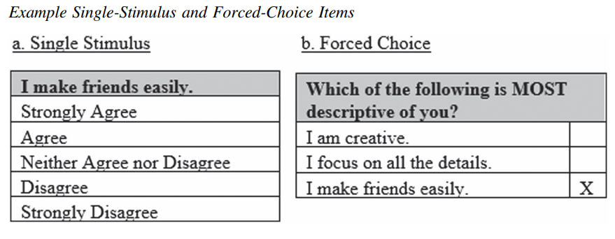

If you are using personality assessments in a high-stakes setting where faking is a more frequent problem, such as in the context of employee selection, you should pay attention to the meta-analytic study by [Speer et al. (2023)](https://www.researchgate.net/publication/371619243_Comparing_forced-choice_and_single-stimulus_personality_scores_on_a_level_playing_field_A_meta-analysis_of_psychometric_properties_and_susceptibility_to_faking){target="_blank"} that compared forced-choice (FC) and traditional single-stimulus (SS) personality assessments in terms of criterion-related validity and susceptibility to faking in terms of mean shifts and decreases in validity. 

{width=100%}

A specific feature of this study was that it compared FC and SS measures after placing them on an equal playing field by relying only on studies that examined matched assessments of each format, and thus, avoiding the extraneous confound of using comparisons from different contexts.

And what were the results?

* Average scores increased from honest to faked samples for both FC (d = .41) and SS scores (d = .75), though the effect was more pronounced for SS measures and with larger effects for context-desirable traits (FC d = .61 vs. SS d = .99).
* Criterion-related validity was similar between matched FC and SS measures overall (r′ = .19 vs. r′ = .18), however, when in faking contexts, FC scores exhibited greater criterion-related validity than SS measures (r′ = .18 vs. r′ = .04). 

So, although FC measures are not completely immune to faking, they seem to show meaningful benefits over SS measures in contexts of faking.