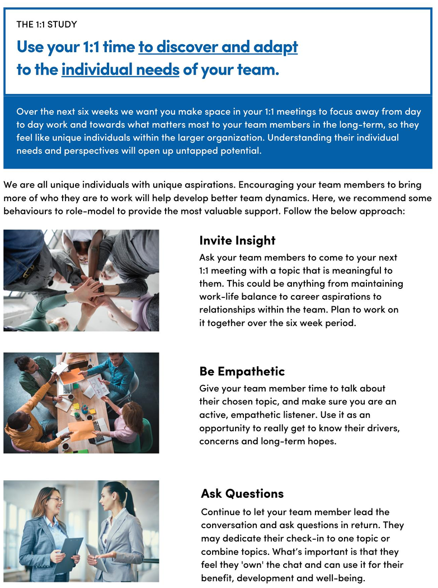
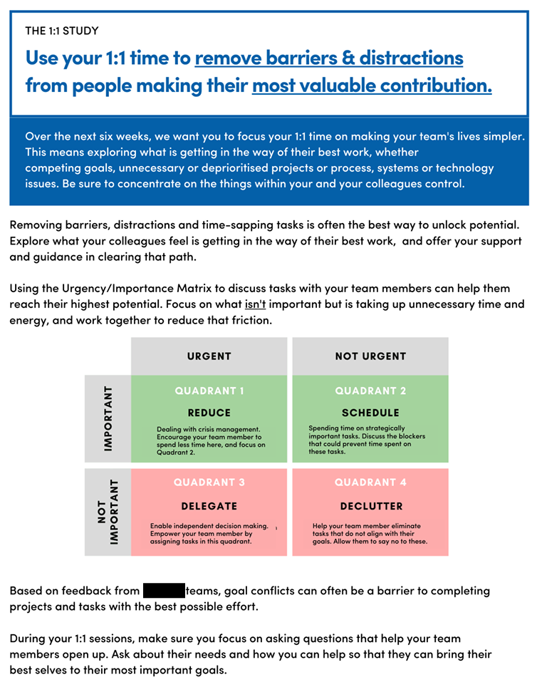

At Sanofi, we recently welcomed [Prof. Dr. Florian Englmaier](https://www.linkedin.com/in/florian-englmaier-4759b05/?originalSubdomain=de){target="_blank"} at our People Insights Seminar, where he shared with us his intriguing [research on interventions that enhance psychological safety](https://papers.ssrn.com/sol3/papers.cfm?abstract_id=4141538){target="_blank"}.

As he pointed out at the start of his talk, while we all understand the importance of psychological safety, the specific actions that effectively increase it are less clear. His research aimed to bridge this knowledge gap.

Conducted in a real-world setting, the study encompassed over 1,000 teams and more than 7,000 employees within a global healthcare company. It utilized a RCT research design, a method not commonly seen in People Analytics, but more effective for identifying causal relationships.

The research team compared two types of brief 6-week email campaigns, which encouraged managers to refocus and make regular their 1:1 meetings, against a control group:

1. The first group of managers was prompted to focus on addressing employees’ individual needs and aspirations.
2. The second group was encouraged to help employees better execute tasks and eliminate obstacles impacting their performance.

Below you can see the used meeting guidance corresponding to the two treatment conditions (individual needs vs. tasks focus). 

{width=100%}

{width=100%}

Despite their simplicity, these interventions led to a noticeable increase in psychological safety, particularly in the group focusing on employees' individual needs. Additionally, they improved the relationships to and perceptions of the managers. 

Other significant and instrumental findings included an increase in the frequency of 1:1 meetings, as evidenced by Microsoft Workplace Analytics and survey data, and the observation that junior managers benefited most from these interventions.

For more details, see the [original paper](https://papers.ssrn.com/sol3/papers.cfm?abstract_id=4141538){target="_blank"}.
