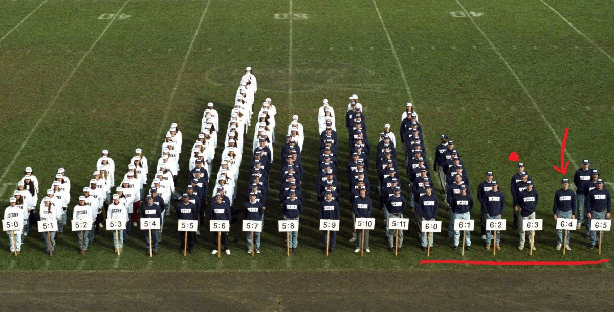

Out of curiosity and a bit for fun, I just completed the 11-item height inventory by Hynek Cigler from the Department of Psychology, FSS MU, a teaching aid designed to demonstrate some of the basics of measurement in psychology and related fields. 

Instead of using a ruler, you indicate how much you agree with statements like “*I often have to stand on my tiptoes to see better.*” or “*I have plenty of legroom on the bus.*”

Its decent psychometric qualities showed up in a fairly accurate estimate of my actual height (193 cm): it estimated my body height at 189 cm with a 95% confidence interval of [182-197] cm. The attached pic illustrates where the test put me. In terms of the height quotient (IQ), I was at 117 with a 95% CI of [100-129], so it's not up to Mensa, but at least I won't have to pay membership fees 😁

{width=100%}

If you are doing training in psychometrics or need to educate your audience in this area, this tool can be very handy.

The inventory is in Czech, but the online translation in Chrome does a pretty good job, so you can try it out for yourself even if you're not a Czech speaker (with all the limitations given by non-standard localization and not 100% adequate norms). You can find it [here](http://fssvm6.fss.muni.cz/vyska/){target="_blank"}.

